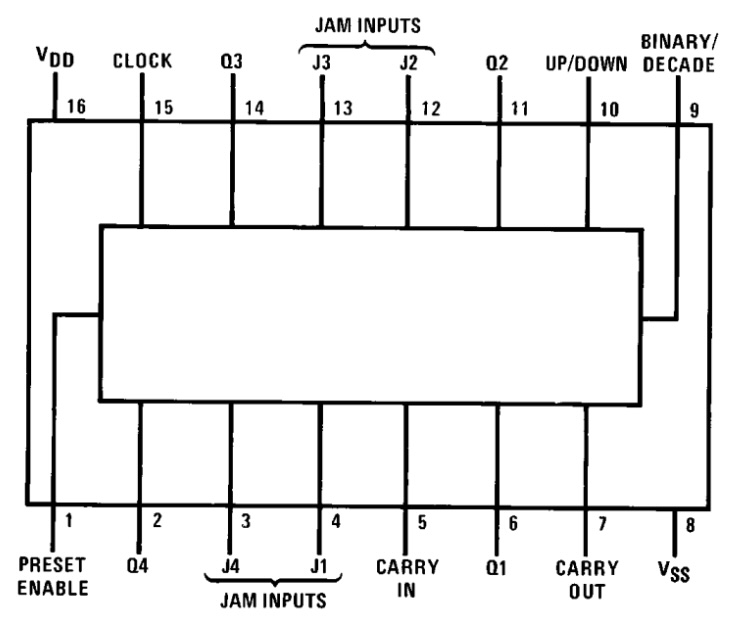
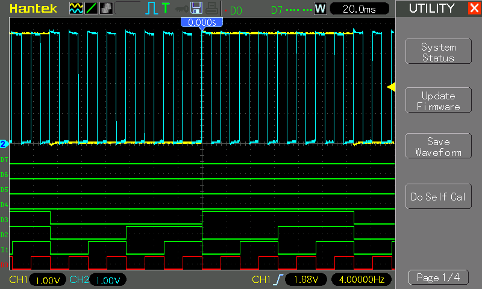

# #xxx CD4029 Counter

Taking a close look at the CD4029 Pre-settable Binary/Decade Up/Down Counter, and testing it out with a basic counter circuit.

Here's a quick demo..

## Notes

### About the CD4029

The CD4029 is a versatile CMOS 4-bit binary/decade up/down counter that can be configured to operate in either binary or BCD (decade) mode. It features separate up/down control, a synchronous preset (allowing the counter to be loaded with any 4-bit value), and a carry-out signal for cascading multiple counters. With each clock pulse, it increments or decrements its count depending on the control inputs, making it suitable for frequency division, event counting, digital clocks, and arithmetic operations.

Operating over the wide CMOS voltage range of 3V to 15V, the CD4029 offers high noise immunity, low power consumption, and compatibility with other 4000-series logic devices. Its configurability and clean, synchronous operation make it more flexible than simpler counters like the CD4516 or CD4040, allowing it to be used in applications such as programmable timers, keypad interfaces, sequence generators, and digital control systems.

### Circuit Design

The demonstration circuit features:

* a variable frequency clock signal provided by [LEAP#791 555 Breadboard Pulse Generator](../../555Timer/BreadboardPulseGen/)
* J0-3 tied to ground, so that pressing CLEAR will reset the output to 0x0
* a SPDT switch `BIN/DEC` to switch between a binary (0-15) and decimal (0-9) count
* count UP/DOWN hard-wired to count up

Designed with Fritzing: see [Counter.fzz](./Counter.fzz).

Running on a breadboard:

## Test Results

Wired up the outputs to a mixed oscilloscope/logic analyzer so we can see the behaviour in detail:

In the following trace we see a full 4-bit binary count:

* CH1 (Yellow) - Q4 (slowest changing output, used to trigger the scope)
* CH2 (Blue) - CLK signal
* Logic signals:
    * D0: Q1
    * D1: Q2
    * D2: Q3
    * D3: A4
    * D4-7: unused (tied to ground)

## Credits and References

* [CD4029 datasheet](https://www.futurlec.com/4000Series/CD4029.shtml)
