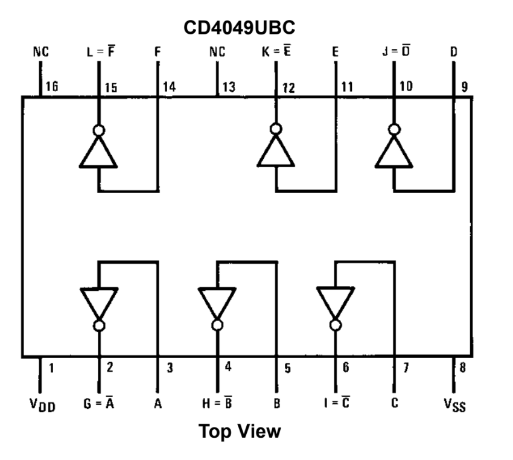

# #607 CD4049 Voltage Doubler

Testing a voltage doubler circuit based on a CD4049 inverter-driven bucket brigade.

## Notes

The [CD4049](https://www.futurlec.com/4000Series/CD4049.shtml) is a hex inverter buffer/driver with the ability to operate over a wide voltage range of 3V to 15V. Unlike standard inverters, it can provide higher output drive capability, making it suitable for interfacing between different logic families and driving capacitive or resistive loads. It features symmetrical output rise and fall times, low power consumption, and high noise immunity. The CD4049 is often used in logic level shifting, waveform generation, and simple amplification applications, especially where standard logic gates do not provide sufficient drive strength.

### Circuit Design

An relaxation oscillator uses two inverters with an RC network to drive the circuit.

The frequency is determined by the RC time constant,
and in the Inverter/NAND Gate Waveform configuration can be estimated as `f = 1 / (2.2 * R1 * C)`. R2 should be approximately 10 times R1.

With R1=6.8kΩ and C=100nF, the expected frequency is [668.4 Hz](https://www.wolframalpha.com/input?i=1%2F%282.2*6.8k%CE%A9*100nF%29).

The oscillator output drives 4 inverters in parallel (to 4x the output current capacity). These drive a two-stage charge pump that delivers the doubling of the voltage.

### Test Results

The scope trace below captures the system in operation:

* CH1 (Yellow): oscillator output at OSC.
    * Measured: 684 Hz at 46.4%
    * Calculated: [668.4 Hz](https://www.wolframalpha.com/input?i=1%2F%282.2*6.8k%CE%A9*100nF%29)
* CH2 (Blue): voltage at VOUT
    * Measured: 23.6V

## Credits and References

* [CD4049 datasheet](https://www.futurlec.com/4000Series/CD4049.shtml)
* <https://www.build-electronic-circuits.com/4000-series-integrated-circuits/ic-4049/>
* [Voltage Doubler Circuit - 12V to 24V](https://www.circuits-diy.com/12v-to-24v-voltage-doubler-circuit-using-cd4049-ic/)
* [12V to 24V DC Converter Circuit](https://www.electronicshub.org/12v-24v-dc-converter-circuit/)
