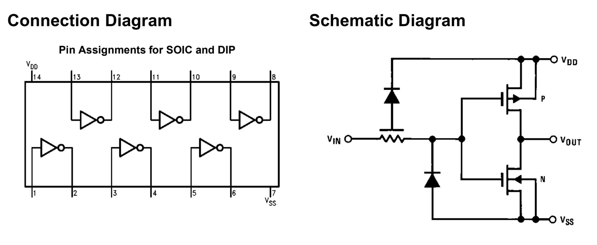
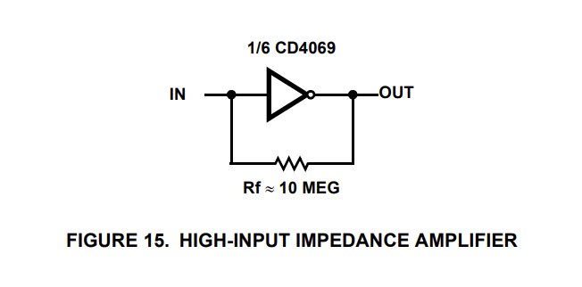
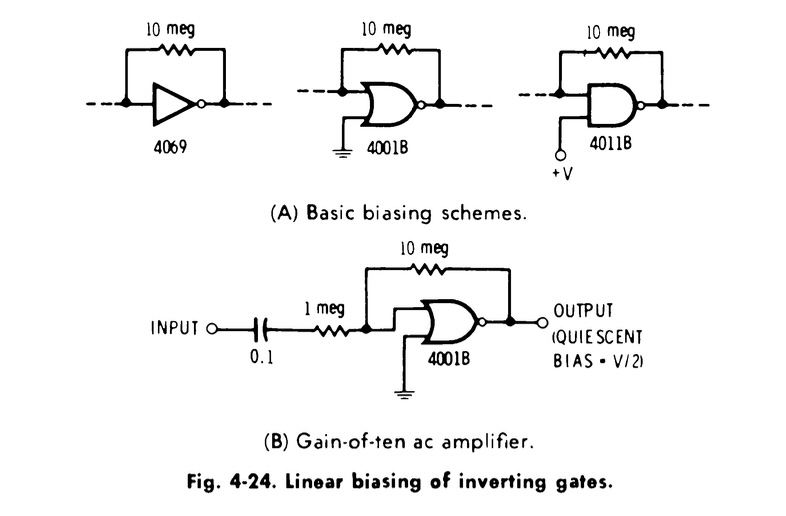
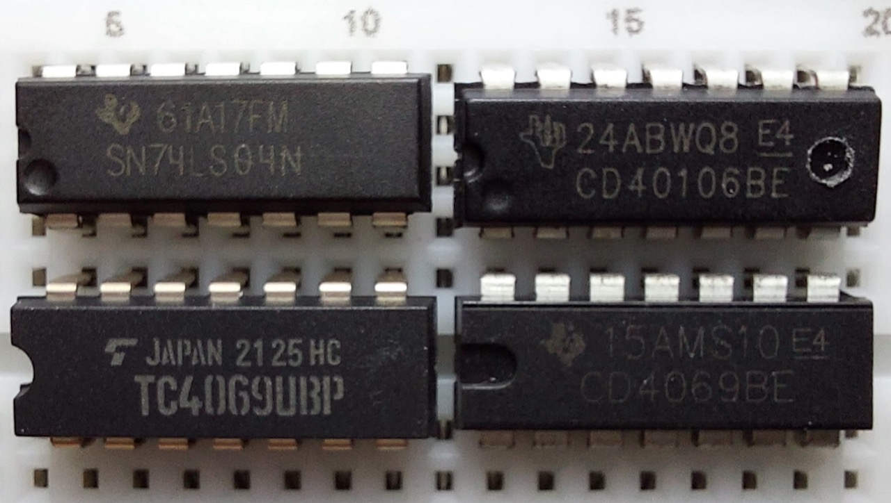
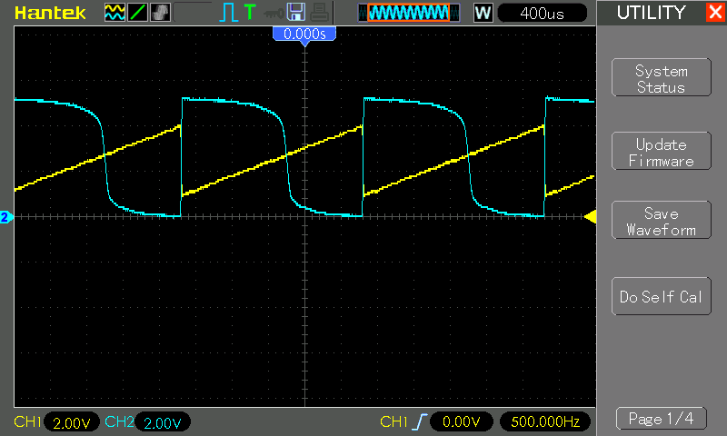
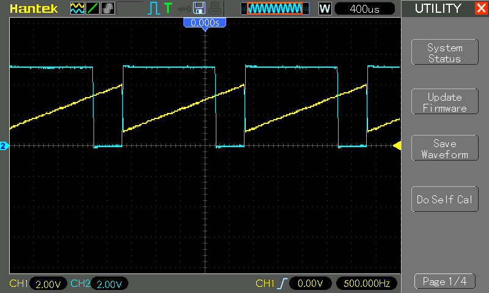
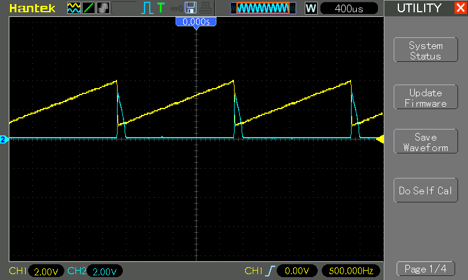

# #745 CD4069 High-impedance Amplifier

An unusual use of the unbuffered CD4069 inverter - as a high-impedance amplifier.

## Notes

The CD4069 is a hex inverter IC from the CMOS 4000 series, containing six independent NOT gates in a single package. It is available in both standard (CD4069UB) and buffered (CD4069BE) versions, with the buffered version offering improved drive strength and faster switching due to additional internal gain stages. Operating over a wide voltage range of 3V to 15V, it offers high noise immunity, low power consumption, and symmetrical rise and fall times, making it suitable for a wide range of digital logic and waveform-shaping applications.

One of the key advantages of the CD4069, especially in its unbuffered form, is its versatility in analog and mixed-signal circuits, such as oscillators, filters, and amplifiers—thanks to its ability to operate linearly under specific conditions. This makes it a popular choice for both digital logic inversion and creative analog designs. Its broad voltage compatibility and robust performance make it a flexible and reliable component in both hobbyist and professional electronic designs.

## The High-Impedance Amplifier

The Intersil datasheet includes this curious oddity:

A digital inverter as an amplifier?
I learned all about this on
IMSAI Guy #2187 CD4069 Unbuffered CMOS:

### High-Impedance Amplifier Circuit Design

I found some more illuminating information in the
[CMOS Cookbook](../../../books/cmos-cookbook/) p121, p279:

> Fig. 4-24 shows the basic biasing schemes for linear operation. In
> Fig. 4-24A, we simply provide a 10-megohm resistor from output back to input, making sure that there is no other de path to the input.
> With this negative-feedback resistor, the inverter, or inverting gate, will automatically bias itself to an output voltage of one-half the supply voltage, or +V/2. It will behave as a high-gain amplifier, swinging almost to the supply limits in either direction with very good linearity.
> The gain you get will depend on the device you use. Most A-series devices end up with a gain of about 30 or so. But triple-buffered, inverting B-series CMOS will give you gains of 10,000 or even more.
> One exception is the 4069B which isn't buffered.

So while we are using the 4069 inverters in this example, the behaviour is common to all basic unbuffered gates.

### Are my Inverters Buffered of Unbuffered?

There is a
[very good answer on EE.SE](https://electronics.stackexchange.com/a/636366/52289)
that delves into the history:

* there are no buffered 4069 parts
* the "B" suffix originally did not mean "buffered"
* it appears that TI subsequently established the convention, standardized by JEDEC, of "B" = buffered, and "UB" - unbuffered

NB: I belatedly realised that this question actually arose from a discussion I had with Steve Schnepp [right here](https://github.com/tardate/LittleArduinoProjects/issues/30)!

So let's put things to the test: check the transfer function with a triangle wave:

* buffered chips should show clean, sharp transitions of the output
* unbuffered chips will have "rounded" transitions

Test setup:

* 5V power for the chip
* CH1: input signal
    * direct to pin 1 (inverter A input)
    * 500 Hz, 3V peak-peak triangle wave, offset 2.5V
* CH2: output signal
    * direct to pin 2 (inverter A output)
* no feedback or input resistors

I have 4 chips to test:

* [Toshiba TC4069UBP](https://toshiba.semicon-storage.com/ap-en/semiconductor/product/general-purpose-logic-ics/detail.TC4069UBP.html)
    * a new part I purchased in the hope I get a true unbuffered component
* CD4069BE.
    * a part I tried at first, but it was behaving in a distinctly "buffered" manner
    * What is this supposedly "TI CD4096BE" part?
        * as far as I can tell, never produced by TI. They currently have [CD4096UB](https://www.ti.com/product/CD4069UB) and I can't find any historic references to a CD4096BE
        * but currently [listed for sale e.g. here](https://kitsguru.com/products/cd4069-cmos-inverter-ic)
        * with multiple listings on [octopart](https://octopart.com/cd4069be-texas+instruments-20842261)
* [CD40106BC](https://www.mouser.com/datasheet/2/308/cd40106bc-1190732.pdf)
    * Hex Schmitt Trigger, definitively triple-buffered according to the datasheet
* [SN74LS04N](https://www.futurlec.com/74LS/74LS04.shtml)
    * a low-power schottky variant. The data sheet doesn't clarify whether buffered or not, but I would expect not

TC4069UBP Result:

* good, this is what we are looking for to confirm unbuffered behaviour - a non-linear output transition

CD4069BE Result:

* whatever it is, it is looking distinctly buffered

CD40106BC Result:

* as expected, a clean buffered design.
* crossover is quite a bit higher than the CD4069BE

SN74LS04N Result:

* the crossover point is extremely low, barely making it in the sweep
* showing quite a bit of non-linearity, perhaps worthy of a separate investigation

### Test Circuit

At this point, I can conclude that the TC4069UBP has the desired unbuffered behaviour to test the high-impedance amplifier design.

So, let's give it a go!

I've configured for a hi-impedance 1:10 gain with AC-coupled input.

### Test Results

All these tests are run with an input sine wave of magnitude 200mV peak-peak, and a supply voltage of 5V.

At 100Hz:

* output measures approximately 1.72V peak-peak
* so a gain of [8.6](https://www.wolframalpha.com/input?i=1.72V%2F0.2V)
* pretty close to expected 10x gain

At 1kHz:

* output measures approximately 1.56V peak-peak
* so a gain of [7.8](https://www.wolframalpha.com/input?i=1.56V%2F0.2V)
* still pretty close to expected 10x gain

At 10kHz:

* output has dropped to approximately 0.95V peak-peak
* so a gain of [4.75](https://www.wolframalpha.com/input?i=0.95V%2F0.2V)
* gain starting to drop off

At 50kHz:

* output has dropped to approximately 0.26V peak-peak
* so a gain of [1.3](https://www.wolframalpha.com/input?i=0.26V%2F0.2V)
* gain almost down to 1

### Test Results - Varying the Supply

Gain varies based on the the supply voltage.
Here's a table of measurements I made,
with a constant input of 0.2V peak-peak at 1kHz:

| Supply | Output Magnitude | Gain |
|--------|------------------|------|
| 3v     | 1.81v            | 9.05 |
| 4v     | 1.65v            | 8.25 |
| 5v     | 1.53v            | 7.65 |
| 6v     | 1.46v            | 7.3  |
| 7v     | 1.39v            | 6.95 |
| 8v     | 1.36v            | 6.8  |
| 9v     | 1.32v            | 6.6  |
| 10v    | 1.27v            | 6.35 |

Some samples traces. First, at 3V:

At 5V:

At 10V:

### Conclusions

Yes, unbuffered gates can be used as high-impedance amplifiers! Note:

* gain is frequency-dependant. It rolls off as frequency increases - effectively a low-pass filter
* gain also varies with supply voltage. It is thus possible to use the 4069 supply pin (VDD) as the control for a voltage-controlled amplifier

With 4096 inverters, it is important to verify that the chip is really unbuffered, as there appear to be buffered variants on the market.

## Credits and References

* [CD4069UBMS Datasheet (Intersil)](https://www.renesas.com/en/document/dst/cd4069ubms-datasheet)
* [CD4069UB TI Product Info](https://www.ti.com/product/CD4069UB)
* [TC4069UBP Toshiba Product Info](https://toshiba.semicon-storage.com/ap-en/semiconductor/product/general-purpose-logic-ics/detail.TC4069UBP.html)
* [74LS04 Datasheet](https://www.futurlec.com/74LS/74LS04.shtml)
* [CD40106BC Datasheet](https://www.mouser.com/datasheet/2/308/cd40106bc-1190732.pdf)
