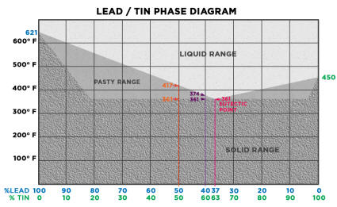

# #258 Clap-switch Kit 2

Practice some Boldport-style soldering on yet-another clap switch kit.

## Notes

I've had this clap-switch (voice activated) kit sculling around for a while (another "stocking stuffer" bargain on aliexpress).

The circuit is very similar to a previous [ClapSwitchKit](../ClapSwitchKit) project.
The operating principle is identical, but it varies in two main ways:

* no output stage included
* component selection and values are different

So I pulled this kit out primarily to practice some Saar Drimer/Boldport-style soldering. The objective?

* beautiful solder joints
* smooth to handle

See the [Making beautiful solder points](https://www.youtube.com/watch?v=KXBbiXaq1ec) video to find out more on the technique.

### Comparing Solder Techniques

I used different techniques for the three solder points in the picture:

* **A (left)** 2-pass boldport style: solder; clip down to the board; re-flow and make the dome
* **B (middle)** the cheats' boldport 1-pass style: blu-tack the part and clip the lead first, then solder with dome on the first pass
* **C (right)** normal technique - lead clipped after soldering
* Note the joint in the upper right - now that's more like it! ... though still not very shiny

A and B are clearly superior to C - which is asymmetrical and not finger-safe.

In practice, I can't tell much difference between the results of A and B. I think for now my preferred style is B:

* place the parts - I use blu-tack to hold them in place if necessary
* clip the leads as close to trim with the board as possible
* solder and make the dome in one pass
* side benefit is you get to harvest the clipped leads free of solder and flux (if you care - I keep some around for ad-hoc protoboard wiring)

### Making the "Dome"

At first, I had real trouble making smooth symmetrical domes. I'd always end up with "meringue tips" when I drew the iron away.
The technique that seems to work best for me is:

* make sure the iron isn't overloaded with solder
* withdraw the iron by first pulling down and around the nearside of the solder joint, nudge in a little then withdraw smoothly

This sounds more like icing a cake!

### Making Shiny Joints

So now I'm getting decent domes (most of the time) that are electrically and mechanically sound. But they are rarely shiny.

"Shiny" is not usually a QA issue for solder points (advice abounds on how it is not important).
This is not to be confused with dry joints, that will be both dull and flakey/crystalline.

Google delivers many opinions, for example:

* [Why aren't my solder connections shiny and perfect?](http://www.strat-talk.com/threads/why-arent-my-solder-connnections-shiny-and-perfect.143458/)
* [lead free soldering - Why are some joints shiny?](http://www.eevblog.com/forum/projects/lead-free-soldering-why-are-some-joints-shiny/)

The main advice for why solder points are not shiny seems to boil down to one or more of the following:

* unleaded solder "rarely produces shiny solder joints"
* no Silver (Ag) in the solder - especially lead free
* iron is too hot
* iron is too cold (but may be confused with dry joint issues)
* cooling too fast/airconditioning/cold-board
* contamination
* not enough flux
* disturbed before cooled

In other words, lots of theories!

So I ran some tests:

* I'm using [WL-0510 B-1 0.5mm 63Sn/37Pb](http://www.dx.com/p/wlxy-wl-0510-b-1-0-5mm-tin-solid-solder-wire-reel-spool-silver-262916#.WAjGsZN97XE)
* I tested with a range of iron temperatures from 250˚C to 325˚C
* with A/C (24˚C) and without (probably heading to 27˚C)
* with and without additional flux

... and I get pretty much the same result all the time: a nice shiny ball when I remove the iron, then as it cools, it gets to a point when
the ball instantly frosts over and I end up with a "dull" solder point.

It seems pretty clear that it is oxidizing at the phase-change from liquid to solid. Not sure what to try next to control this...

... except elbow grease;-) Turns out that with a bit of polish (using solder-station copper wool), I get some of the shine back.

So after a bit more research, I am suspecting the dullness created during the phase change from liquid to solid
is due to the eutectic property of 63Sn/37Pb. As you can see in the phase diagram below, 63/37 is the alloy
with almost perfect eutectic properties (meaning it goes straight from liquid to solid without passing an intermediate plastic phase).

### REALLY Shiny Domes

Since everything I tried so far hadn't made much difference (temperature, technique, aircon),
the only thing left to try is different solder.

So I got hold of some [Pro'sKit 9S002 Solder](https://www.aliexpress.com/item/Pro-sKit-9S002-Solder-Wire-W-2-AG-17G/32428346399.html) (62% Sn, 37% Pb, 2% Ag) ... and the difference is amazing:

* it creates "domes" with hardly any effort
* and they are all nice and shiny

Here's a side-by-side comparison using the same iron and tip, and both at 275˚C.

* on the left: 62Sn/37Pb/2Ag. Soldering is a breeze, and the results are perfectly formed and shiny
* on the right: 63Sn/37Pb. Making domes is "hard work" and they rarely turn out shiny

I'll need to do some more tests to determine if the problems I was originally seeing are typical of
a 63Sn/37Pb formulation, or if perhaps I just have some very poorly manufactured 63Sn/37Pb.

### First Pass on the Board

Here is the first pass. Electrically/mechanically sound but not really perfect "Boldport" quality:

* my dome sizes/shapes are a bit uneven
* a few meringue tips
* dull (see above) but brightened up with a bit of buffing

### Circuit Performance

This is a trace of the "clap-on" transition

* CH1 (yellow) is the output signal
* CH2 (blue) is the piezo speaker input to the base of Q1
* no vertical offset

The board under test...

## Construction

## Credits and References

* [The clap switch](https://www.aliexpress.com/item/Voice-control-switch-suite-DIY-kits-selling-electronic-circuit/32338281477.html) - from a seller on aliexpress
* LEAP: [ClapSwitchKit](../ClapSwitchKit) - another clap-switch kit project
* [Making beautiful solder points](https://www.youtube.com/watch?v=KXBbiXaq1ec) - the boldport way
* [Common Causes of Soldering Tip Failure](http://www.inlandcraft.com/uguides/tipfailure.htm) - includes some great info on the metallurgy of solder
* [Soldering for Show](https://luckyresistor.me/2016/09/25/soldering-for-show/) - great article
* [7.1.1 Soldering Basics](http://www.circuitrework.com/guides/7-1-1.shtml) - Circuit Technology Center
* [WL-0510 B-1 0.5mm 63Sn/37Pb](http://www.dx.com/p/wlxy-wl-0510-b-1-0-5mm-tin-solid-solder-wire-reel-spool-silver-262916#.WAjGsZN97XE)
* [Pro'sKit 9S002 Solder Wire W/2% AG 17G](https://www.aliexpress.com/item/Pro-sKit-9S002-Solder-Wire-W-2-AG-17G/32428346399.html)
* [..as mentioned on my blog](https://blog.tardate.com/2017/03/leap258-another-clap-switch-and-excuse-to-solder-boldport-style.html)
