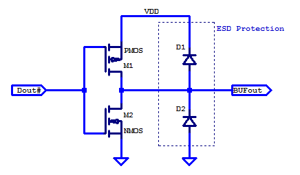

# #726 Push-Pull Output Driver

Testing the basic MOSFET push-pull output driver, similar to designs used in digital logic output or GPIO circuits.

## Notes

A push–pull amplifier is a type of electronic circuit that uses a pair of active devices that alternately supply current to, or absorb current from, a connected load. This kind of amplifier can enhance both the load capacity and switching speed.

Push–pull outputs are present in TTL and CMOS digital logic circuits and in some types of amplifiers, and are usually realized by a complementary pair of transistors, one dissipating or sinking current from the load to ground or a negative power supply, and the other supplying or sourcing current to the load from a positive power supply.

For more information see: 2.4.1 Push–pull output stages, p106, [The Art of Electronics 3rd Edition](../../../books/the-art-of-electronics/).

A simplified circuit for the output portion of a GPIO pin is shown below.
It basically comprises a p-channel MOSFET to provide the positive drive current when the output is "HIGH", and an n-channel MOSFET to sink the negative drive current when the output is "LOW".
Typically additional features such as ESD protection may be included, and this does not include the input side of a full GPIO circuit.

### Circuit Design

The following circuit demonstrates the basic operation of a MOSFET push-pull output driver:

* a 10kΩ pull-down is included on the input so that by default the gate input is pulled LOW, output HIGH.
* the high-side p-channel MOSFET is the [BS250](https://www.futurlec.com/Transistors/BS250.shtml)
* the low-side n-channel MOSFET is the [2N7000](https://www.futurlec.com/Transistors/2N7000.shtml)
* red LED is wired to be on when the output is HIGH
* green LED is wired to be on when the output is LOW

The Arduino is only there to provide a test input signal:
the [PushPullOutputDriver.ino](./PushPullOutputDriver.ino) is configured to generate a square wave on pin 9. The frequency can be adjusted by changing the `DELAY` value (in milliseconds).

Note that in the breadboard build, I've included a 200mA polycap fuse.
This is to protect against the case of having both the high and low side MOSFETs enabled at the same time (effectively shorting the power rail).

An oscilloscope trace of the behaviour:

* CH1 (yellow) - input signal as measure at `TEST_SIGNAL`
* CH2 (blue) - output signal as measure at `OUTPUT`, offset by -5V for clarity

### Function Test

Replacing the Arduino-generated signal with a [FY3200S Function Generator](./../../../Equipment/FY3200S/) for some more testing...

10kHz square wave

10kHz sine wave. No apparent cross-over effects.

10kHz triangle wave. No apparent cross-over effects.

Boosting up to 2MHz sine wave, we start to see some significant cross-over distortion,
especially on the rising input.

## Credits and References

* [BS250 datasheet](https://www.futurlec.com/Transistors/BS250.shtml)
* [2N7000 datasheet](https://www.futurlec.com/Transistors/2N7000.shtml)
* [Push–pull output](https://en.wikipedia.org/wiki/Push%E2%80%93pull_output) - wikipedia
* [The Art of Electronics 3rd Edition](../../../books/the-art-of-electronics/)
* [GPIO Output Resistance](https://2n3904blog.com/gpio-output-resistance/)
* [Understanding the Microcontroller GPIO – GPIO Working Explained](https://embetronicx.com/tutorials/tech_devices/understanding-the-microcontroller-gpio-gpio-working-explained/)
