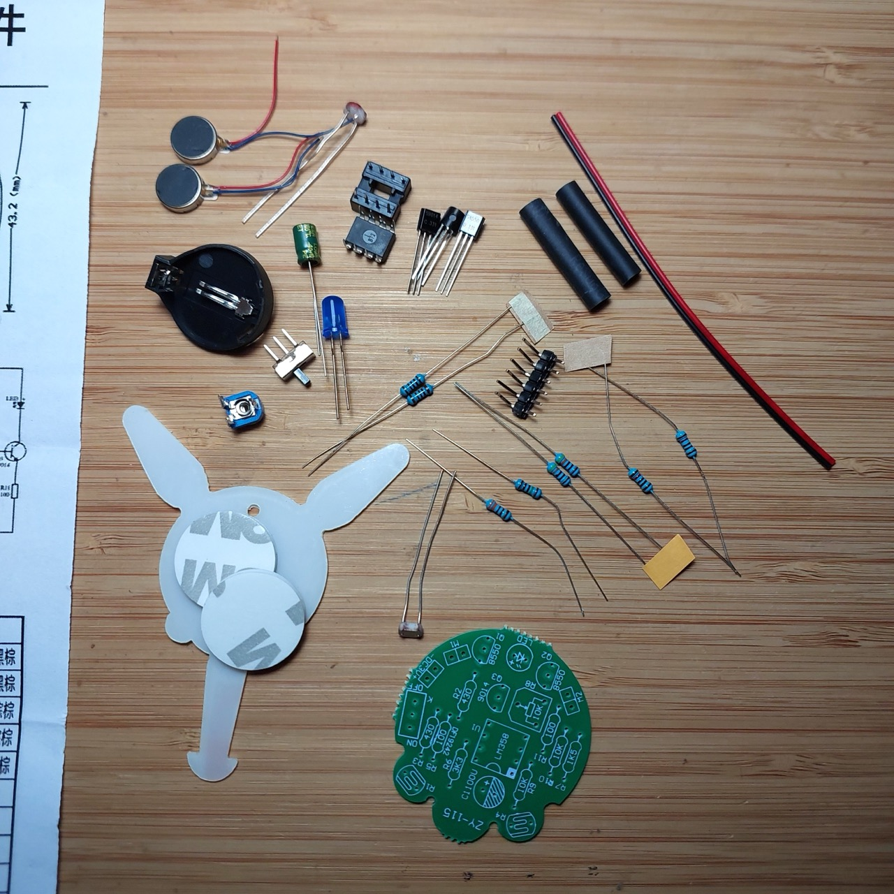
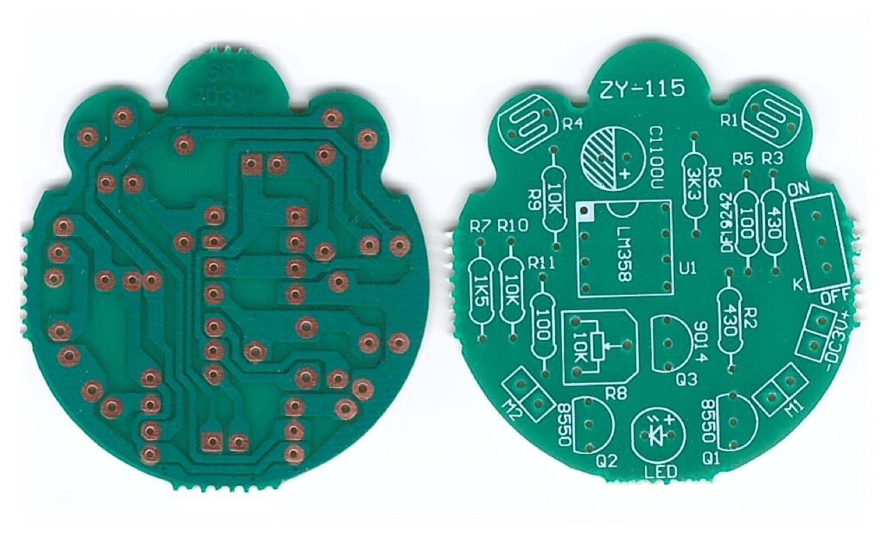

# #798 Firefly Kit

Build and understand the circuit that is used in this common Firefly DIY kit featuring light-activated vibration movement and a pulsating LED.

Here's a quick demo..

## Notes

notes here

### The Kit

The kit (identified as X-CX0174A on the packaging)
is widely available from e-commerce sites. I picked my kit up from a
[seller on aliexpress](https://www.aliexpress.com/item/1005007211407355.html) for SGD$2.87 in Oct-2024. The kit is usually listed as something like
"Photosensitive Mobile Robot Kit Firefly DIY Bulk Tail Breathing Light Fun Electronic Education Training".

The kit includes [instructions](./assets/FireflyKit-instructions.pdf) in Chinese, although
the construction is readily understandable even if you cannot read Chinese.

### Parts

| Item | Component name    | Specification             | Reference  | Quantity |
|------|-------------------|---------------------------|------------|----------|
|    1 | IC                | LM358P                    | U1         | 1        |
|    2 | IC socket         | DIP-8P                    | U1         | 1        |
|    3 | transistor        | S8550                     | Q1 Q2      | 2        |
|    4 | transistor        | S9014                     | Q3         | 1        |
|    5 | LED               | 5mm blue                  | LED        | 1        |
|    6 | capacitor         | 100uF electrolytic        | C1         | 1        |
|    7 | power switch      | 2.54 SPDT                 | K          | 1        |
|    8 | pin header        | 2.54-2P                   | M1 M2 DC3V | 3        |
|    9 | battery holder    | CR2032                    | DC3V       | 1        |
|   10 | Vibration motor   | 10x3mm                    | M1 M2      | 2        |
|   11 | pot               | 10kΩ                      | R8         | 1        |
|   12 | resistor          | 100Ω                      | R5 R11     | 2        |
|   13 | resistor          | 430Ω                      | R2 R3      | 2        |
|   14 | resistor          | 1.5kΩ                     | R7         | 1        |
|   15 | resistor          | 3.3kΩ                     | R6         | 1        |
|   16 | resistor          | 10kΩ                      | R9 R10     | 2        |
|   17 | Photo-resistor    | MG5516                    | R1 R4      | 2        |
|   18 | base              | transparent PVC           |            | 1        |
|   19 | double-sided tape | 3M 20x2.5mm               |            | 2        |
|   20 | heat shrink tube  | 15x7mm                    |            | 2        |
|   21 | wire              | 100mm Red and black       |            | 2        |
|   22 | PCB               | 40x43.2x1.6               |            | 1        |

NB: I didn't need to use the 2.54-2P pin headers.
Not sure why they are included. It seems some versions of the kit do not include them,
and I don't see any built examples with them used either.

### Circuit Design

I've redrawn the schematic with Fritzing: see [FireflyKit.fzz](./FireflyKit.fzz).

### How It Works

The two vibration motors are activated based on the light incident on their respective light-dependent resistor (LDR).
This will cause hte bug to move away from the light source.

The blue LED is pulsed by the LM358 configured as an oscillator.

In theory, the vibration motors and LED circuits operate independently,
but in practice when the motors are activated it drops the battery voltage
sufficiently to turn off the LED.
This may just be true with a partially used battery, but the effect is pleasing.

### Build Log

Construction is quite straight-forward.

The battery, PVC body, and the PCB are sandwiched together with double-sided adhesive pads.

I should probably have replaced the battery wires provided in the kit with something finer,
and routed them more unobtrusively.

Vibration motors are stuck the the legs. They are provided with adhesive backing.

I initially put the heat-shrink around both LDR leads until I thought about it for a second and realised
this was probably a great way to ensure they shorted together.
So I cut them out and have one lead inside the heat-shrink, and one wrapped around the outside.

## Credits and References

* [Photosensitive Mobile Robot Kit Firefly DIY Bulk Tail Breathing Light Fun Electronic Education Training](https://www.aliexpress.com/item/1005007211407355.html) - seller on aliexpress
* [LM358N Datasheet](https://www.futurlec.com/Linear/LM358N.shtml)
