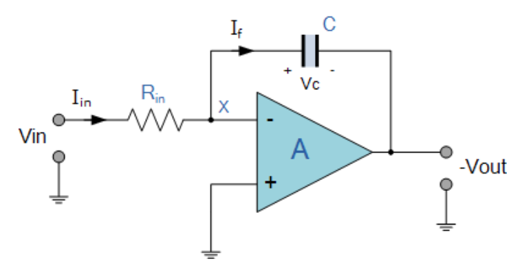
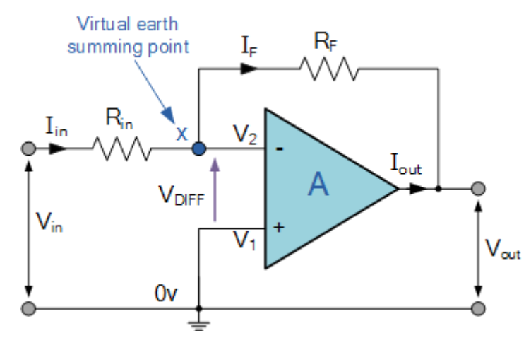

# #053 LM324 Function Generator

Use an Arduino to monitor the behaviour of a low-frequency LM324 OpAmp waveform generator (square,triangle,sine,cosine) and plot the results with [Processing](https://www.processing.org).

## Notes

The circuit uses the 4 OpAmps in an LM324 to drive four waveforms: square,triangle,sine,cosine.

The frequency is designed to be very low, in order to drive output effects visible to the human eye.

### Stage 1: Square Wave Generator

Stage 1 uses an RC network (R4,C1) to generate a low frequency square wave. It can oscillate from about
[0.24Hz](https://www.wolframalpha.com/input/?i=1%2F%282%CF%80+*+20k%CE%A9+*+33%CE%BCF%29)
to about 4Hz by adjusting R4.

    f = 1/(2πRC)
    f = 1/(2π * 20kΩ * 33μF)
    f = 0.24Hz

The non-inverting voltage reference is pegged to Vcc/2 using the R1/R2 voltage divider.
A similar reference voltage is repeated for each OpAmp unit.
Note that the reference voltage is not shared to avoid cross-over problems.

### Stage 2: Triangle Wave Integrator

The square wave from stage 1 is fed to the second stage configured as an [integrating amplifier](https://en.wikipedia.org/wiki/Op_amp_integrator).
This results in a triangle wave.

### Stage 3: Sine Wave Integrator

The triangle wave from stage 1 is fed to the third stage to perform a second [integration](https://en.wikipedia.org/wiki/Op_amp_integrator).
This results in a sine wave.

### Stage 4: Cosine Wave Integrator

To transform the output from stage 3 (sine) to cosine, we use the final OpAmp unit as an inverting amplifier with gain = 1.

### Measured Behaviour

[LEAP#090 PlotNValues (a simple Processing sketch)](../../playground/PlotNValues) reads the data from the serial port and plots the output values over time, with some coloration effects thrown in for good measure. In other words, we're using Arduino and Processing as a basic oscilloscope ... and it kind of works, mainly because the frequency is so low.

The behaviour is demonstrated in the following trace with R4 variable resistor at about 10kΩ.

* Stage 4 (upper trace) is the cosine output
* Stage 3 (upper middle trace) is the sine wave output
* Stage 2 (lower middle trace) is the triangle wave output
* Stage 1 (lower trace) is the square wave output

### Construction

The Arduino only acts as a measurement device in this circuit. For simplicity, the circuit is powered from the Arduino 5V pin.
That works fine, although it is equally possible to use a separate power supply (but ensuring there is a common ground connection).

## Credits and References

* [LM324 Datasheet](https://www.futurlec.com/Linear/LM324N.shtml)
* [Op-amp Astables](https://learnabout-electronics.org/Oscillators/osc42.php)
* [Op-amp Integrator](https://www.electronics-tutorials.ws/opamp/opamp_6.html)
* [integrating amplifier](https://en.wikipedia.org/wiki/Op_amp_integrator) - wikipedia
* [Inverting Operational Amplifier](https://www.electronics-tutorials.ws/opamp/opamp_2.html)
* [instructable for a similar circuit](https://www.instructables.com/id/THE-SIMPLEST-FUNCTION-GENERATOR-BUILT-ON-A-BREADBO/?ALLSTEPS)
* [Download Processing](https://www.processing.org/download/)
