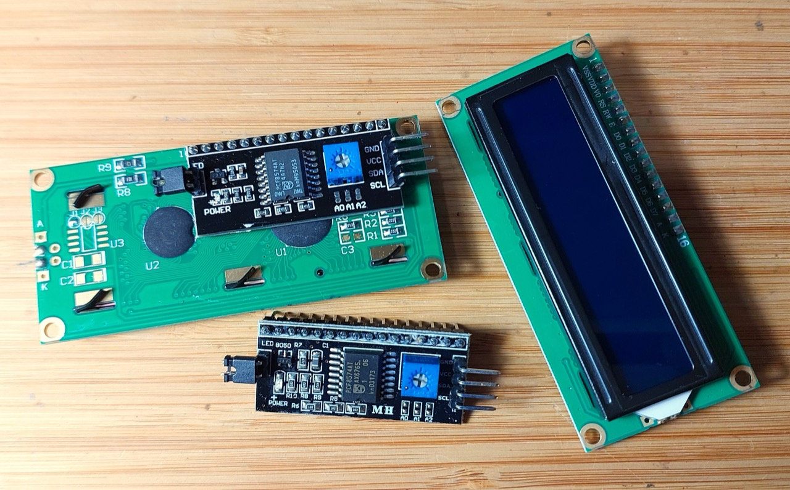

# #749 HD44780-based LCD Modules

All about HD44780-based LCDs, commonly used with microcontrollers to provide 16x1, 16x2, or 20x4 character display output (e.g. QC1602A).

## Notes

Liquid crystal displays (LCD) are commonly used in microcontroller projects.
They are well supported by libraries for most platforms,
but the interface is simple enough to control directly if needed.

### The HD44780

The [HD44780](https://en.wikipedia.org/wiki/Hitachi_HD44780_LCD_controller)
LCD controller is an alphanumeric dot matrix liquid crystal display (LCD) controller developed by Hitachi in the 1980s.
Numerous third-party displays are compatible with its 16-pin interface and instruction set, making it a popular and cheap LCD driver.

The Hitachi HD44780 LCD controller is limited to monochrome text displays and is often used in copiers, fax machines, laser printers, industrial test equipment, and networking equipment, such as routers and storage devices.

Compatible LCD screens are manufactured in several standard configurations. Common sizes are one row of eight characters (8×1), and 16×2, 20×2 and 20×4 formats.

The HD44780 takes care of managing the LCD, and provides a simple 16-pin interface
over which it accepts commands and data for the display

### The HD44780 Interface

HD44780-based LCD controller modules provide a 16-pin interface:

| LCD Pin No. | LCD Pin Name         | Description |
|-------------|----------------------|-------------|
| 1           | Ground (GND)         | Power Supply Ground |
| 2           | VCC                  | Power Supply (+3.3 or +5 V depending on module) |
| 3           | VEE or V0            | Contrast Adjustment (analog input) |
| 4           | Register Select (RS) | Register Select (0 = command, 1 = data) |
| 5           | READ/WRITE (RW)      | Read/Write (0 = write to module, 1 = read from module) |
| 6           | Enable (EN)          | Clock Enable (falling-edge triggered) |
| 7           | Data Bit 0 (DB0)     | Data Bit 0 (not used in 4-bit operation) |
| 8           | Data Bit 1 (DB1)     | Data Bit 1 (not used in 4-bit operation) |
| 9           | Data Bit 2 (DB2)     | Data Bit 2 (not used in 4-bit operation) |
| 10          | Data Bit 3 (DB3)     | Data Bit 3 (not used in 4-bit operation)|
| 11          | Data Bit 4 (DB4)     | Data Bit 4 |
| 12          | Data Bit 5 (DB5)     | Data Bit 5 |
| 13          | Data Bit 6 (DB6)     | Data Bit 6 |
| 14          | Data Bit 7 (DB7)     | Data Bit 7 |
| 15          | LED Positive         | Backlight Anode (+) (if applicable) |
| 16          | LED Negative         | Backlight Cathode (−) (if applicable) |

Note:

* RW will often be hard-wired low (write mode), as usually there is no need to read from the module.
* Display contrast is controlled with the Contrasts/VEE/V0 pin. Options:
    * For adjustable contrast, connect a 10 kΩ variable resistor (pot) between VDD (+5 V) and VSS (GND), with wiper to VEE/V0.
    * If a specific contrast setting is acceptable, use a fixed resistor divider
    * Some LCD modules display acceptable contrast if V0 is tied directly to GND.
    * Temperature Compensation:
        * LCD contrast changes with temperature.
        * Some circuits use a thermistor in place of (or combined with) the pot to automatically adjust contrast.

### LCD I²C Adapters

To simplify integration in larger projects,
LCD display modules are often paired with
dedicated I²C adapters.

See the [LEAP#398 LCD I²C Adapter](../../playground/LCD/I2CAdapter/) for more information and a demonstration or their use.

### 16x2 Display Modules

The [QC1602A](./assets/LCD_QC1602A_datasheet.pdf)
is an example of the 16x2 format display modules.
They come from many manufacturers, but "1602" will often be somewhere in the product name.

The "16x2" refers to the form factor of 16 characters (columns) over 2 lines:

### Arduino Integration

The [LiquidCrystal library](https://github.com/adafruit/LiquidCrystal) works with all LCD displays that are compatible with the Hitachi HD44780 driver.

## Credits and References

* <https://en.wikipedia.org/wiki/Hitachi_HD44780_LCD_controller>
* [HD44780 LCD Display IC Datasheet](https://www.futurlec.com/LED/LCD16X2BLa.shtml)
* [LiquidCrystal library](https://github.com/adafruit/LiquidCrystal)
* [QC1602A datasheet](./assets/LCD_QC1602A_datasheet.pdf)
