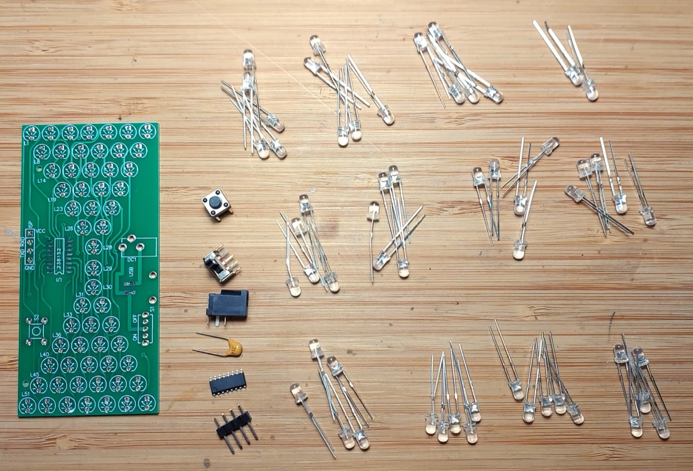
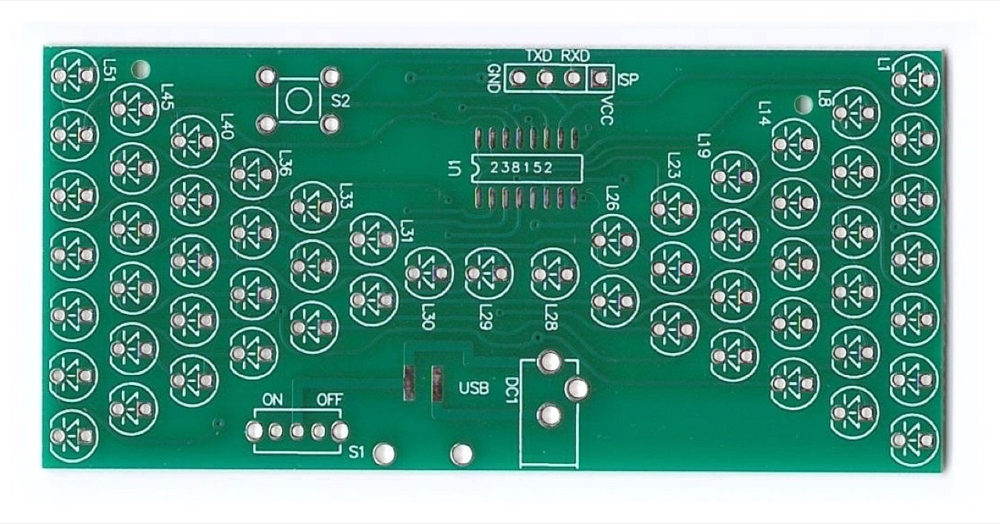
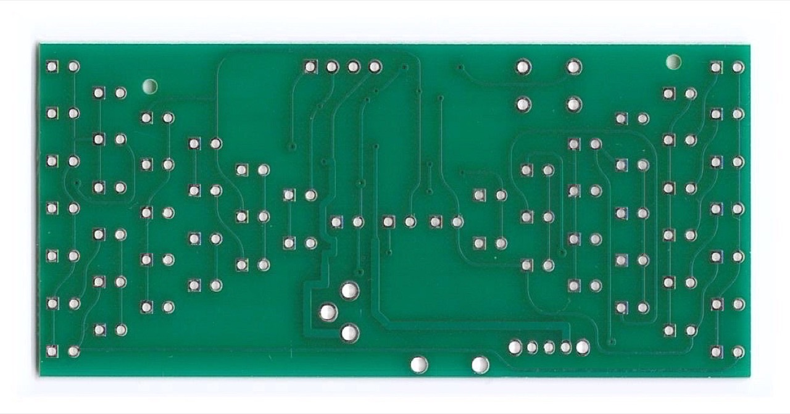
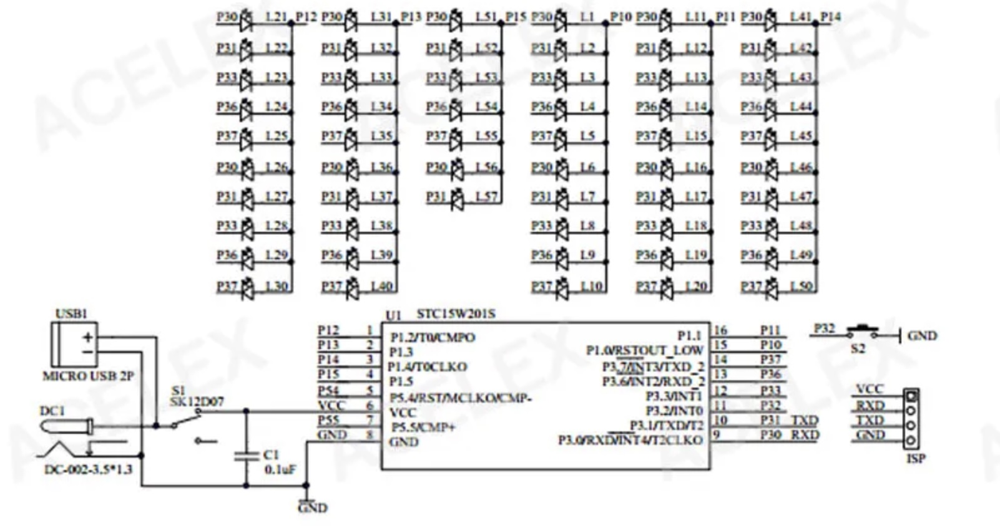

# #xxx Hourglass Kit

description here

Here's a quick demo..

## Notes

notes here

### The Kit

I purchased the kit
["5V Electronic Hourglass DIY Kit Funny Electric Production Kits Precise With LED Lamps Double Layer PCB Board 84*40mm"](https://www.aliexpress.com/item/1005006960085941.html)
from an aliexpress seller for SGD$1.83 in Oct-2024.

| Ref   | Qty | Part                                             |
|-------|-----|--------------------------------------------------|
| U1    | 1   | STC15W204S - Enhanced 8051 microprocessor, SOP16 |
| C1    | 1   | 330nF capacitor                                  |
| ISP   | 1   | 4-pin male header 2.54mm pitch                   |
| L1-57 | 57  | 3mm Blue LED                                     |
| DC1   | 1   | 3.5mm*1.3mm barrel jack (center-positive)        |
| S1    | 1   | SPDT switch.                                     |
| S2    | 1   | push-button micro switch 6x6mm                   |
|       | 1   | PCB                                              |

### Circuit Design

Here is the original schematic posted by some sellers:

The kit appears to have been originally designed to use the STC15W201S (1Kb Flash, 4Kb EEPROM),
but is now shipped with the STC15W204S (4Kb Flash, 1Kb EEPROM).

The power-decoupling capacitor C1 is provided in the kit, but this version of the PCB has no provision for fitting it. I will leave it out and see if there are any issues.

For study purposes I've redrawn the circuit with Fritzing: see [HourglassKit.fzz](./HourglassKit.fzz).

It looks complex, but the circuit is using a pretty clever multiplexing scheme:

* Uses two set of ports:
    * from port 1: P10, P11, P12, P13, P14, P15
    * from port 3: P30, P31, P33, P36, P37
* 2 LEDs are connected with opposite polarity between each pair of ports
    * e.g. L1 & L6 LED pair:
        * L1: anode to P30, cathode to P10
        * L6: cathode to P30, anode to P10
        * so L1 is ON if +ve to P30 and -ve to P10. L6 is OFF in this case
        * and L6 is ON if +ve to P10 and -ve to P30. L1 is OFF in this case
        * L1, L6 are both OFF if there is no voltage differential between P10 and P30
* In total, this allows for 6*5 = 60 LEDs to be individually addressed by applying the appropriate +/- voltage to the pair of ports
    * as the hourglass design only needs 57 LEDs, there are 3 possible port combinations that are not provisioned.

### Build Log

Its a nice soldering practice - nothing complicated. Even the SOP16 is a good exercise and quite easy by hand.

I started with the microprocessor and then soldered all the other components before adding the LEDs:

I tested each LED before soldering to the board.
All were fine, but I've had too many experiences in the past with faulty LEDs in cheap kits.

The finished kit ready to test.

The board can be powered with 5V in a number of ways:

* via the barrel jack (as I'm doing)
* with power lines soldered to the "USB" pads
* with a mini/micro USB adapter soldered the the USB pad
* or via the VCC/GND pins on the ISP header (but these bypass the power switch)

### Operation

The factory animation depicts an hourglass with the LEDs from the "top" gradually falling to the "bottom".
The push-button controls the speed of the hourglass animation (4 speeds).

### Next Steps: Programming and Features

I've seen that the programming of this device has been pretty well investigated and documented, for example see <https://github.com/Rick-100/STC-hourglass-kit>.

I plan to return to look at the source code and tackle programming with custom patterns in the future.

Another obvious enhancement would be to add a tilt switch to allow resetting the "hourglass" by inverting it.

## Credits and References

* ["5V Electronic Hourglass DIY Kit Funny Electric Production Kits Precise With LED Lamps Double Layer PCB Board 84*40mm"](https://www.aliexpress.com/item/1005006960085941.html) - aliexpress
* [STC15W204S series](https://www.stcmicro.com/stc/stc15w204s.html)
* <https://github.com/Rick-100/STC-hourglass-kit>
