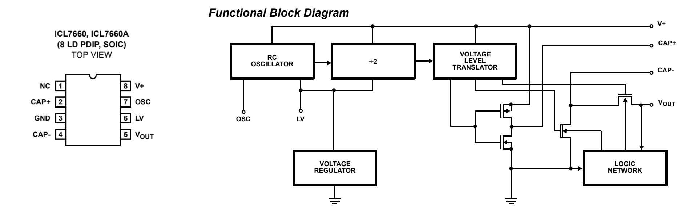
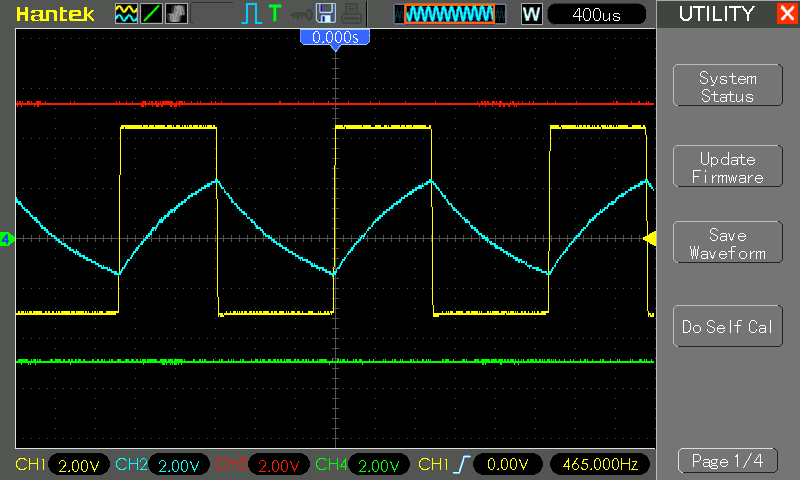

# #xxx ICL7660

About the ICL7660 CMOS Voltage Converter, and testing its use to convert a +5V supply to a ±5V supply.

## Notes

The ICL7660 is a CMOS charge-pump voltage converter IC designed to invert, double, or divide a positive input voltage, enabling efficient generation of negative or doubled outputs from a single positive supply.

It operates across a wide input voltage range of 1.5V to 10V (or 12V for the ICL7660A variant) and requires only two external capacitors for basic operation, making it ideal for low-current applications such as battery-powered devices, op-amp power supplies, and dynamic RAM systems. By leveraging a built-in oscillator (typically 10kHz) to alternate charge transfer between capacitors, it achieves high power efficiency (up to 98%) and open-circuit voltage conversion efficiency of 99.9%.

The IC is commonly used to generate negative rails (e.g., -5V from +5V) for analog circuits, LCD biasing, or data acquisition systems, though its output current is limited to 20–40mA depending on configuration. While simple to implement, it may introduce voltage ripple due to its switching mechanism, a trade-off for its compact design and minimal component requirements. Available in DIP-8 or SOIC-8 packages, the ICL7660 remains a cost-effective solution for applications needing dual or inverted voltages without complex circuitry.

NOTE: the ICL7660 is now officially end-of-life, although it is still widely available.

The
[ICL7660 datasheet](https://www.renesas.com/en/document/dst/icl7660-datasheet)
provides details of a range of possible circuits, including:

* Simple Negative Voltage Converter
* Positive Voltage Doubling
* Combined Negative Voltage Conversion and Positive Supply Doubling
* Voltage Splitting
* Regulated Negative Voltage Supply

Further information and other applications are covered in
[AN051 Principals and Applications of the ICL7660 and ICL7660A CMOS Voltage Converter](https://www.renesas.com/en/document/apn/an051-principles-and-applications-icl7660-cmos-voltage-converter)

### Circuit Design

The most basic and common use of the ICL7660 is to convert a +5V supply to a ±5V supply.

A few key points about using the ICL7660:

* The LV pin may be tied to GROUND to bypass the internal series regulator and improve low voltage operation when V+ <3.5V.
* The charge pump operates at a nominal 10kHz. The OSC pin can be used to alter the frequency to suite the application:
    * lower the frequency with a capacitor between OSC and V+, and a corresponding increase in the value of C1 and C2
    * increase the frequency with an external clock source

Testing the +V and -V rails with multimeters. No load, and it pretty perfectly mirrors the voltage:

### Demonstration - Driving a Dual-supply OpAmp

As a simple demonstration,
I've added an UA741 op-amp powered from the dual ±5V rails,
configured as a square wave oscillator,
similar to
[LEAP#039 Astable Opamp Oscillators](../Oscillators/AstableOpamp/).

With R1=10kΩ and R2=10kΩ, ß=[0.5](https://www.wolframalpha.com/input?i=10k%CE%A9%2F%2810k%CE%A9%2B10k%CE%A9%29)
so the expected frequency of oscillation is
[455.1Hz](https://www.wolframalpha.com/input?i=1%2F%282*100nF*10k%CE%A9*ln%28%281%2B0.5%29%2F%281-0.5%29%29%29)

We are recording 465Hz, which is nicely close to the prediction.
Note: component values matter, especially for C3 ceramic capacitor which can be far from nominal value.

In the scope trace:

* CH1 (Yellow) - `OSC_OUT`
* CH2 (Blue) - capacitor C3 charge
* CH3 (Red) - tracking V+
* CH4 (Green) - tracking V-

## Credits and References

* [ICL7660 datasheet](https://www.renesas.com/en/document/dst/icl7660-datasheet)
* [AN051 Principals and Applications of the ICL7660 and ICL7660A CMOS Voltage Converter](https://www.renesas.com/en/document/apn/an051-principles-and-applications-icl7660-cmos-voltage-converter)
* [UA741CN datasheet](https://www.ti.com/lit/ds/symlink/ua741.pdf)
