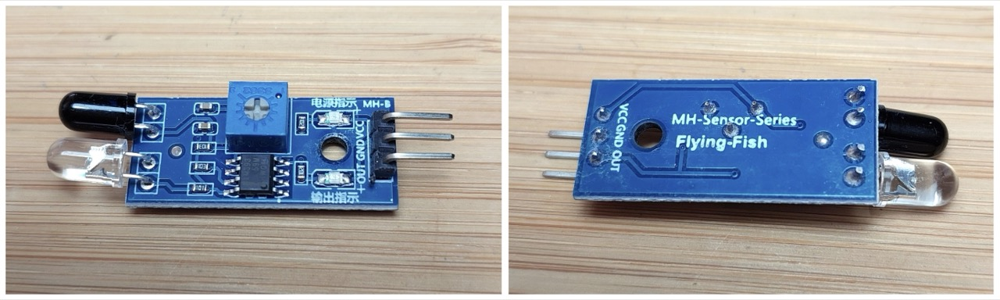
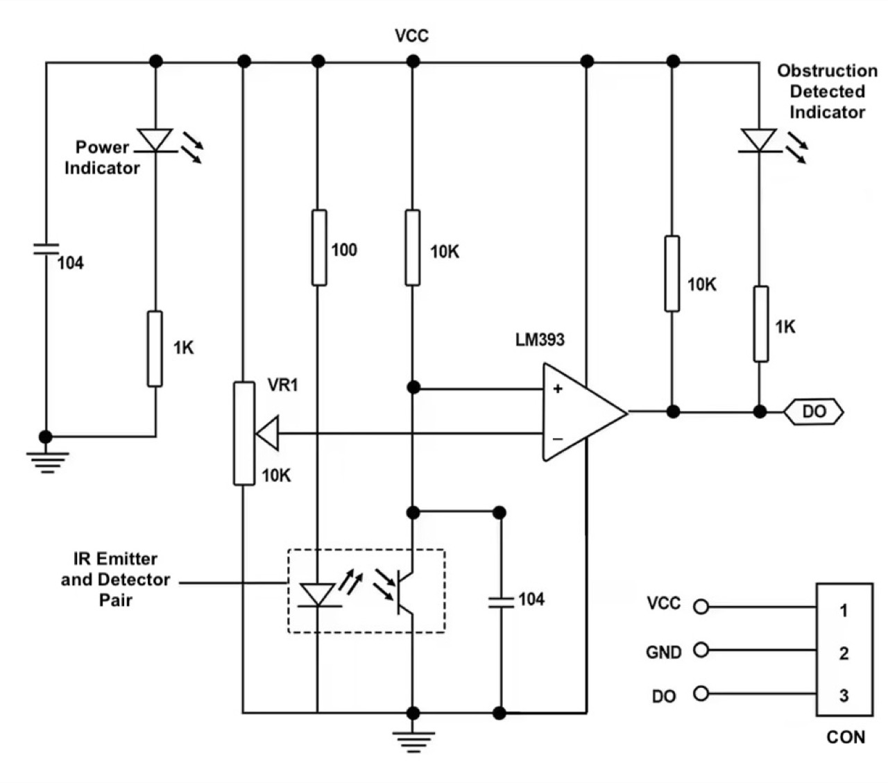
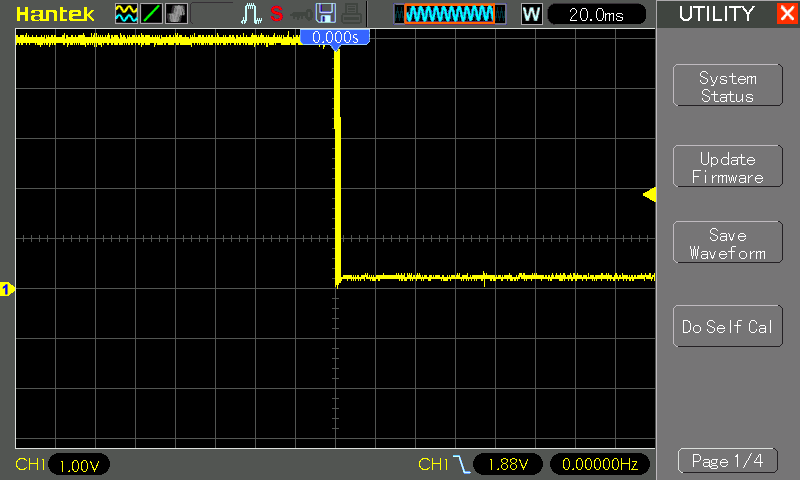
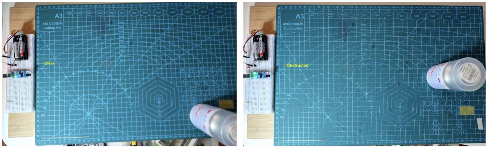
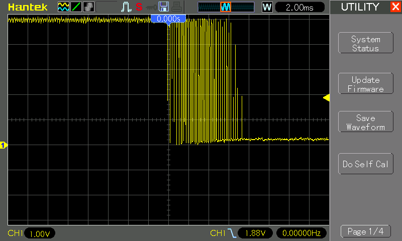
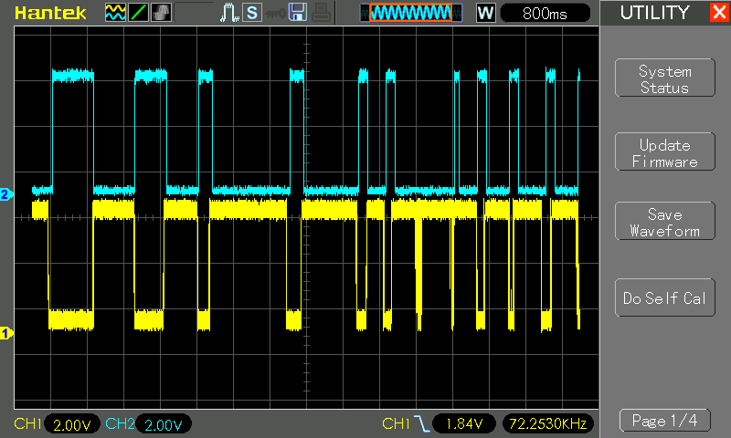

# #806 FC-51 IR Obstacle Avoidance Sensor Module

Testing a common infrared obstacle avoidance sensor module, and reviewing the behaviour of the LM393-based comparator circuit when used directly or with a microcontroller (Arduino). Includes suggestions for practical use.


## Notes

This is a common infrared obstacle avoidance sensor module, often referred to as the "FC-51", "MH-B" or with the branding "MH-Sensor-Series Flying-fish".
As yet, I've been unable to determine the original designer or manufacturer of the modules.
They are widely available - I purchased the module used here from an
[aliexpress seller](https://www.aliexpress.com/item/1005006385279953.html) for SG$1.03 in Dec-2025.



### Specifications

I haven't found an original datasheet for the module, however all sellers provide a similar details.

Product Description:

* Product name: infrared obstacle avoidance module (from 2 to 30cm adjustable)
* Product size: 31.3mm X 14.2mm X 6.6mm (length x width x height)
* Board color: blue
* Product weight: 3.42g (including packaging)

Use:

* When no obstacle detected:
    * OUT port level is high (5V)
    * green obstacle detector LED is off
* When no obstacle detected, circuit board on the green light is lit, the OUT port at the same time
    * OUT port level is low (0V)
    * green obstacle detector LED is on
* Obstacles can be detected from 2-30cm, with a 35° maximum angle of detection
* Detection distance can be adjusted with the potentiometer:
    * clockwise increases the detection distance
    * counter-clockwise reduces the detection distance
* Detection is performed with active infrared reflection, therefore the reflectivity, size and shape of the target will affect the detection range.
* The sensor module output port OUT can be directly connected to the microcontroller I/O port, can also direct drive a 5V relay for example
* Uses an LM393 comparator
* Can use 3.3V to 5V DC power. When powered, the power indicator LED will be on.

Module schematic:



The LM393 is used in simple comparator mode without feedback. It compares the received IR signal with the threshold set with the potentiometer. LM393 package details:


### Initial Module Tests

Although primarily intended to be used with a microcontroller, the module provides a binary signal that could be used in any appropriate circuit.

The output has a built-in 10kΩ pull-up and output indicator LED, so the main concern is to provide a relatively high-impedance load so as to avoid floating the output between states.

For initial testing with the module, I have added an external nFET to drive a "clear" indicator LED:

| Obstacle | Built-in LED | External LED |
|----------|--------------|--------------|
| Clear    | OFF          | ON           |
| Detected | ON           | OFF          |

Designed with Fritzing: see [fc-51-basic-test.fzz](./fc-51-basic-test.fzz).


Setup on a breadboard. This is the "clear" state (nothing detected):


A scope trace showing a series of object occlusions.
The first few at close range show clear on/off transitions,
but the 5th showing oscillation as I try I test at maximum range.


Transition captured at close range:



When set for long range, I can still get reliable object detection up to about 30cm within a cone of about
[35˚](https://www.wolframalpha.com/input?i=2+*+tan%5E-1%2810%2F32%29+in+degrees):



However, at long range, there can be significant crossover oscillation:



### Using the Module with an Arduino

Most people are probably using this module with a microcontroller.
Let's do some simple tests with an Arduino:

* detector powered from the Arduino 5V rail
* detector output connected to Arduino pin 2, as this supports hardware interrupts
* the built-in LED on pin 13 is used to indicate detector state

Designed with Fritzing: see [fc-51-sensor-module.fzz](./fc-51-sensor-module.fzz).


Setup with a breadboard to facilitate connecting a scope to the signals:


### The Sketch

The sketch implements a simple hardware interrupt-driven scheme
but with hysteresis to avoid crossover oscillation:

* an on-change interrupt sets a `detector_flag`
* the `getDetectorState` function
    * reads a new detector state if a change has been flagged since the last call
    * returns the current detector state
* the main loop polls the detector state every 100ms.

See [fc-51-sensor-module.ino](./fc-51-sensor-module.ino):

```c
/*

  FC-51 IR Obstacle Avoidance Sensor Module Demo

  For info and circuit diagrams see https://github.com/tardate/LittleArduinoProjects/tree/main/Electronics101/IR/fc-51-sensor-module

 */

const int LED_PIN = 13;
const int DETECTOR_PIN = 2;
const int DELAY = 100;
volatile bool detector_flag = HIGH;
bool detector_state = LOW;

/*
 * On detector trigger, set flag
 */
void detectorInterrupt() {
  detector_flag = HIGH;
}

/*
 * Return the current detector state. HIGH - obstacle detected, LOW - no obstacle
 * Reads new value if a change has been detected
 */
bool getDetectorState() {
  if (detector_flag) {
    detector_state = !digitalRead(DETECTOR_PIN);
    detector_flag = LOW;
  }
  return detector_state;
}

/*
 * Command: one-time setup
 */
void setup() {
  pinMode(LED_PIN, OUTPUT);
  pinMode(DETECTOR_PIN, INPUT);
  attachInterrupt(digitalPinToInterrupt(DETECTOR_PIN), detectorInterrupt, CHANGE);
}


/*
 * Command: main loop
 */
void loop() {
  digitalWrite(LED_PIN, getDetectorState());
  delay(DELAY);
}
```

### Arduino Test Results

Capturing the behaviour on a scope:

* CH1 (Yellow) - detector output (offset -5V)
* CH2 (Blue) - Arduino output pin13 (offset +1V)

One can see the sketch effectively dampening the response:



### Conclusions

The FC-51 (or similar) modules are simple and quite effective. The circuit uses basic components and can easily be made oneself, but probably not cheaper!

From tests:

* When set for short range detection (under 20cm), detection transitions are generally quite clean
* When set for long range detection (up to 30cm and beyond), there can be significant crossover oscillation

Practical considerations:

* Use the shortest range detection possible to ensure clean transitions
* For longer range detection, may need dampening or de-bouncing in hardware or code to avoid ringing/oscillation at transition
    * or better yet, redo the circuit with feedback, as explained in [LEAP#803 LM339 Inverting Comparator](../../LM339/InvertingComparator/)
* I did note that sunlight and even bright LED lamps can interfere with the reading. One may need to shield from light outside the cone of focus.

## Credits and References

* Example aliexpress sellers:
    * ["FC-51 IR Infrared Obstacle Avoidance Sensor Module for Smart Car Robot"](https://www.aliexpress.com/item/1005006244747703.html)
    * ["IR Infrared Obstacle Avoidance Sensor Module For Arduino DIY Smart Car Robot 3-wire Reflective Photoelectric New"](https://www.aliexpress.com/item/1005006385279953.html)
* [LM393](http://www.ti.com/product/LM393) Dual Differential Comparator
