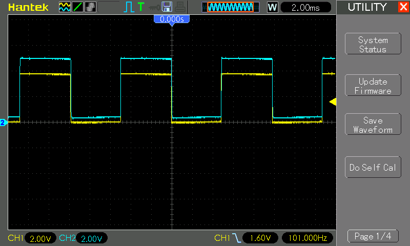
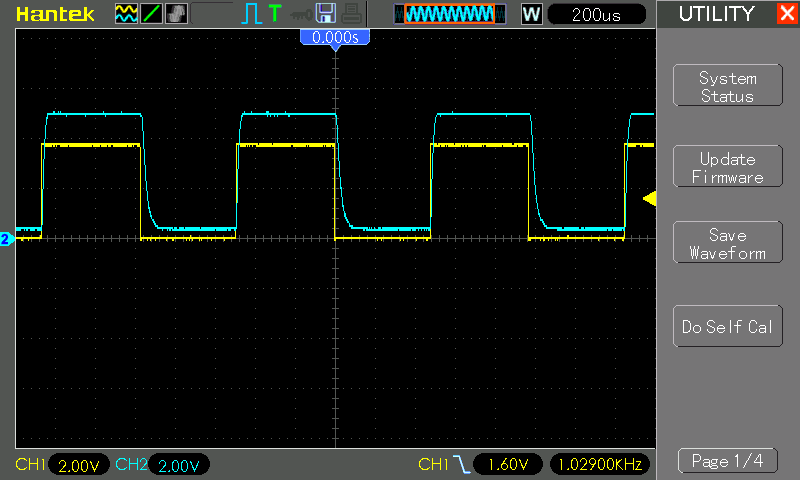
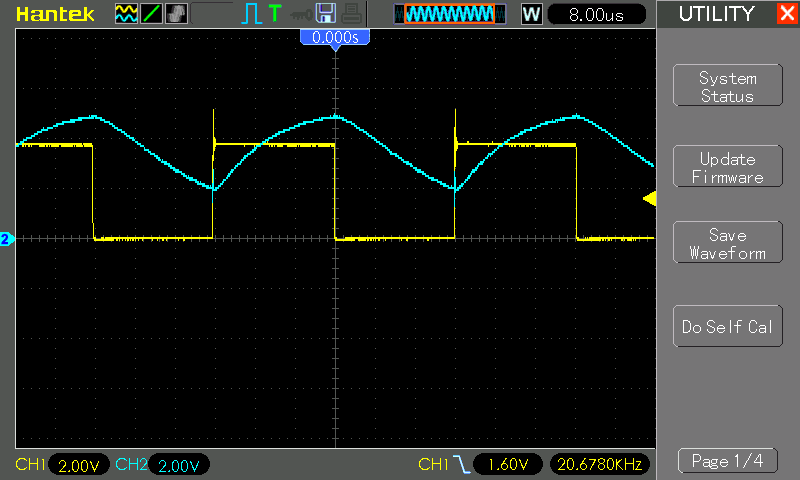
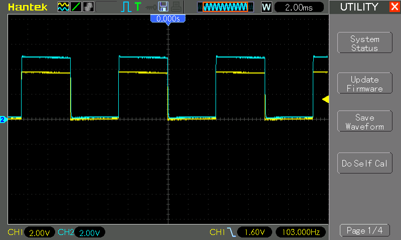
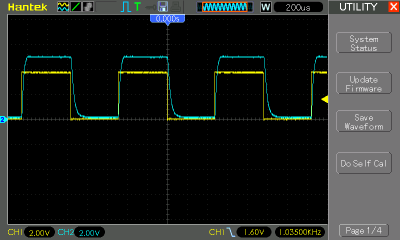
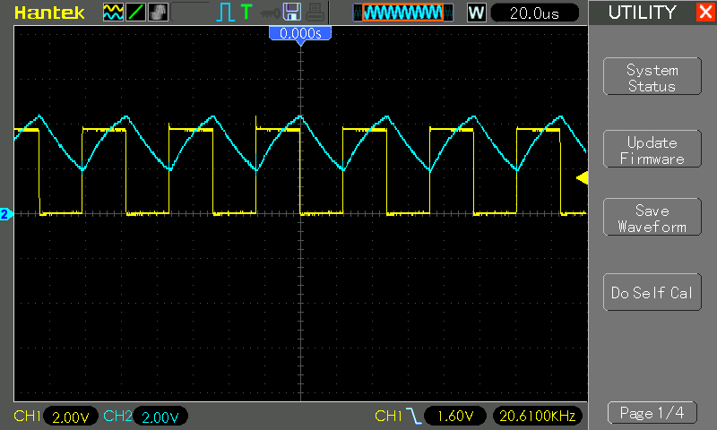

# #800 IR Photodiodes

Investigating and testing infrared (IR) transmission between IR LEDs and IR photodiodes.

## Notes

Infrared transmitters (LEDs) and receivers (photodiodes) are widely available in 3mm and 5mm through-hole tuned for 850nm or 940nm
for example from [this aliexpress seller](https://www.aliexpress.com/item/1005003324844421.html).

See also
[The Art of Electronics](../../../books/the-art-of-electronics/)
12.6.1 Photodiodes and phototransistors (3rd Edition).

### IR LEDs (Infrared Light-Emitting Diodes)

What they do:

* Emit light in the infrared spectrum (typically 850–950 nm).
* Similar to visible LEDs but optimized for IR output.
* Can be clear or tinted; clear lenses allow more efficient IR emission.

Key points:

* Forward-biased → emits IR photons
* Narrow spectral range, often centered near ~940 nm
* Very fast switching (tens of MHz for good emitters)
* Used as transmitters in sensing or communication systems

### IR Photodiodes

What they do:

* Detect IR light and convert it into an electrical signal.
* Photodiodes operate in **photovoltaic** (solar-cell-like) or **photoconductive** (reverse-biased, fast) mode.
* **Phototransistors** are more sensitive but slower (because of internal gain).

Key points:

* Reverse-biased → produces current proportional to incident IR light
* Spectral response typically matches IR LED wavelengths (850–950 nm)
* Clear packages maximize sensitivity
* Phototransistor variants provide higher gain at the cost of speed

### Summary

| Feature          | IR LED         | IR Photodiode | IR Phototransistor |
| ---------------- | -------------- | ------------- | ------------------ |
| Function         | Emit           | Detect        | Detect (amplified) |
| Biasing          | Forward        | Reverse       | Reverse            |
| Speed            | Very fast      | Very fast     | Moderate           |
| Sensitivity      | N/A            | Low–Medium    | High               |
| Use as detector? | Yes (weak)     | Yes           | Yes                |

### Typical applications

* remote controls
* IR data communication (IrDA, legacy systems)
* Proximity sensors
* Break-beam detectors
* IR interlocks
* Night-vision illumination (CCTV, security cameras)
* Optical encoders (quadrature disks, motor feedback)
* Line-following robots
* Gesture sensors
* Optical flame and smoke detectors
* Barcode scanners

### Circuit Design

The test circuit is a simple setup between transmitter and receiver:

* a square wave generator drives an IR LED
    * I am using [LEAP#791 555 Breadboard Pulse Generator](../../555Timer/BreadboardPulseGen/) for this (not shown in the schematic)
* the voltage across the IR Photodiode is traced with an oscilloscope

Designed with Fritzing: see [ir-photodiodes.fzz](./ir-photodiodes.fzz).

Testing on a breadboard:

* the clear component is the IR LED transmitter. It is used like other LEDs.
* the black component is the IR photodiode receiver. It is used "reverse-biased".

### Testing with 5mm Components

The following scope traces show test results at varying frequencies:

* CH1 (Yellow) - input square wave
* CH2 (Blue) - IR photodiode voltage response

At 100Hz, we see a perfect reproduction at the receiver:

At 1kHz, we see some slew appearing at the receiver:

At 20kHz, the received signal is significantly distorted:

### Testing with 3mm Components

The following scope traces show test results at varying frequencies:

* CH1 (Yellow) - input square wave
* CH2 (Blue) - IR photodiode voltage response

At 100Hz, we see a perfect reproduction at the receiver:

At 1kHz, we see some slew appearing at the receiver:

At 20kHz, the received signal is significantly distorted:

## Credits and References

* [100Pcs 3mm 5mm IR LED Diode Transmitter Receiver 850nm 940nm Infrared Photodiode Phototransistor Emitter Lights Emitting Bulb](https://www.aliexpress.com/item/1005003324844421.html)
* [The Art of Electronics](../../../books/the-art-of-electronics/) 12.6.1 Photodiodes and phototransistors (3rd Edition).
* <https://en.wikipedia.org/wiki/Photodiode>
* <https://www.build-electronic-circuits.com/photodiode/>
* <https://www.electronics-tutorials.ws/diode/photodiode.html>
