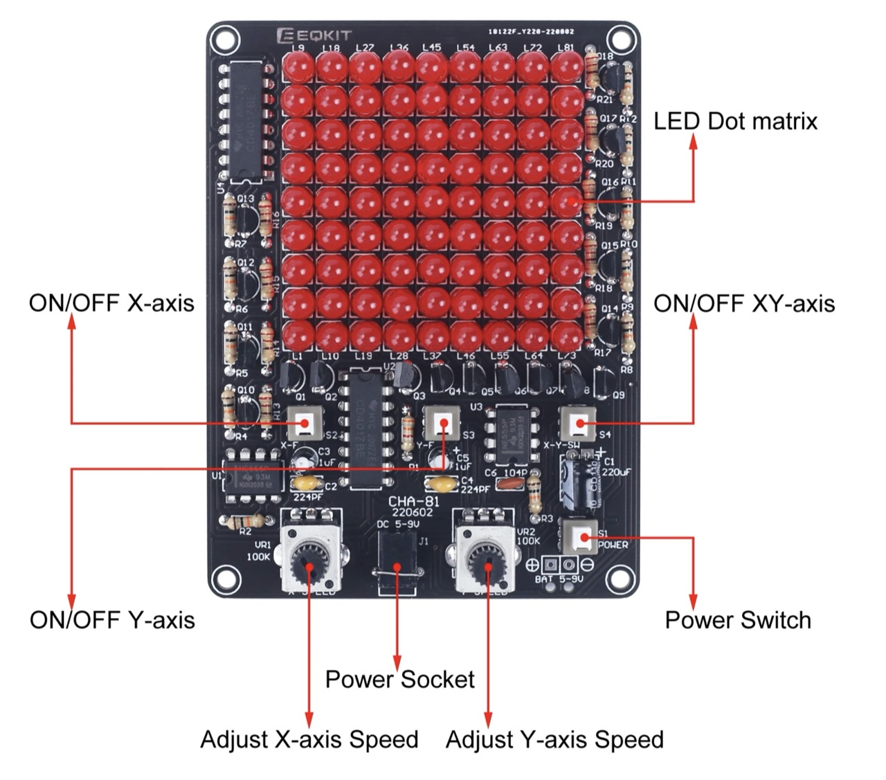
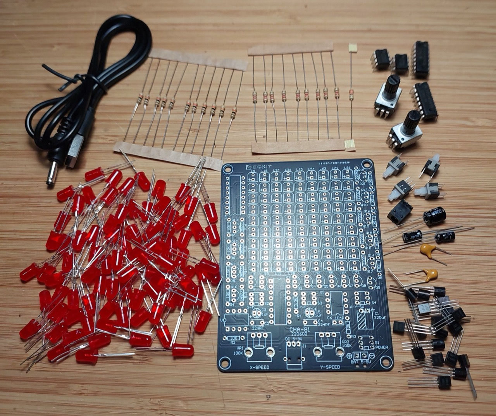
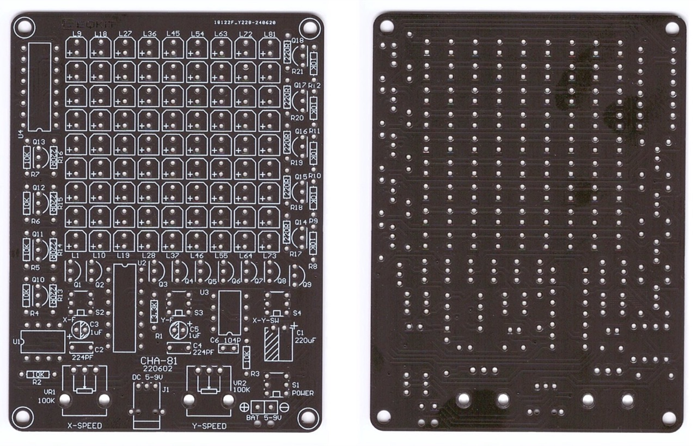

# #818 CHA-81 LED Matrix Soldering Kit

Building the CHA-81 LED Matrix Soldering Kit and investigate the principles of operation. A simple design that offers endless hours of fiddling!

Here's a quick demo..

## Notes

I first saw this kit on [Julian Ilett's YouTube channel](https://www.youtube.com/watch?v=7o8EXDWuFkw) (see video links below)
and immediately had to find one to play with!

The kit basically runs an X and Y ripple counters that drive a 9x9 LED array.
Speed adjustment and directional controls make this a wonderful time-sink.

I suspect it may originally be a design from [ICStation](https://www.icstation.com/mobile/follow-spot-lights-light-chaser-game-electronic-soldering-practice-learning-p-16018.html)

### Kit Details

I found
["CHA-81 DC5-9V LED Tracking Light DIY Parts Electronic Production Kit 9X9 Dot Matrix Display" (aliexpress seller listing)](https://www.aliexpress.com/item/1005004655634360.html), purchased for SG$4.78 (Dec-2025).

Specifications as provided by the seller:

> 1. Introduction:
>
> CHA-81 is a LED Follow Spot Lights LED Game DIY Kit. It can make the LED move along the X-axis/Y-axis/XY-axis, and the moving direction can be controlled by the buttons. It can also adjust the speed of the LED movement, resulting in a variety of LED blinking effects.
>
> It is a very interesting DIY electronic product which enables users to understand the circuit more clearly and learn welding skills.
>
> 1. Feature:
>
>     1. 81pcs highlight Red LED
>     2. Controllable movement direction for X-axis/Y-axis/XY-axis
>     3. Controllable movement speed for X-axis/Y-axis
>     4. Simulate LED light game tracking effect
>     5. Perfect simple circuit
>     6. DIY hand soldering
>
> 2. Parameter:
>
>     1. Product Name: CHA-81 LED Follow Spot Lights LED Game DIY Kit
>     2. Product Number: CHA-81
>     3. Work Voltage: DC 4.5V-9.0V
>     4. Power Type: 3.5mm Power Socket
>     5. Color: Red LED
>     6. Size(Installed): 97x73x24mm

### Kit Parts

| No.| Component Name          | PCB Marker  | Parameter   | Quantity |
|----|-------------------------|-------------|-------------|----------|
| 1  | Metal Film Resistor     | R13-R21     | 220Ω        | 9        |
| 2  | Metal Film Resistor     | R1          | 3.3kΩ       | 1        |
| 3  | Metal Film Resistor     | R2-R12      | 10kΩ        | 11       |
| 4  | Potentiometer           | VR1, VR2    | 100kΩ       | 2        |
| 5  | Ceramic Capacitor       | C6          | 0.1µF 104   | 1        |
| 6  | Monolithic Capacitor    | C2,04       | 0.22µF 224  | 2        |
| 7  | Electrolytic Capacitor  | C3,C5       | 1µF 50V     | 2        |
| 8  | Electrolytic Capacitor  | C1          | 220µF 16V   | 1        |
| 9  | Red LED                 | L1-L81      | 5mm         | 81       |
| 10 | S9014 Transistor        | Q1-Q18      | TO-92       | 18       |
| 11 | Self-locking Switch     | S1-S4       | 5.8*5.8mm   | 4        |
| 12 | DC Socket               | 3.5mm       |             | 1        |
| 13 | CD4017                  | U2,U4       | DIP-16      | 2        |
| 14 | NE555                   | U1,U3       | DIP-8       | 2        |
| 15 | USB to 3.5mm Power Wire |             | 80cm        | 1        |
| 16 | PCB                     |             | 97x73x1.6mm | 1        |

### Circuit Design

I haven't re-drawn the circuit, but I did verify that the following schematic
from ICStation appears to be correct for the board.

How does it work? The essence:

* The two 555 timers (U1, U3) are configured as astable oscillators
    * the associated variable resistor (VR1/VR2) adjusts the frequency
    * the associated push-button (S2/S3) selects the timing capacitor
    * Resulting frequency ranges:
        * [6.9 Hz](https://visual555.tardate.com/?mode=astable&r1=10&r2=100&c=1) - [144 Hz](https://visual555.tardate.com/?mode=astable&r1=10&r2=0&c=1)
        * [31 Hz](https://visual555.tardate.com/?mode=astable&r1=10&r2=100&c=0.22) - [655 Hz](https://visual555.tardate.com/?mode=astable&r1=10&r2=0&c=0.22)
* The timers provide the clock for their associated CD4017 counter
* CD4017 U2 outputs sequentially enable the LED "rows" with a high-side NPN
    * NB: because the overall current is limited by the 220Ω resistor in the LED column, there is no resistor required on the NPN base
* CD4017 U4 outputs sequentially enable the LED "columns" with a low-side NPN
* At any given moment, the LED that is on ON is the one at the intersection of the enabled U2 and U4 outputs
* Pushbutton S4 changes how U4 is clocked. It switches between:
    * 555 timer U3 output
        * i.e. row and column speed are independently controlled
    * CD4017 U2 reset
        * i.e. raster mode. CD4017 U4 increments every time CD4017 U2 rolls-over

### Build

Soldering was a pleasurable couple of hours.

The kit was packed with an extra S9015 and a handful of extra LEDs, but
these weren't needed as everything worked as expected.

## Credits and References

* ["CHA-81 DC5-9V LED Tracking Light DIY Parts Electronic Production Kit 9X9 Dot Matrix Display" (aliexpress seller listing)](https://www.aliexpress.com/item/1005004655634360.html)
    * Originally purchased for SG$4.78 (Dec-2025)
* [ICStation](https://www.icstation.com/mobile/follow-spot-lights-light-chaser-game-electronic-soldering-practice-learning-p-16018.html) - possibly the original kit source
* Component information:
    * [CD4017 datasheet](https://www.futurlec.com/4000Series/CD4017.shtml)
    * [NE555 datasheet](http://www.ti.com/lit/ds/symlink/ne555.pdf)
    * [S9014 datasheet](https://www.futurlec.com/Transistors/S9014.shtml)

### Julian Ilett's Investigation of the Kit

#### Led Matrix Soldering Kit (YouTube)

#### What it Does - LED Matrix DIY Soldering Kit CHA-81 (YouTube)

