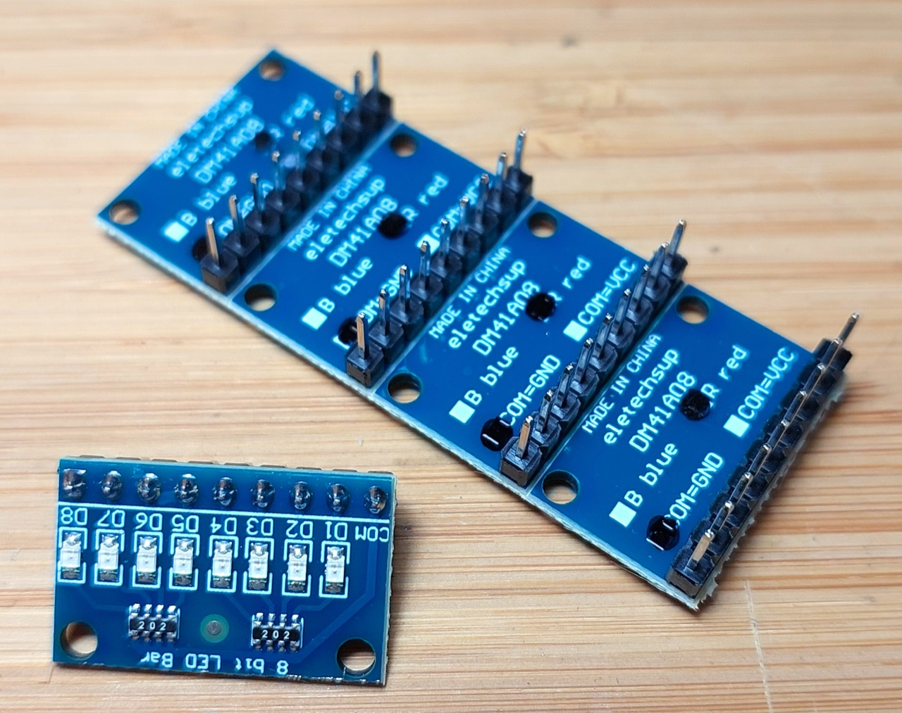

# #752 LED Breadboard Modules

Testing some 8x Red LED common-cathode modules, making breadboarding with LEDs much more fun!

## Notes

How often do you find yourself wiring up a series of LEDs on a breadboard, along with current limiting resistors?
I'd thought about making a simple module, but of course the job has already been done:
I found some suitable units on [aliexpress](https://www.aliexpress.com/item/1005004567063273.html):

* choice of red and blue LEDs
* choice of common-cathode and common-anode configurations
* fitted with 2kΩ current limiting resistors for each LED, allowing a voltage range of 3-24V
* 8 LEDs
* 9 pins, in-line at 2.54mm pitch (breadboard compatible)

Perhaps the only improvement I can think of would be to make a version with a pin configuration that could be plugged directly into an Arduino.

### Circuit Design

As a test, I'll just blink them with a 555 timer
at around [0.69 Hz](https://visual555.tardate.com/?mode=astable&r1=1&r2=47&c=22).

I have the common-cathode module, so COM goes to ground, and a positive signal is required on the LED input.

## Credits and References

* [3-24V 8 Bit Blue/Red Common anode/cathode LED indicator Module Breadboard starter kit Board for MCU ARM 3d printer UNO MEGA2560](https://www.aliexpress.com/item/1005004567063273.html)
