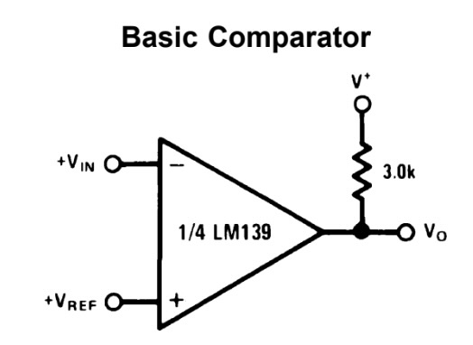
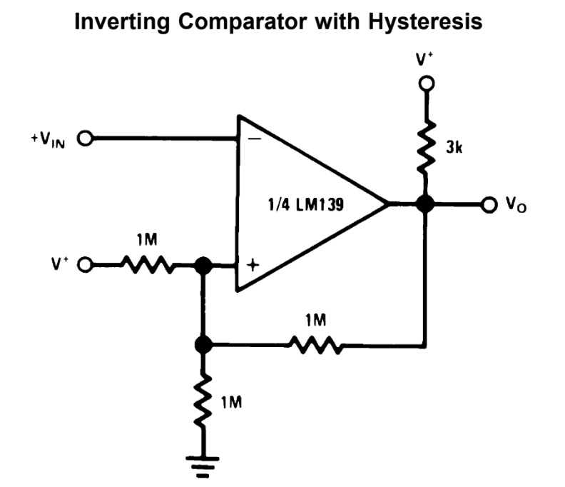

# #803 LM339 Inverting Comparator

Testing the LM339 when used as an inverting comparator, and the effect of positive feedback (hysteresis) to prevent oscillations at the crossing point.

## Notes

In [LEAP#802](../NonInvertingComparator/) I covered the LM339 non-inverting comparator configuration. Let's now cover the inverting configuration.
It is trivial to use in its basic comparator role:

In this project however, I'm going to test the effect of adding positive feedback (hysteresis) to prevent oscillations at the crossing point.

See [LEAP#802 LM339 Non-inverting Comparator](../NonInvertingComparator/) for more details and general design recommendations concerning the LM339.

### Circuit Design - Without Feedback

First let's try this without feedback/hysteresis:

* input is a sine wave from a signal generator, 4V peak-peak, 2.5V offset
* inverting comparator configuration
    * i.e. input signal goes to IN-, reference to IN+
* input clamps to prevent negative voltage excursions
* all unused pins tied to ground
* adjustable Vref

Designed with Fritzing: see [InvertingComparator.fzz](./InvertingComparator.fzz).

Setup on a breadboard:

This is actually working quite well. Looking at some oscilloscope traces where:

* CH1 (Yellow) - input signal
* CH2 (Blue) - output signal
* CH3 (Red) - input signal at IN1-, after input attenuation resistor (Rin)
* CH4 (Green) - Vref

At 10Hz, things look good at the macro scale:

But if we zoom in on the falling edge, we see ringing:

Same for the rising edge:

Bumping up the input frequency to 50kHz, we no longer have output oscillation, although the slew is starting to show in the output:

Zooming in on the falling edge, still looking good:

### Circuit Design - With Feedback

Adding feedback:

* circuit as before
* adding adjustable positive feedback (hysteresis) with a 500kΩ pot

Designed with Fritzing: see [InvertingComparatorWithFeedback.fzz](./InvertingComparatorWithFeedback.fzz).

Setup on a breadboard:

Let's take a look at the results.

With minimum feedback (Rfb = 500kΩ) at 10Hz,
things still look good at macro scale, although I could probably do with a much larger Rfb compared to Vref voltage divider in order to minimise the hysteresis.

Zooming in on the rising and falling edges,
we can see the ringing is no longer present:

At 50kHz, things are still good without ringing:

As we crank up the feedback (reducing Vfb),
we shift the output trigger point, effectively introducing a phase shift.

### Conclusion

With an inverting comparator configuration,
ringing is seen on rising and falling edges especially at low frequencies.
At higher frequencies, the problem can disappear.

Adding a little positive feedback (hysteresis) fixes the problem.
If too much feedback is introduced, there can be significant hysteresis in the output, effectively a phase shift.

## Credits and References

* <https://en.wikipedia.org/wiki/Comparator>
* [LM339 Datasheet](https://www.futurlec.com/Linear/LM339N.shtml)
* [1N4148 Datasheet](https://www.futurlec.com/Diodes/1N4148.shtml)
* [LEAP#802 LM339 Non-inverting Comparator](../NonInvertingComparator/)
