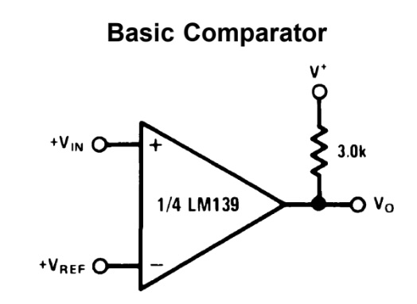
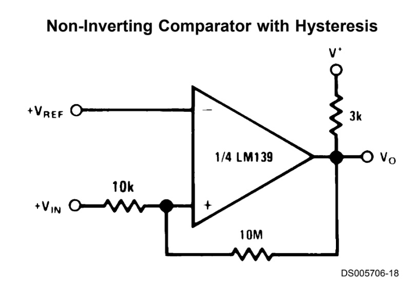
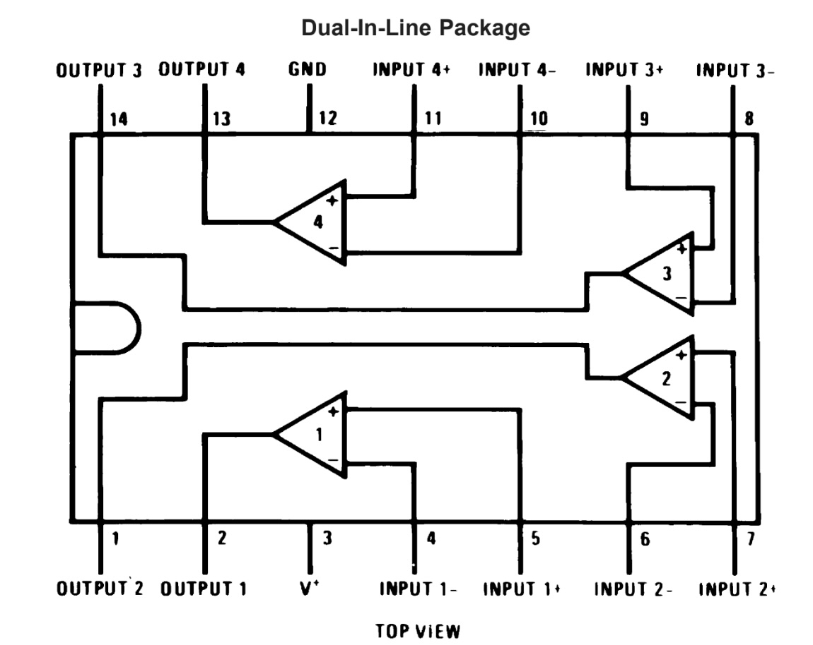

# #802 LM339 Non-inverting Comparator

Testing the LM339 when used as a non-inverting comparator, and the effect of positive feedback (hysteresis) to prevent oscillations at the crossing point.

## Notes

I've used the LM449 comparator in various projects before, but let's take a closer look. It is trivial to use in its basic comparator role:

In this project however, I'm going to test the effect of adding positive feedback (hysteresis) to prevent oscillations at the crossing point.

### About the LM339

The LM339 is a quad voltage comparator IC containing four independent, precision comparators designed to operate from a single power supply. Each comparator compares two input voltages and pulls its open-collector output low when the non-inverting input is lower than the inverting input. The open-collector design allows the outputs to be wired-ORed and enables flexible interfacing with logic levels different from the supply voltage. The LM339 operates over a wide supply range (typically 2V to 36V), consumes very little current, and offers good input common-mode range that includes ground, making it ideal for single-supply designs.

Because of its stability, low power consumption, and open-collector outputs, the LM339 is widely used in zero-cross detectors, threshold detectors, oscillators, window comparators, and sensor interface circuits. Its ability to run from high supply voltages and still interface with low-voltage logic makes it a staple in mixed-signal designs, industrial control systems, analog front-ends, and general-purpose comparator applications.

### Oscillation and the use of Feedback

The LM139 series are high gain, wide bandwidth devices which, like most comparators, can easily oscillate if the output lead is inadvertently allowed to capacitively couple to the inputs via stray capacitance.

This shows up only during the output voltage transition intervals as the comparator changes states.

Power supply bypassing does not solve this problem.
Methods that can help:

* standard PC board layout reduces stray input-output coupling.
* reducing input resistors to < 10 kΩ reduces the feedback signal levels

But by far the most effective method is by adding positive feedback (hysteresis)

* adding even a small amount (1 to 10 mV) of positive feedback (hysteresis) causes such a rapid transition that oscillations due to stray feedback are not possible.
* simply socketing the IC and attaching resistors to the pins will cause input-output oscillations during the small transition intervals unless hysteresis is used.
* if the input signal is a pulse wave-form, with relatively fast rise and fall times, hysteresis is not required.

### Other Design Recommendations

* All pins of any unused comparators should be tied to the negative supply.
* It is usually unnecessary to use a bypass capacitor across the power supply line.
* Protection should be provided to prevent the input voltages from going negative more than -0.3 Vc (at 25°C). An input clamp diode can be used as shown in the applications section.
* The output of the LM139 series is the uncommitted collector of a grounded-emitter NPN output transistor.
    * Many collectors can be tied together to provide an output OR'ing function.
    * An output pull-up resistor can be connected to any available power supply voltage within the permitted supply voltage range, but it does **not** need to be the same as V+
    * The output can also be used as a simple SPST switch to ground (when a pull-up resistor is not used).

### Circuit Design - Without Feedback

First let's try this without feedback/hysteresis:

* input is a sine wave from a signal generator, 4V peak-peak, 2.5V offset
* non-inverting comparator configuration
    * i.e. input signal goes to IN+, reference to IN-
* input clamps to prevent negative voltage excursions
* all unused pins tied to ground
* adjustable Vref

Designed with Fritzing: see [NonInvertingComparator.fzz](./NonInvertingComparator.fzz).

Setup on a breadboard:

This is actually working quite well. Looking at some oscilloscope traces where:

* CH1 (Yellow) - input signal
* CH2 (Blue) - output signal
* CH3 (Red) - input signal at IN1+, after input attenuation resistor (Rin)
* CH4 (Green) - Vref

At 10Hz, things look good at the macro scale:

But if we zoom in on the falling edge, we see ringing:

Same for the rising edge:

Bumping up the input frequency to 50kHz, we no longer have output oscillation, although the slew is starting to show in the output:

Zooming in on the falling edge, still looking good:

### Circuit Design - With Feedback

Adding feedback:

* circuit as before
* adding adjustable positive feedback (hysteresis) with a 500kΩ pot

Designed with Fritzing: see [NonInvertingComparatorWithFeedback.fzz](./NonInvertingComparatorWithFeedback.fzz).

Setup on a breadboard:

Let's take a look at the results.

With minimum feedback (Rfb = 500kΩ) at 10Hz,
things still look good at macro scale

Zooming in on the rising and falling edges,
we can see the ringing is no longer present:

At 50kHz, things are still good without ringing:

As we crank up the feedback (reducing Vfb),
we shift the output trigger point, effectively introducing a phase shift.

### Conclusion

With a non-inverting comparator configuration,
ringing is seen on rising and falling edges especially at low frequencies.
At higher frequencies, the problem can disappear.

Adding a little positive feedback (hysteresis) fixes the problem.
If too much feedback is introduced, there can be significant hysteresis in the output, effectively a phase shift.

## Credits and References

* <https://en.wikipedia.org/wiki/Comparator>
* [LM339 Datasheet](https://www.futurlec.com/Linear/LM339N.shtml)
* [1N4148 Datasheet](https://www.futurlec.com/Diodes/1N4148.shtml)
* [LEAP#803 LM339 Inverting Comparator](../InvertingComparator/)
