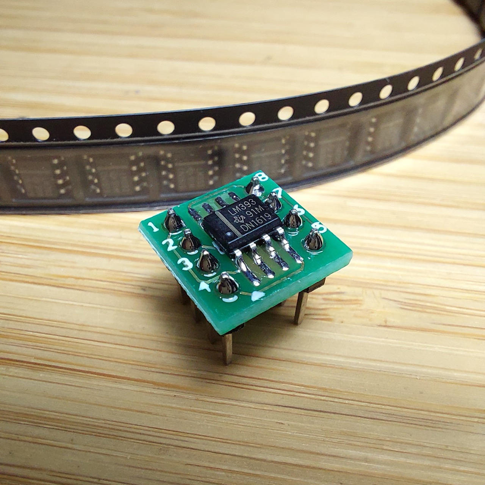
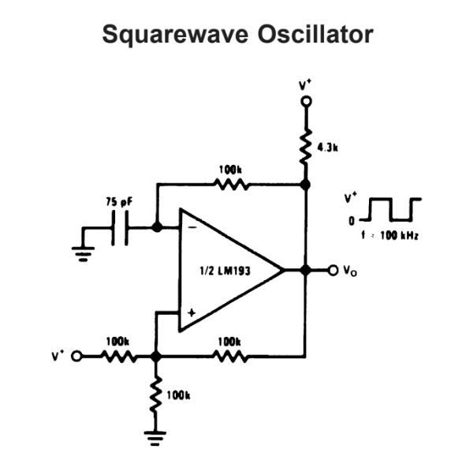
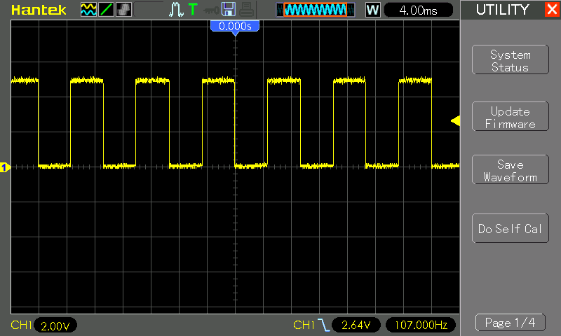

# #807 LM393 Square-wave Oscillator

Demonstrating a free-running square wave oscillator circuit using an LM393 comparator.

## Notes

The LM393 is a dual voltage comparator IC containing two independent, high-gain comparators designed for single-supply operation. Each comparator compares two input voltages and drives an open-collector output that pulls low when the inverting input exceeds the non-inverting input, allowing easy interfacing with a wide range of logic levels via a pull-up resistor. The LM393 operates from a broad supply range (typically 2V to 36V), has low power consumption, and features an input common-mode range that includes ground, making it well suited for low-voltage and single-supply designs.

Because of its open-collector outputs and stable performance, the LM393 is widely used in threshold detectors, window comparators, zero-crossing detectors, oscillators, and sensor interfaces. It is essentially the dual version of the LM339, offering similar electrical characteristics in a smaller package, and is a common choice in mixed-signal, industrial, and embedded applications where reliable voltage comparison is required.

I have some [LM393 chips in a SOP-8 package](https://www.aliexpress.com/item/32421779206.html), so I put one on a DIP adapter for breadboard testing.

### Circuit Design

The National Semiconductor datasheet for the LM393 provides a reference design for a square wave oscillator.

Let's translate that to a practical experiment:

* I've increased the capacitor value to 100nF to slow down the oscillator.

Designed with Fritzing: see [SquareWaveOscillator.fzz](./SquareWaveOscillator.fzz).

Putting the basic circuit on a breadboard:

### Test Results

An it is oscillating nicely:

## Credits and References

* <https://www.ti.com/product/LM393>
* [LM393 datasheet](https://www.futurlec.com/Linear/LM393N.shtml) - Low Power Low Offset Voltage Dual Comparators
* ["20pcs LM393 LM393DR LM393D SOP-8 Comparators Dual Differential new original"](https://www.aliexpress.com/item/32421779206.html) - aliexpress seller
