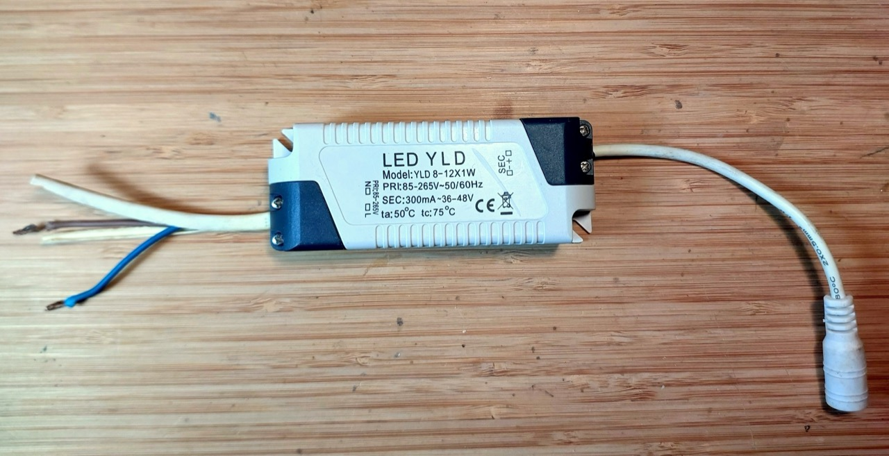
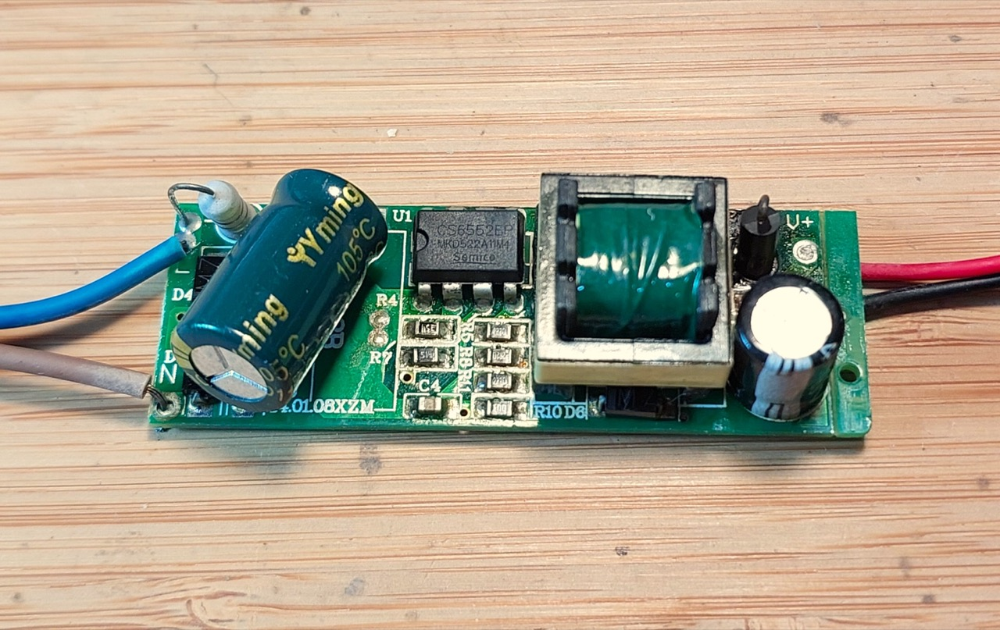
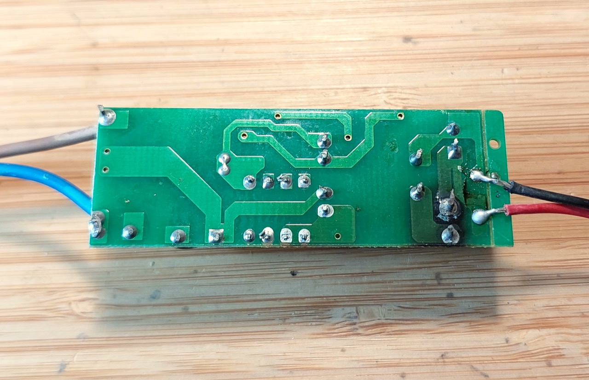
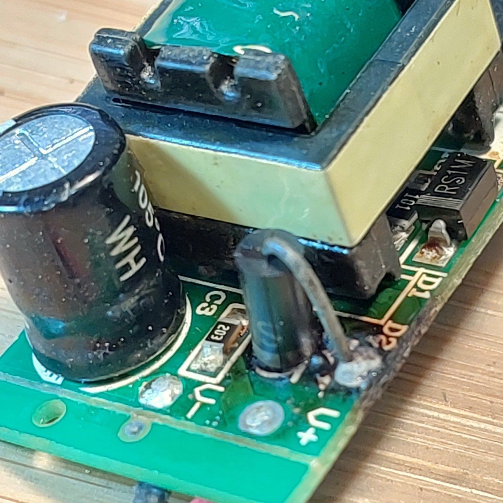
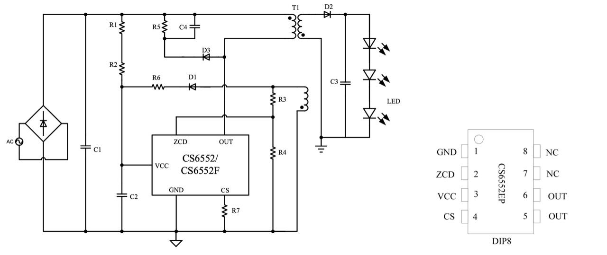
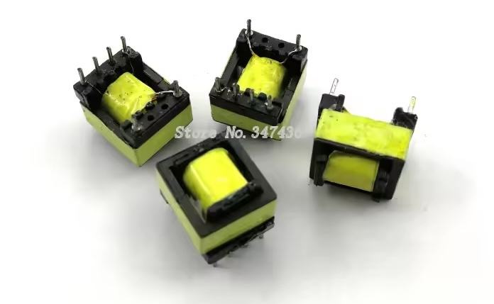

# #837 YLD8-12X1W

Reverse-engineer a faulty YLD8-12X1W LED driver, diagnose the issue, but determine the fix is not worth the effort.

## Notes

A friend's LED ceiling light failed, and I was conscripted to help. I discovered that the LED driver had failed, and quickly replaced it with a SG$15 driver from a local lighting store.

I wondered what had failed with the driver and whether it was fixable, and thus this page of notes was born.

### The Failure

Opening up the unit, and it's clear the output protection diode (SF28) has failed.

I first tried replacing the diode, but to no avail.
Capacitors look OK, but probing around a bit further indicates one coil in the transformer has failed open-circuit.
Whether other components have also failed is unclear.

I couldn't easily find an exact replacement for the transformer, so at this point I gave up on the repair, and decided just to use this as an opportunity to examine the circuit.

### CS6552EP

The core of the driver is the CS6552EP constant current LED control IC.
It is apparently an old product of [CR Micro](https://www.crmicro.com/), but no mention of it remains on their website.
The [CS6552EP datasheet is available here](https://www.alldatasheet.com/datasheet-pdf/pdf/2079421/HUAJING-MICRO/CS6552EP.html).

The datasheet includes a reference application circuit:

| Pin | Symbol | Function                                        |
|-----|--------|-------------------------------------------------|
|  1  | GND    | Ground                                          |
|  2  | ZCD    | Degaussing time detection                       |
|  3  | VCC    | Power                                           |
|  4  | CS     | Current sampling                                |
| 5,6 | NC     | No connection                                   |
| 7,8 | OUT    | Drain of the built-in high voltage power MOSFET |

### Circuit Design

Here's my quick tracing of the driver circuit.
The circuit is basically the same as the reference application from the datasheet, with a few extra components:

So a this point it seems pretty clear this is a terrible LED driver circuit:

* lacks anti-surge protection varistor
* lacks EMI suppression safety capacitor
* minimal high-voltage/low-voltage separation

#### What is the Transformer?

I can't determine the specs or find and exact replacement.

It seems however that it may be similar to an EE10-A1,
for example
["EE10-A1 switching power supply high-frequency transformer 220V to 5-12V maximum output 3W" (aliexpress seller listing)](https://www.aliexpress.com/item/32810387594.html)

## Credits and References

* [SF28 Datasheet](https://www.alldatasheet.com/datasheet-pdf/pdf/974763/HDSEMI/SF28.html)
* [CS6552EP Datasheet](https://www.alldatasheet.com/datasheet-pdf/pdf/2079421/HUAJING-MICRO/CS6552EP.html)
    * Apparently an old product of [CR Micro](https://www.crmicro.com/), but no mention of it remains on their website.
* [How to Tell if Your LED Driver is Bad](https://www.ledlightingexperience.com/how-to-tell-if-your-led-driver-is-bad/)

### Exploring a faulty LED driver (with schematic)

YouTube by bigclivedotcom

### (Flashing content.) Repair of strobing LED power supply

YouTube by bigclivedotcom

### LED Transformer teardown and repair - is it fixed?

YouTube by backofficeshow

