# #743 MCP601 Buffer

Testing the unity gain buffer performance of the MCP601 2.7V to 6.0V Single Supply CMOS Op Amp.

## Notes

The [MCP601](https://www.microchip.com/en-us/product/mcp601) is a single-channel, low-power, general-purpose operational amplifier designed by Microchip Technology. It features a rail-to-rail input and output, allowing signals to swing very close to the supply rails, which is ideal for low-voltage applications. Operating with a supply voltage range of 2.7V to 6.0V, the MCP601 offers a typical gain-bandwidth product of 2.8 MHz and low input bias current, making it suitable for sensor interfaces, active filters, and battery-powered systems. Its low quiescent current (typically 230 µA) also contributes to energy efficiency in portable or low-power designs.

This op-amp is internally frequency-compensated for unity gain stability, and its CMOS architecture provides high input impedance and low offset voltage, enhancing performance in precision analog signal processing. The MCP601 is commonly used in applications that demand accurate signal amplification, minimal power draw, and full-range signal handling, such as medical devices, instrumentation, and consumer electronics.

It comes in a range of packages and configurations, MCP601/1R/2/3/4:

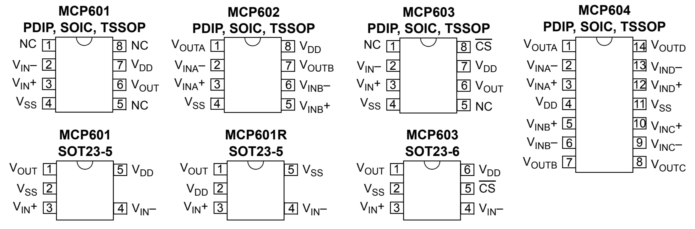

### Circuit Design

I'm testing with the canonical unity gain buffer circuit aka "voltage follower".

I've added an arbitrary 10kΩ "load".
The MCP601 can source ±22mA, but this will only draw
[0.5mA peak](https://www.wolframalpha.com/input?i=5V%2F10k%CE%A9).

## Testing Performance

I'm using the [FY3200S](../../../Equipment/FY3200S/) signal generator to test the circuit,
and
[Hantek MSO5074FG](../../../Equipment/MSO5074FG_unboxing/) scope for recoding the results.

Let's give it a go..

### Slew Rate

The datasheet quotes a slew rate of 2.3V/µs.

The maximum frequency we can expect to handle before seeing distortions due to the slew rate is estimated with the formula:

`fmax = ( Slew Rate V/µs ) / ( 2π * Vpeak )`

Let's use a test signal of 2V peak-peak centered around 2.5V - well within the Common Mode Input Voltage Range, in which case we can expect to handle up to
[183kHz](https://www.wolframalpha.com/input?i=%282.3V%2F%C2%B5s%29%2F%282%CF%80*2V%29).

The following scope traces show the input and output signals overlaid:

* CH1 (Yellow) - input signal (Vout), DC coupled without offset
* CH2 (Blue) - out signal (Vout), DC coupled without offset

At 100kHz - perfect reproduction of the input signal:

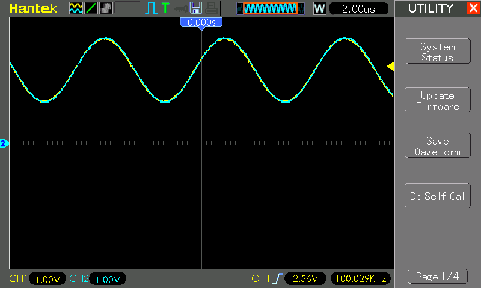

At 180kHz - still pretty perfect reproduction of the input signal:

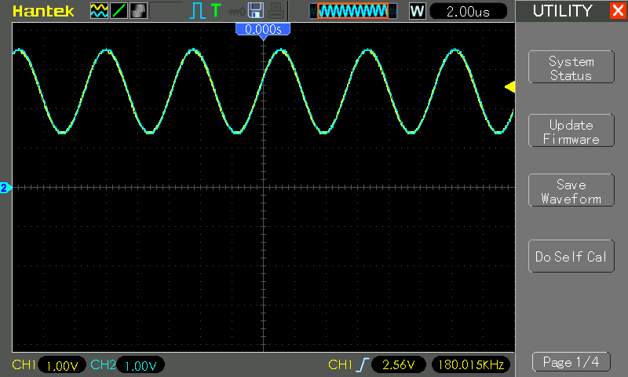

At 200kHz - starting to see some phase delay in the output, as would be expected given the slew rate specification.

At 400kHz - significant distortion of the wave; approaching a triangle wave output:

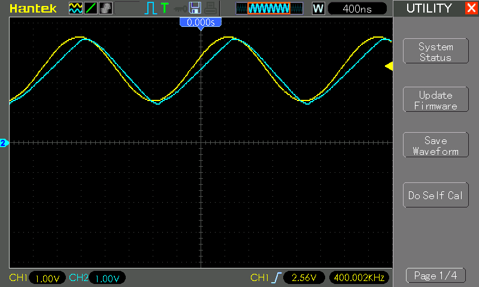

### Gain Bandwidth Product

The Gain Bandwidth Product is specified in the datasheet as 2.8MHz.

With the unity gain buffer, that means bandwidth should also be 2.8 MHz before we start to see attenuation of the output.

Now, as we've already seen, the slew rate will start to distort the signal way before this, so I'll switch to a 50% duty cycle square wave to better see the effects. Again, 2V peak-peak centered around 2.5V.

At 400kHz, we see the slew rate distortion, but no attenuation of the output:

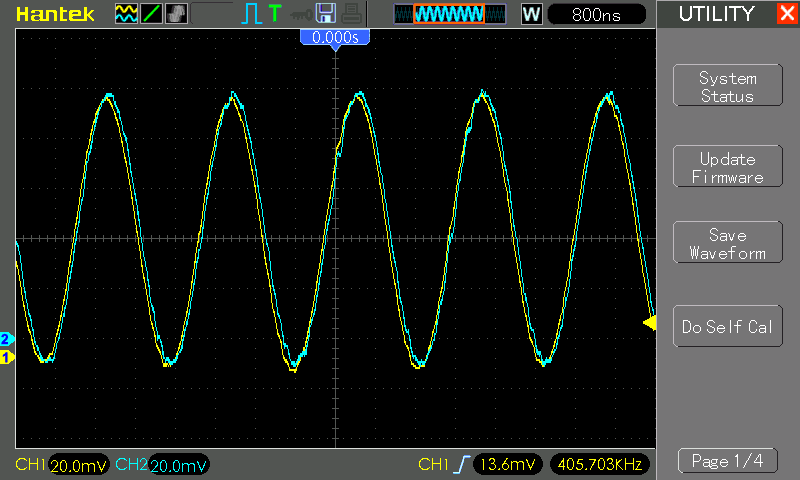

By 500kHz, the upper limit of the output has been attenuated, but this is clearly due to the slew rate. It is around 430-440kHz that the attenuation really starts to have an effect.

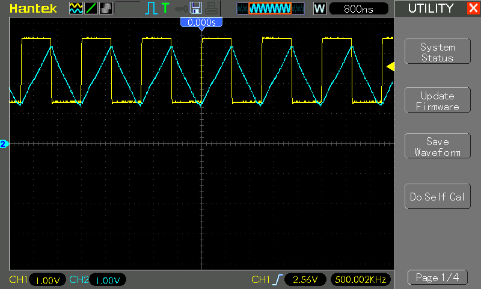

So, with a unity gain buffer, slew rate is the limiting factor, not Gain Bandwidth Product.
Based on the results here, I would expect Gain Bandwidth Product only to become a factor with amplifier circuits having a gain of
[6.5](https://www.wolframalpha.com/input?i=2.8+MHz+%2F+430+kHz)
or more.

### Common Mode Input Voltage Range

The datasheet specifies

* Common Mode Input Voltage Range (VCMR) from `VSS–0.3V` to `VDD–1.2V` at +25°C.
* Linear Output Voltage Swing from `VSS+100mV` to `VDD–100mV`

To quote the datasheet:

> This means that the amplifier input behaves linearly as long as the
> Common Mode Input Voltage (VCM) is kept within the specified VCMR.

I other words, a unit gain buffer must keep Vout below VDD–1.2V for "correct operation".

Let's give it a go...

First test on the limits:

* with 5V supply, range should basically be limited to 0-3.8V.
* test signal: 10kHz sine wave 3.8V peak-peak with offset 1.9V

Result is a perfect reproduction:

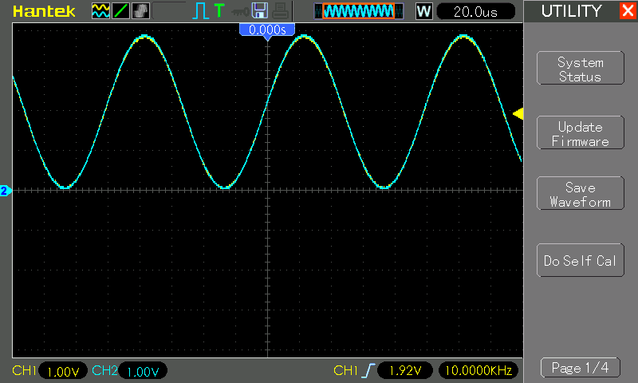

Push the input further:

* to peak at ~4.4V (VDD-0.6V)
* test signal: 10kHz sine wave 4.4V peak-peak with offset 2.2V

Scope trace (offset -2V), shows we are still getting an almost perfect reproduction

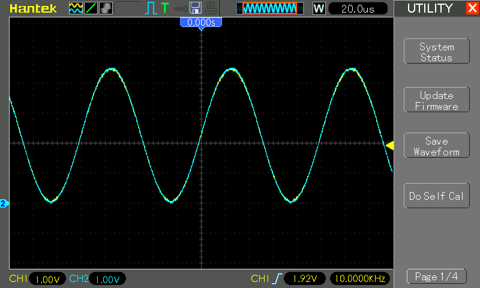

Finding the limits

* test signal: 10kHz sine wave 2V peak-peak. Will test by adjusting the offset towards the upper limits
* scope display: DC-coupled, 500mV grid, traces offset -3V
* FFT: rectangular

With offset 2.7V:

* Vin peak 3.7V, Vout peaks at 3.7V (VDD-1.3V)
* no distortion apparent

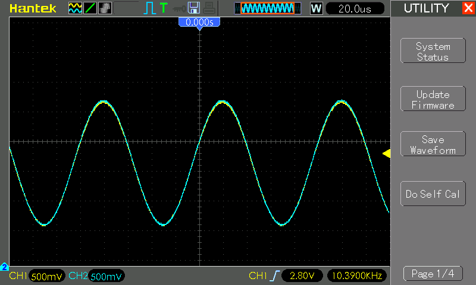

With offset 3.0V:

* Vin peak 3.98V, Vout peaks at 3.98V (VDD-1.02V)
* slight distortion appears visible in the time domain, but no significant artifacts in the FFT

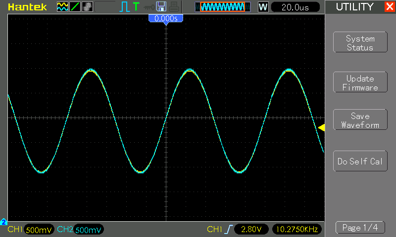

With offset 3.5V:

* Vin peak 4.44V, Vout peaks at 4.44V (VDD-0.56V)
* slight distortion

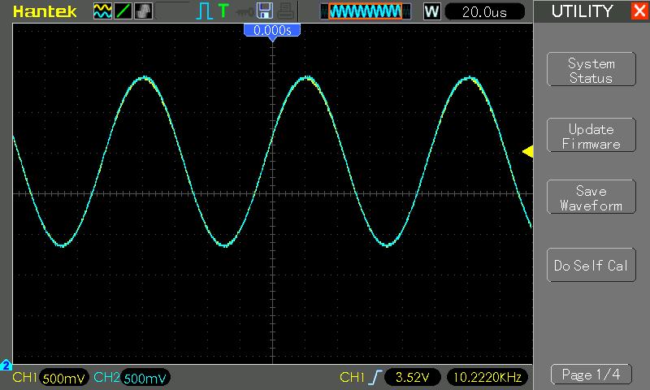

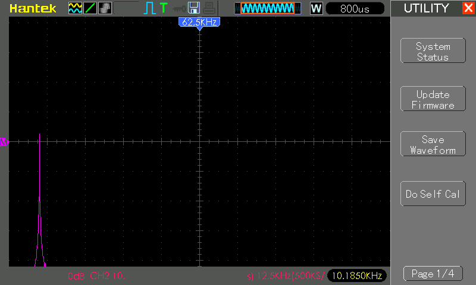

With offset 3.6V:

* Vin peak 4.52V, Vout peaks at 4.48V (VDD-0.52V)
* slight clipping, significant secondary frequencies appearing in the FFT

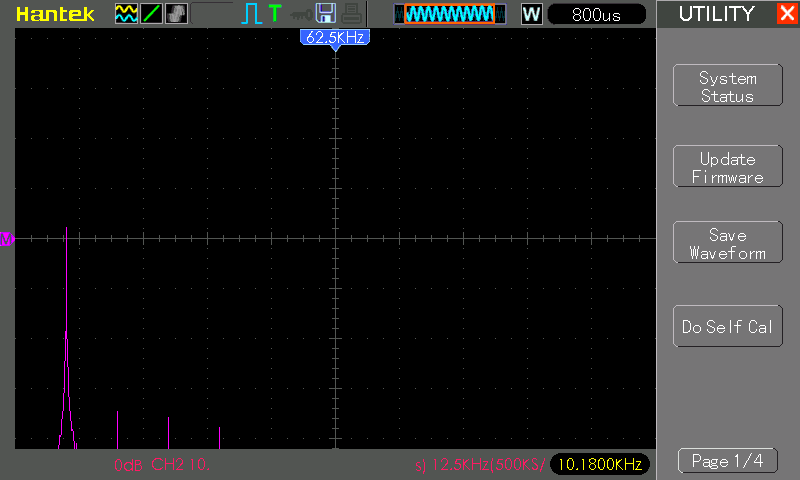

With offset 3.7V:

* Vin peak 4.62V, Vout peaks at 4.50V (VDD-0.5V)
* significant clipping, significant secondary frequencies appearing in the FFT

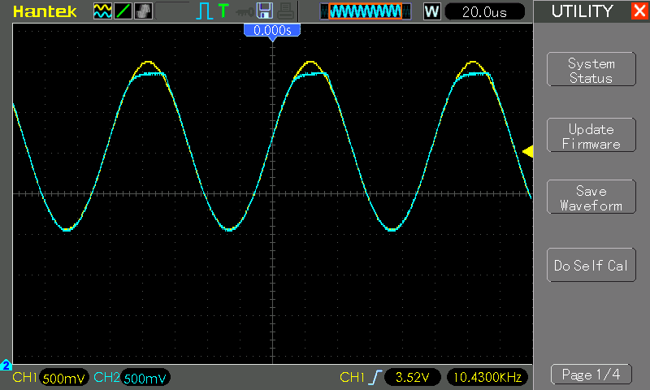

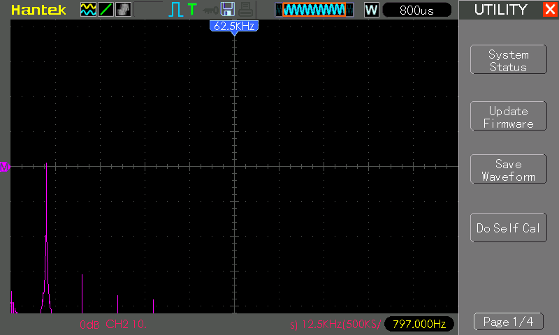

Conclusion:
The quoted limit of `VDD–1.2V` appears conservative.
I don't see much evidence of the Common Mode Input Voltage Range limits
kicking in until we hit a common mode voltage of `VDD-1V`,
with the effects becoming very significant above `VDD-0.6V`.

## Credits and References

* [MCP601 Product Info](https://www.microchip.com/en-us/product/mcp601)
* [MCP601 Datasheet](https://www.futurlec.com/SFMicrochip/MCP601.shtml)
