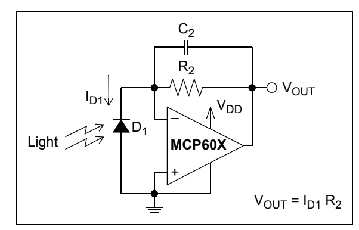
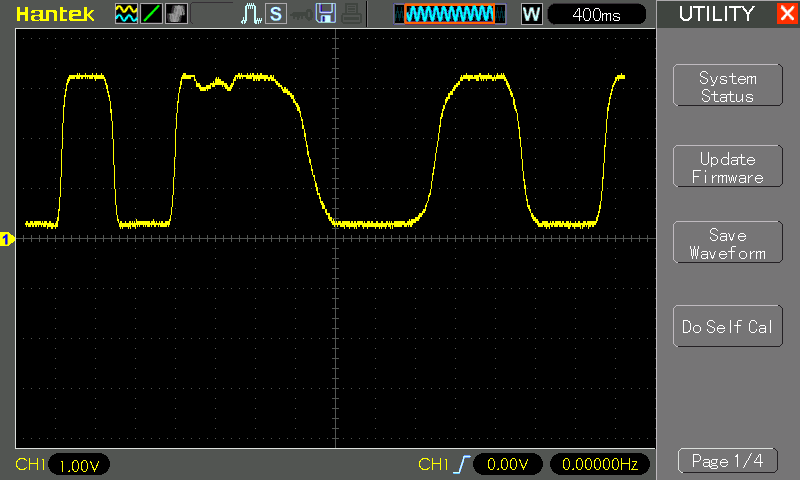

# #781 Light Detector

Demonstrating the MCP601 op-amp used in a light detection circuit with the 2CU84 photodiode.

## Notes

The [MCP601 Datasheet](https://www.futurlec.com/SFMicrochip/MCP601.shtml) includes an example
of how the MCP601/1R/2/3/4 op amps can be used to easily convert the signal from a sensor that produces an output current (such as a photo diode) into a voltage (a transimpedance amplifier). This is implemented with a single resistor (R2) in the feedback loop of the amplifiers. The optional capacitor (C2) provides stability for these circuits.

A photodiode configured in the Photovoltaic mode has zero voltage potential placed across it (see below). In this mode, the light sensitivity and linearity is maximized.

This behaviour is also explained in
[The Art of Electronics](../../../books/the-art-of-electronics/)
12.6.1 Photodiodes and phototransistors (3rd Edition).

### 2CU84 PIN Silicon Photodiode

I am using a
[2CU84 PIN Silicon Photodiode from aliexpress](https://www.aliexpress.com/item/1005004400771647.html).
I can't find a specific datasheet for this component, but it does appear similar to
the [TW30SY datasheet](https://docs.rs-online.com/0f29/0900766b80b4c5bd.pdf).

One of the issues it seems is identifying the anode/cathode of the device in the absence of a datasheet, as there does not appear to be any consistency in packaging.

Specifications provided by the seller:

> * Photosensitive area (mm^2): 6 x 6
> * Spectral range (nm): 300-1000
> * Peak wavelength (nm): 700
> * Short circuit current E=100L x (UA): > 20
> * Open circuit voltage E=100L x (mL): 300
> * Dark current R=100mV (A): < 1x10-8
>
> Photocell is a semiconductor device that directly converts light energy into electrical energy, belonging to the category of rectifier optoelectronic components. It has a large area of pn junction. When light shines on the pn junction, electromotive force is generated at both ends of the pn junction, and a certain current and voltage can be output between the electrodes. It is suitable for optoelectronic detection components, near infrared detectors, optoelectronic readouts, opto-couplers, grating ranging, laser collimation characteristic identification, and optoelectronic switches. This photocell has a wide spectral response of photomultiplier tubes, photocells, and solar cells, making it suitable for various optical instruments operating in the spectral range of 300NM to 1000NM. Strong sensitivity to blue and purple light, small device size, stable and reliable performance, and simple and flexible circuit design. This type of photocell is a semiconductor optical receiver designed specifically for various photoelectric instruments such as spectrophotometers, colorimeters, whiteness meters, illuminometers, brightness meters, chromaticity meters, optical power meters, flame detectors, color amplifiers, etc.

### Circuit Design

The circuit is based on the common reference design for photovoltaic mode detection.

* a 100kΩ feedback resistor gives good dynamic performance in my ambient lighting
* a 10nF capacitor for stability

### Testing

A quick test on a breadboard:

* in bright light: LED is on
* in shadow: LED is off

Monitoring the output voltage on an oscilloscope while randomly shielding the photo resistor:

## Credits and References

* [MCP601 Product Info](https://www.microchip.com/en-us/product/mcp601)
* [MCP601 Datasheet](https://www.futurlec.com/SFMicrochip/MCP601.shtml)
* 2CU84 PIN Silicon Photodiode
    * [on aliexpress](https://www.aliexpress.com/item/1005004400771647.html)
    * [on alibaba](https://www.alibaba.com/product-detail/NEW-2CU84-PIN-Photodiode-silicon-photocell_1601390909682.html)
    * [TW30SY datasheet](https://docs.rs-online.com/0f29/0900766b80b4c5bd.pdf)
* DESIGNING PHOTODIODE AMPLIFIER CIRCUITS WITH OPA128
* [Understanding Photovoltaic and Photoconductive Modes of Photodiode Operation](https://www.allaboutcircuits.com/technical-articles/understanding-photovoltaic-and-photoconductive-modes-of-photodiode-operation/)
* [The Art of Electronics](../../../books/the-art-of-electronics/) 12.6.1 Photodiodes and phototransistors (3rd Edition)
