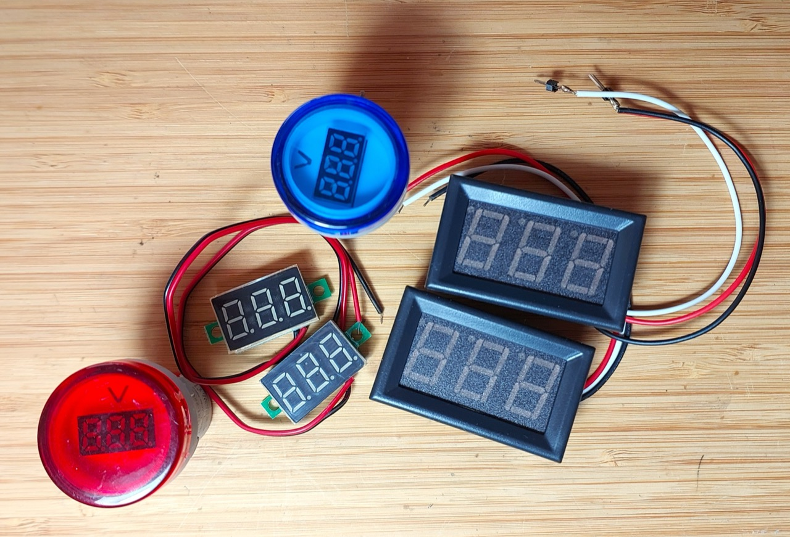
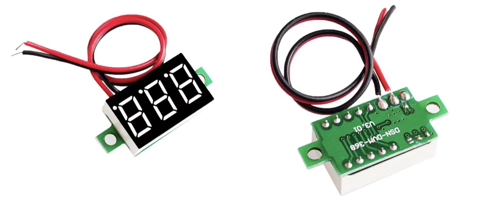
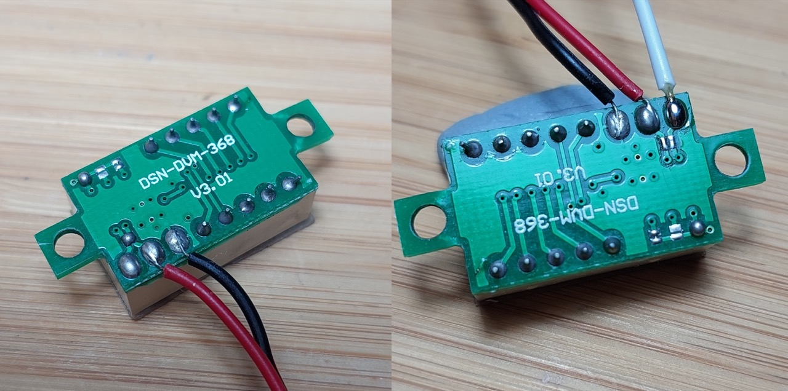
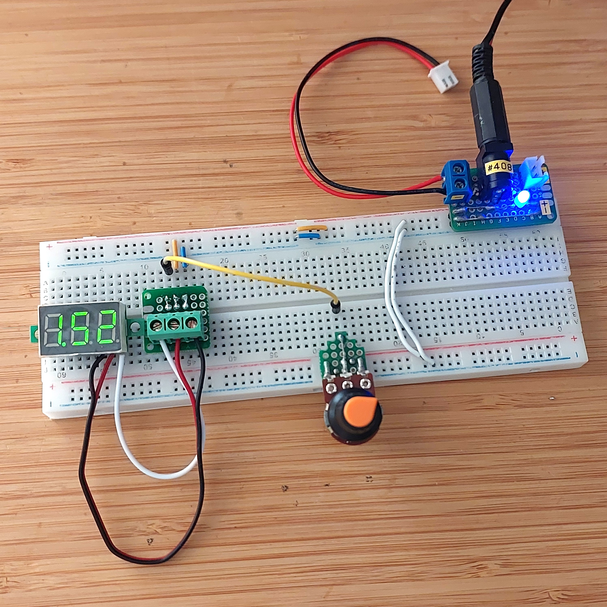
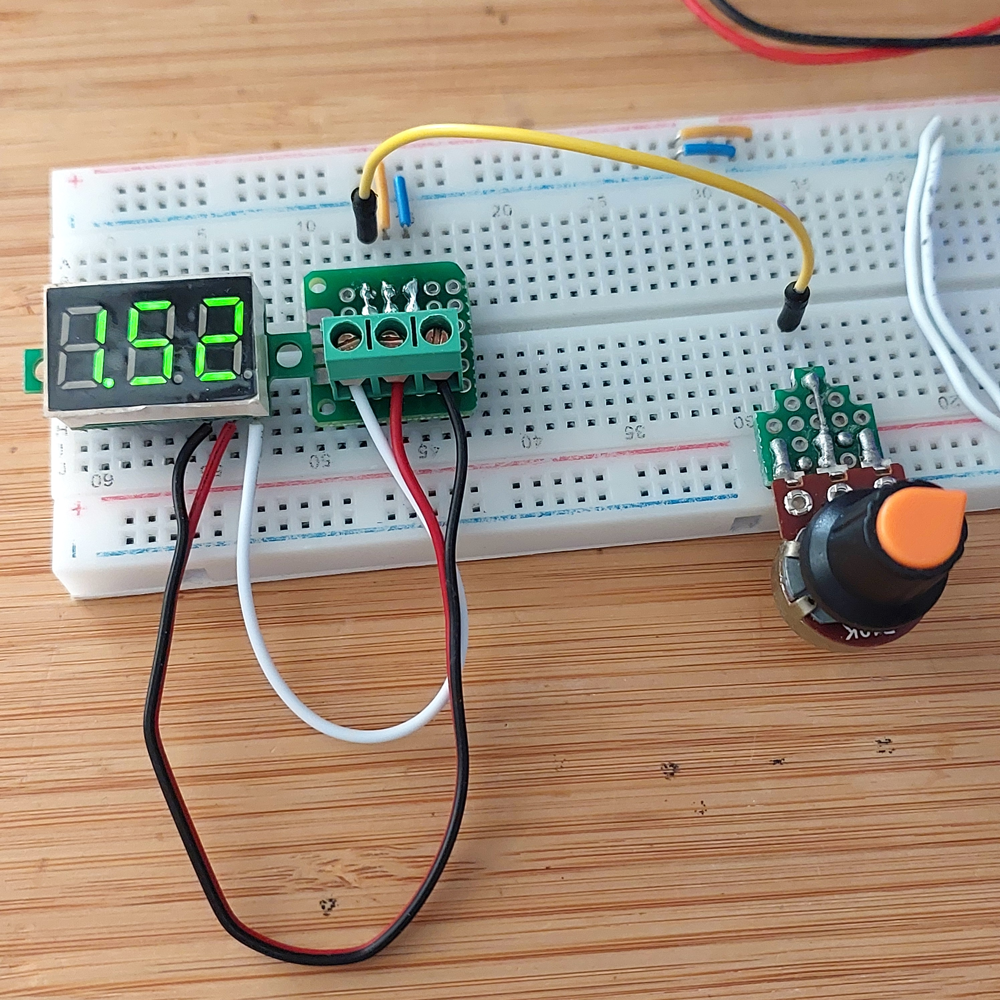
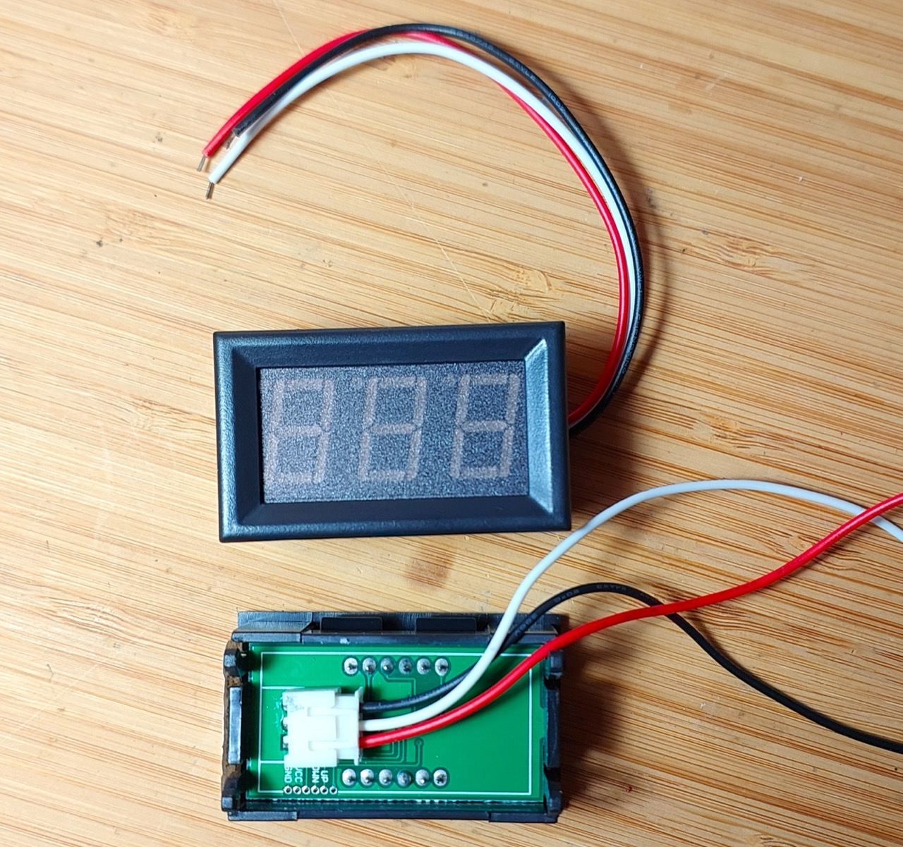
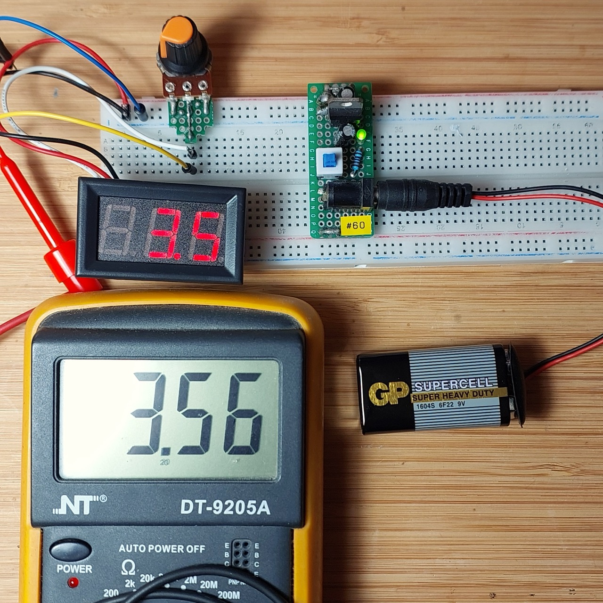
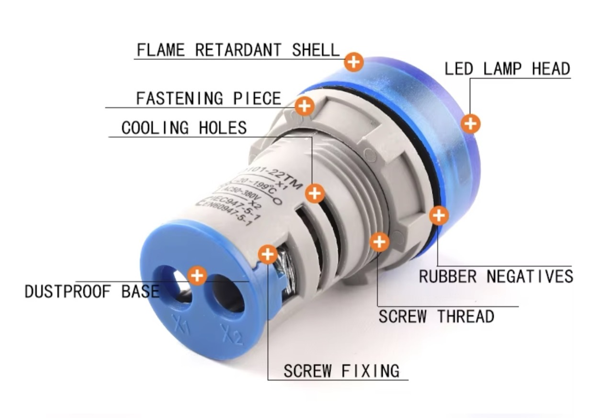
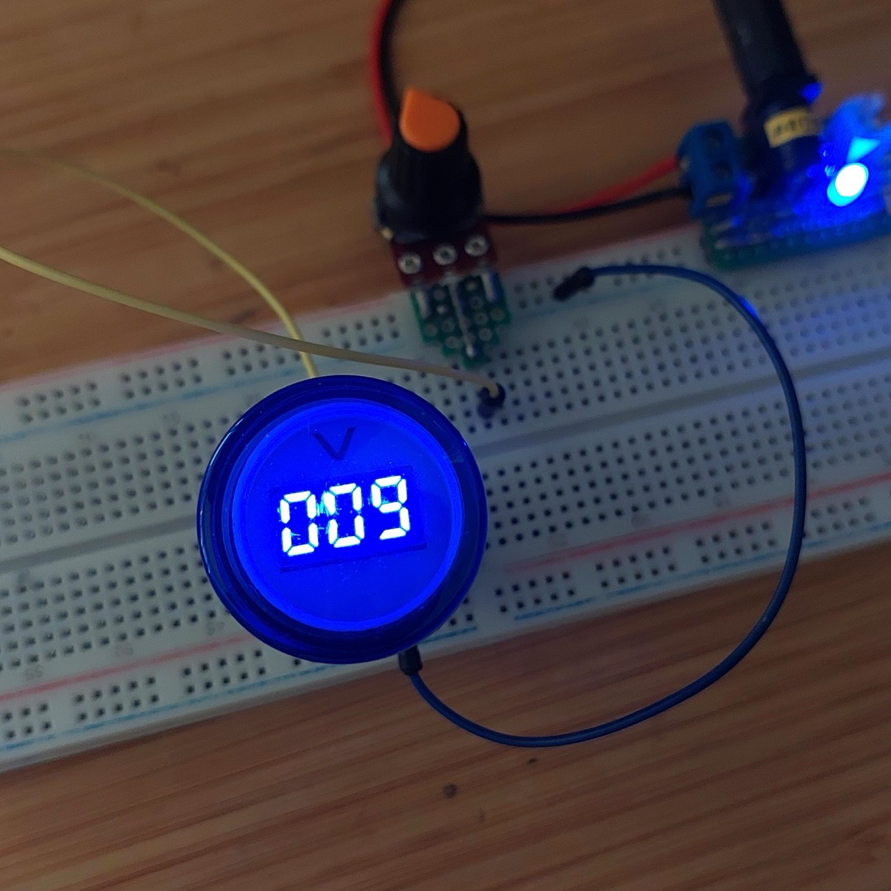

# #181 DC Voltmeter Modules

Testing a selection of 2 and 3-wire DC voltmeter modules.

## Notes

There are two and three wire DC voltmeter modules in the market.

Two-wire modules are the simplest (and generally cheapest).
For most applications where a simple readout of a power supply is required, they are most convenient
since a separate power supply connection is not required. It does mean of course that the meter
draws current from the circuit under test, and will only work down to a certain voltage (usually ~4.5V).

For more precision measurement, the three-wire
modules are better suited:

* they present relatively high input impedance (> 100kΩ)
* can measure voltages from 0V and up

Modules tested below:

* Module 1: DSN-DVM-368 v3.01 (3-wire). Screw mounted with no bezel, measures from 0-30V
* Module 1b: DSN-DVM-368 v3.01 (2-wire variant)
* Module 2: 0.56" Panel Meter
* Module 3: 22mm Round Panel-mounted Voltmeter

## Test Circuit

Schematics below are for a simple test of the meter using a 10kΩ pot to vary the input voltage and compare the reading with a multimeter.

NB: the Fritzing part used here is not quite right (it's actually a 4-wire ammeter) but does well enough for a simple schematic:

### Module 1: DSN-DVM-368 v3.01 (3-wire)

This is a common type of module that is screw mounted with no bezel and can measure from 0-30V. Note that it is also commonly sold in a 2-wire configuration, so caveat emptor.

I think I originally obtained this module as part of a kit, but they are widely available from parts sellers:

* [0.28 0.36 Inch DC 0-30V LED Mini Digital Voltmeter Blue/red/green LED Display Volt Meter Gauge Voltage Panel Meter 2 3 wires](https://www.aliexpress.com/item/32901073658.html) (offers both 2 and 3 wire variants)
* [DSN-DVM-368L-3 3-Digit 0.36" LED Digital DC Voltmeter](http://www.dx.com/p/dsn-dvm-368l-3-3-digit-0-36-led-digital-dc-voltmeter-for-motorcycle-black-white-343750#.VrVc01N97XE) - example product listing on dx.com (no longer in business)

I can't find a specific datasheet for the module, but from product listings,
the specifications are as follows:

* Measuring range: 0~30V;
* Power supply: DC 4.5~30V;
* Max. input: DC 30V;
* Tolerance: +/-1%, +/-0.3V (>=10V), +/0.1 (<10V);
* Input impedance: >100KΩ;
* Working current: red: <23mA;
* Refresh rate: 300ms;
* Display: 3-digit 0.36" LED;
* Display color: red;
* Cable length: 15cm

These modules do not have any kind of digital output that could be used to integrate with a microprocessor,
but as a stand-alone meter, a useful device for power supply circuits.

Using my DMM as a reference, it appears accuracy is within 40mV, good enough for general purposes.

### Module 1b: DSN-DVM-368 v3.01 (2-wire variant)

The DSN-DVM-368 v3.01 is commonly sold in a 2-wire configuration.
Since the unit is powered from the input, the device can't measure voltages under ~5V.

Available from many sellers, for example:

* [DC 0-30V 3 Wires 0.36'' LED Digital Voltmeter Voltage Meter Module Tester Monitor 3-Digital Display Voltmeter Panel 5V 12V 24V](https://www.aliexpress.com/item/32842101575.html)
* [0.28 0.36 Inch DC 0-30V LED Mini Digital Voltmeter Blue/red/green LED Display Volt Meter Gauge Voltage Panel Meter 2 3 wires](https://www.aliexpress.com/item/32901073658.html) (offers both 2 and 3 wire variants)

The 2-wire version is just the 3-wire version but with the +power and +load inputs bridged.

I confirmed this by converting a 2-wire unit into 3-wire, and it works perfectly

### Module 2: 0.56" Panel Meter

This is a common panel mount module with 0.56" digits and can measure from 0-100V.
Other versions are available with different measurement ranges: 0-10V, 0-30V, 0-200V.

They are widely available from parts sellers, e.g.:

* [0.56" 3 Wire Digital LED Voltmeter Voltage Meter Panel with Reverse Protection DC0-100V (Red)](https://www.aliexpress.com/item/1005007129264878.html) - aliexpress

I can't find a specific datasheet for the module, but from product listings,
the specifications are as follows:

* Test voltage range: DC 0-100V
* Accuracy: 1%
* Display: 3 digits LED
* Working temperature: - 10 ~ + 65℃
* Measurement rate: 200mS/time
* Power: DC 3-30V
* Max. output: DC 100V (above 100V carries a risk of burning)
* Min. output: DC 0V (Below 0V, measurement inaccurate or not shown)
* Current consumption: <20mA
* LED color: Red/Blue/Green/Yellow (Optional)
* Weight: Approx.17g/0.6oz
* Size: Approx.4.8*2.9*1.9cm

Tests reasonably accurate:

### Module 3: 22mm Round Panel-mounted Voltmeter

A round panel-mounted voltmeter that can measure DC 5-60V
available on [aliexpress](https://www.aliexpress.com/item/1005001392524771.html)
with 5 different cover tints (Red / White / Green / Blue / Yellow).
An AC 20-500V variant is also available.

Specifications (from the seller site):

* Model: Small Round Digital display Voltage indicator
* Color: Red / White / Green / Blue / Yellow
* Installation size: 22mm
* Measurement range: AC 20-500V / DC 5-60V

A quick test:

## Credits and References

* [..as mentioned on my blog](https://blog.tardate.com/2016/02/littlearduinoprojects181-voltmeter.html)
