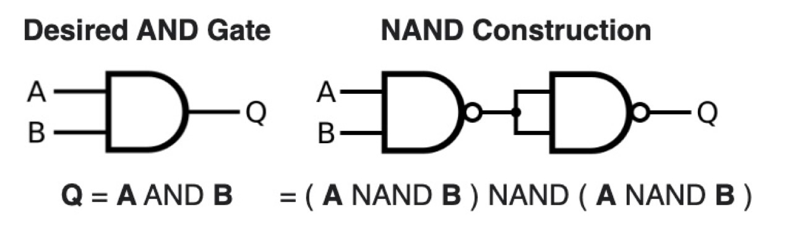
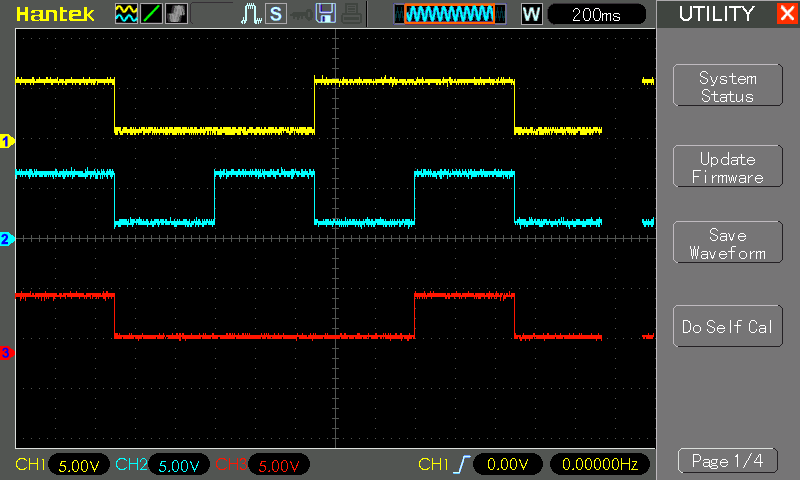

# #838 AND Gate with NAND Logic

Demonstrating how an AND gate may constructed solely from NAND gates.

## Notes

The NAND boolean function has the property of functional completeness, meaning that any Boolean expression can be expressed with an equivalent expression using only NAND operations.

The NAND Truth Table:

| A | B | Q |
|---|---|---|
| 0 | 0 | 1 |
| 0 | 1 | 1 |
| 1 | 0 | 1 |
| 1 | 1 | 0 |

The AND Truth Table:

| A | B | Q |
|---|---|---|
| 0 | 0 | 0 |
| 0 | 1 | 0 |
| 1 | 0 | 0 |
| 1 | 1 | 1 |

An AND gate can be made with NAND gates by inverting the output of a NAND gate:

### Circuit Design

Designed with Fritzing: see [AND.fzz](./AND.fzz).

To demonstrate and AND gate build with NAND gates, I have the circuit constructed on a breadboard using
the CD4011 Quad 2-Input NAND Buffered B Series Gate.

An Arduino is used to automate a demo cycle of inputs.

Inputs and outputs are indicated with LEDs, and captured with an oscilloscope.

### The Sketch

See [AND.ino](./AND.ino).

The sketch simply automates the A, B inputs, cycling through all 4 possibilities.

### Test Results

Here's a scope trace capturing all 4 states, and demonstrating the the output is correct as expected.
Traces are offset vertically for clarity.

* CH1 (yellow): input A
* CH2 (blue): input B
* CH3 (red): output Q

## Credits and References

* [CD4011 datasheet](https://www.futurlec.com/4000Series/CD4011.shtml)
* <https://en.wikipedia.org/wiki/NAND_logic>
