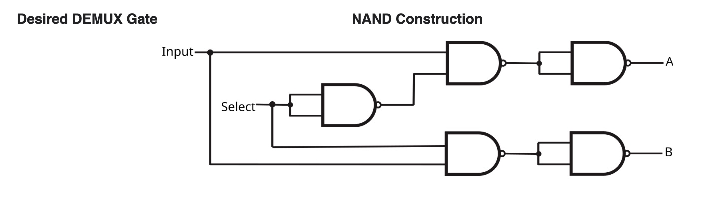
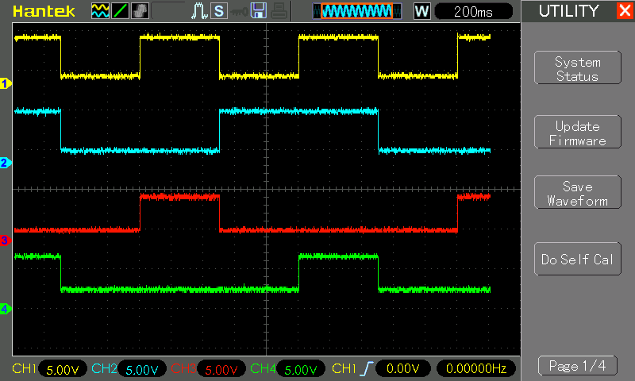

# #845 DEMUX Gate with NAND Logic

Demonstrating how a DEMUX gate may constructed solely from NAND gates.

## Notes

A demultiplexer performs the opposite function of a multiplexer: It takes a single input and channels it to one of two possible outputs according to a selector bit that specifies which output to choose.

The DEMUX Truth Table:

| IN | SEL | Output A | Output B |
|----|-----|----------|----------|
| 0  | 0   | 0        |  0       |
| 1  | 0   | 1        |  0       |
| 0  | 1   | 0        |  0       |
| 1  | 1   | 0        |  1       |

An DEMUX gate can be made with NAND gates as follows:

### Circuit Design

Designed with Fritzing: see [DEMUX.fzz](./DEMUX.fzz).

### The Sketch

See [DEMUX.ino](./DEMUX.ino).

The sketch simply automates the Input, Select signals, cycling through all 4 possibilities.

### Test Results

Here's a scope trace capturing all 4 states, and demonstrating the the output is correct as expected.
Traces are offset vertically for clarity.

* CH1 (yellow): Input
* CH2 (blue): Selector
* CH3 (red): Output A
* CH4 (green): Output B

## Credits and References

* [CD4011 datasheet](https://www.futurlec.com/4000Series/CD4011.shtml)
* <https://en.wikipedia.org/wiki/NAND_logic>
* See also:
    * [LEAP#838 AND Gate with NAND Logic](../AND/)
    * [LEAP#839 OR Gate with NAND Logic](../OR/)
    * [LEAP#840 NOR Gate with NAND Logic](../NOR/)
    * [LEAP#841 NOT Gate with NAND Logic](../NOT/)
    * [LEAP#842 XOR Gate with NAND Logic](../XOR/)
    * [LEAP#843 XNOR Gate with NAND Logic](../XNOR/)
    * [LEAP#844 MUX Gate with NAND Logic](../MUX/)
    * [LEAP#845 DEMUX Gate with NAND Logic](../DEMUX/)
