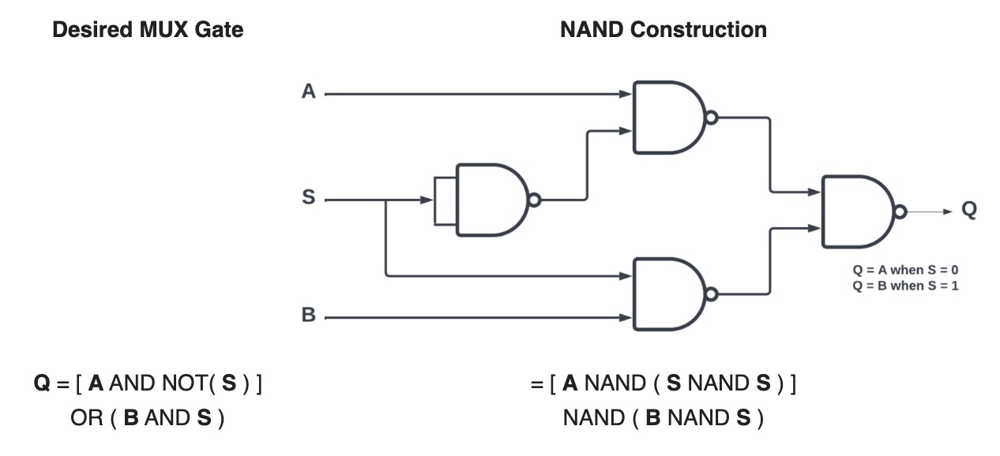
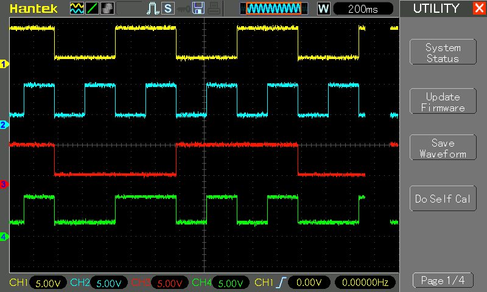

# #844 MUX Gate with NAND Logic

Demonstrating how a MUX gate may constructed solely from NAND gates.

## Notes

A multiplexer or a MUX gate is a three-input gate that uses one of the inputs, called the selector bit, to select one of the other two inputs, called data bits, and outputs only the selected data bit.

The MUX Truth Table:

| A | B | SEL | Q |
|---|---|-----|---|
| 0 | 0 |  0  | 0 |
| 0 | 1 |  0  | 0 |
| 1 | 0 |  0  | 1 |
| 1 | 1 |  0  | 1 |
| 0 | 0 |  1  | 0 |
| 0 | 1 |  1  | 1 |
| 1 | 0 |  1  | 0 |
| 1 | 1 |  1  | 1 |

A MUX gate can be made with NAND gates as follows:

### Circuit Design

Designed with Fritzing: see [MUX.fzz](./MUX.fzz).

To demonstrate a MUX gate made from NAND gates, I have the circuit constructed on a breadboard using
the CD4011 Quad 2-Input NAND Buffered B Series Gate.

An Arduino is used to automate a demo cycle of inputs.

Inputs and outputs are indicated with LEDs, and captured with an oscilloscope.

### The Sketch

See [MUX.ino](./MUX.ino).

The sketch simply automates the A, B, SEL inputs, cycling through all 8 possibilities.

### Test Results

Here's a scope trace capturing all 8 states, and demonstrating the the output is correct as expected.
Traces are offset vertically for clarity.

* CH1 (yellow): input A
* CH2 (blue): input B
* CH3 (red): Selector
* CH4 (green): output Q

## Credits and References

* [CD4011 datasheet](https://www.futurlec.com/4000Series/CD4011.shtml)
* <https://en.wikipedia.org/wiki/NAND_logic>
* See also:
    * [LEAP#838 AND Gate with NAND Logic](../AND/)
    * [LEAP#839 OR Gate with NAND Logic](../OR/)
    * [LEAP#840 NOR Gate with NAND Logic](../NOR/)
    * [LEAP#841 NOT Gate with NAND Logic](../NOT/)
    * [LEAP#842 XOR Gate with NAND Logic](../XOR/)
    * [LEAP#843 XNOR Gate with NAND Logic](../XNOR/)
    * [LEAP#844 MUX Gate with NAND Logic](../MUX/)
    * [LEAP#845 DEMUX Gate with NAND Logic](../DEMUX/)
