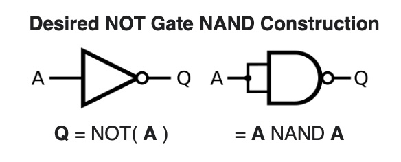
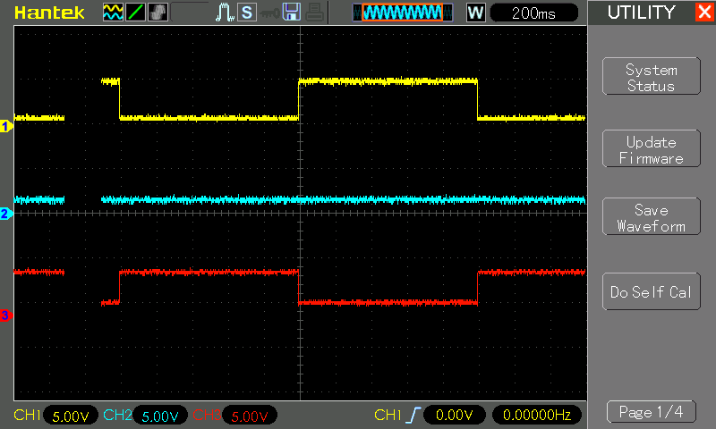

# #841 NOT Gate with NAND Logic

Demonstrating how a NOT gate may constructed solely from NAND gates.

## Notes

The NAND boolean function has the property of functional completeness, meaning that any Boolean expression can be expressed with an equivalent expression using only NAND operations.

The NAND Truth Table:

| A | B | Q |
|---|---|---|
| 0 | 0 | 1 |
| 0 | 1 | 1 |
| 1 | 0 | 1 |
| 1 | 1 | 0 |

The NOT Truth Table:

| A | Q |
|---|---|
| 0 | 0 |
| 1 | 1 |

A NOT gate is made by joining the inputs of a NAND gate together. Since a NAND gate is equivalent to an AND gate followed by a NOT gate, joining the inputs of a NAND gate leaves only the NOT gate.

### Circuit Design

Designed with Fritzing: see [NOT.fzz](./NOT.fzz).

### The Sketch

See [NOT.ino](./NOT.ino).

The sketch simply automates the A input, cycling through all 2 states.

### Test Results

Here's a scope trace capturing all 2 states, and demonstrating the the output is correct as expected.
Traces are offset vertically for clarity.

* CH1 (yellow): input A
* CH2 (blue): input B (unused)
* CH3 (red): output Q

## Credits and References

* [CD4011 datasheet](https://www.futurlec.com/4000Series/CD4011.shtml)
* <https://en.wikipedia.org/wiki/NAND_logic>
* See also:
    * [LEAP#838 AND Gate with NAND Logic](../AND/)
    * [LEAP#839 OR Gate with NAND Logic](../OR/)
    * [LEAP#840 NOR Gate with NAND Logic](../NOR/)
    * [LEAP#841 NOT Gate with NAND Logic](../NOT/)
    * [LEAP#842 XOR Gate with NAND Logic](../XOR/)
    * [LEAP#843 XNOR Gate with NAND Logic](../XNOR/)
