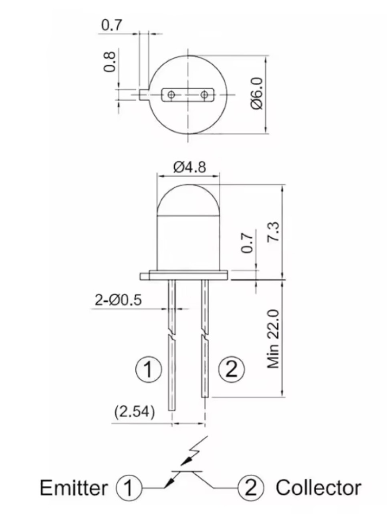
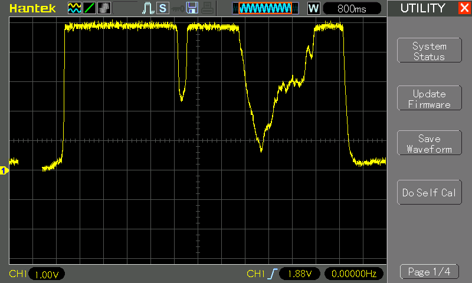

# #805 3DU5C Phototransistor

A quick review and test of the 3DU5C metal-encapsulated silicon phototransistor, used for light detection in the visible and infrared spectrum.

## Notes

The 3DU5C metal-encapsulated silicon phototransistor has a
peak sensitivity at 880nm in the infrared spectrum,
but it is relatively good sensitivity through the visible spectrum.
This makes it very useful in a wide range of applications.

Specifications:

* NPN Silicon Phototransistor
* Model : 3DU5C
* Working Voltage (max) : 10V
* Reverse Breakdown Voltage : 15V
* Dark Current : 0.3uA
* Photocurrent : 0.5-1mA
* Power Consumption : 30mW
* Peak Wavelength : 880nm
* Body Size : 7 x 5mm/ 0.28" x 0.2"(L*D)
* Total Length : 28mm/ 1.1"
* External Material : Metal
* Weight : 3g

The package has equal length leads. The emitter is identified by the metal tab on the can.

### Comparing Photodiodes and Phototransistors

See also
[The Art of Electronics](../../../books/the-art-of-electronics/)
12.6.1 Photodiodes and phototransistors (3rd Edition).

Photodiodes and phototransistors are both light-sensitive semiconductor devices, but they behave quite differently.

Photodiodes:

* A diode optimized to generate current when light hits its junction
* Light creates electron–hole pairs → produces a small photocurrent.
* Used in photoconductive mode (reverse-biased) or photovoltaic mode (like a tiny solar cell).
* Characteristics:
    * Fast response (nanoseconds to microseconds).
    * Low gain — the photocurrent is small because there’s no internal amplification.
    * Very linear and precise.
    * Wide wavelength range (UV → visible → IR depending on material).
    * Can be used for high-speed or analog light-measurement.
* Common uses:
    * Remote controls (as a raw sensor or inside modules).
    * Optical communication receivers.
    * Light meters / lux sensors.
    * Fiber optics.

Phototransistors:

* A transistor (BJT or sometimes photo-darlington) where light replaces the base current.
* Light generates base current → transistor amplifies it → much larger collector current.
* Characteristics:
    * High gain — much more sensitive than a photodiode.
    * Slower (microseconds to milliseconds) because transistor junctions store charge.
    * More nonlinear behavior.
    * Often packaged in IR receiver modules.
    * Requires some biasing and has more electrical complexity.
* Common uses:
    * IR object detection.
    * Slotted opto-switches / rotary encoders.
    * Simple ambient light detection.
    * Counter/frequency detection at modest speeds.

In summary:

| Feature        | Photodiode                     | Phototransistor                         |
| -------------- | ------------------------------ | --------------------------------------- |
| Sensitivity    | Low                            | High (amplified)                        |
| Speed          | Very fast                      | Slower                                  |
| Linearity      | Very good                      | Moderate                                |
| Noise          | Lower                          | Higher                                  |
| Output current | Small                          | Large (gain × photo-generated currents) |
| Best for       | Precision & high-speed sensing | Easy, high-sensitivity detection        |

### Test Circuit Design

This is a quick test of the sensitivity of the 3DU5C:

* positioned on the high-side of a 3.3kΩ resistor, so voltage measured at the emitter will increase with brightness
* a 3-wire voltmeter attached to monitor the voltage

Note: this is similar to the tests described in
[Make: More Electronics](../../../books/make-more-electronics/) Experiment 4: Measuring Light

Designed with Fritzing: see [3DU5C.fzz](./3DU5C.fzz).

### Test Results

Responds well to a wide range of light sources:

* LED lamp
* sunlight
* red, green, blue LEDs
* IR LED

The following is a scope trace of the voltage being excited with a blue LED:

## Credits and References

* ["2PCS 3DU5C Phototransistor Transistor Silicon Phototransistor Transistor Metal Package 2-pin NPN"](https://www.aliexpress.com/item/1005007571351820.html) - aliexpress seller
* <https://www.alibaba.com/product-detail/3DU5C-Silicon-Phototransistor-Two-Pin-Metal_1601271212767.html> - example alibaba source
* [The Art of Electronics](../../../books/the-art-of-electronics/) 12.6.1 Photodiodes and phototransistors (3rd Edition).
* [Make: More Electronics](../../../books/make-more-electronics/) Experiment 4: Measuring Light
