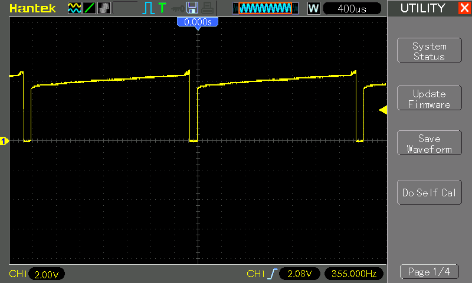

# #759 PWM Motor Control Module

Test and reverse-engineer cheap PWM module designed for 0%-99% duty cycle control at 5-16V to 10A.

## Notes

I often build PWM control circuits based around a 555 timer.
But is it worth making my own when
[PWM modules like this](https://www.aliexpress.com/item/1005006509700866.html) are available for ~S$1?

Seller's Specification:

* Voltage: DC 5V-16V
* Continuous Current: 10A
* Short maximum current: 20A (less than 10 seconds)
* Speed control mode: PWM step-less speed regulation, can also be used to adjust the light
* Control mode: speed control potentiometer (clockwise clicked open, continue to rotate clockwise from 1% to 99% speed)
* Duty cycle: 0%-99% (0% position is the state of the switch off when the potentiometer is most on the left).
* When the current is switched on, the 0.002A (long time no need to switch off the governor is no current).
* Efficiency: the maximum efficiency is as high as 98%.
* Volume: long 3cm (excluding potentiometer), wide 2cm, high 1.4cm

### Operating Principle and Circuit Design

Taking a closer look at the module, it basically comprises:

* 555 timer configured as a variable duty cycle astable using diode steering
    * theoretically running at around [300Hz](https://visual555.tardate.com/?mode=astable&r1=4.6&r2=0.1&c=1)
* the duty-cycle pot has a built-in switch, used to cut the common power input
* low-side MOSFET (NIKOS P0903BDG) controls the output
* NOTE: output connections share a common +ve with power input, but **not** a common ground

Here's my re-drawing of the module circuit in Fritzing:

### Testing

With 5V power supply and a simple resistive (LED) load, tracing the gate/555 timer out:

* with duty cycle dialed to min: +duty 2.5% at 350Hz
* with duty cycle dialed to max: +duty 95.5% at 350Hz

Tracing the output:

* with duty cycle dialed to min: +duty 2.5% at 350Hz
* with duty cycle dialed to max: +duty 95.5% at 350Hz

## Credits and References

* [5V 12V 10A Voltage Regulator PWM DC Motor Speed Controller Governor Stepless Speed Regulator LED Dimmer Power Controller](https://www.aliexpress.com/item/1005006509700866.html) - aliexpress
* [NIKOS P0903BDG](http://www.cheertech.com.tw/Niko-sem/Data%20sheet/P0903BDG.pdf)
* [LM555 Datasheet](https://www.futurlec.com/Linear/LM555CN.shtml)
