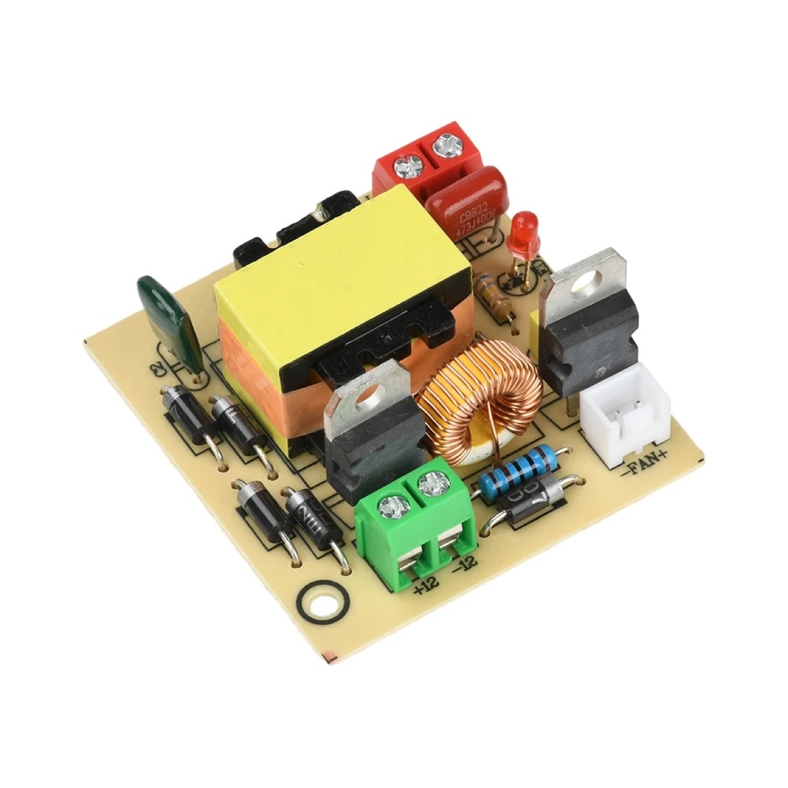
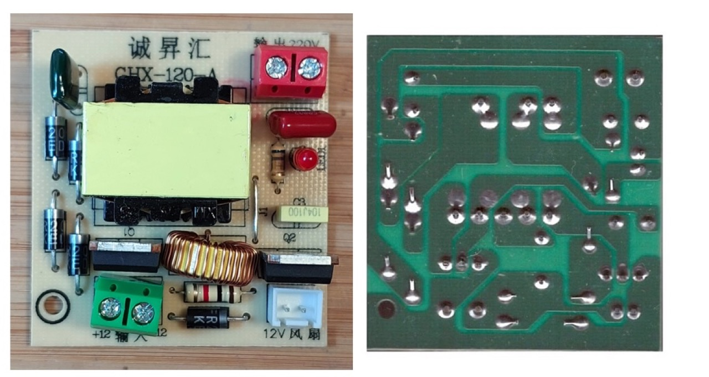
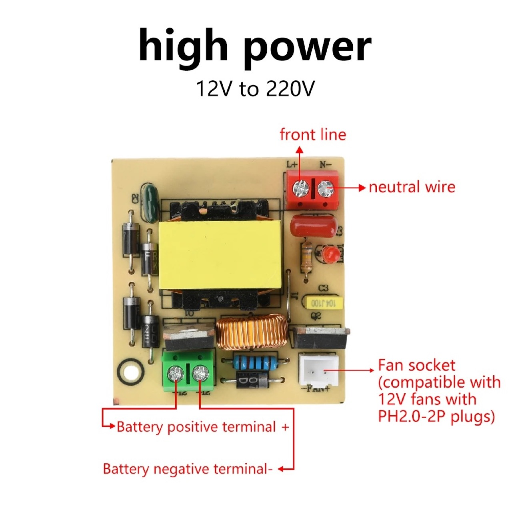
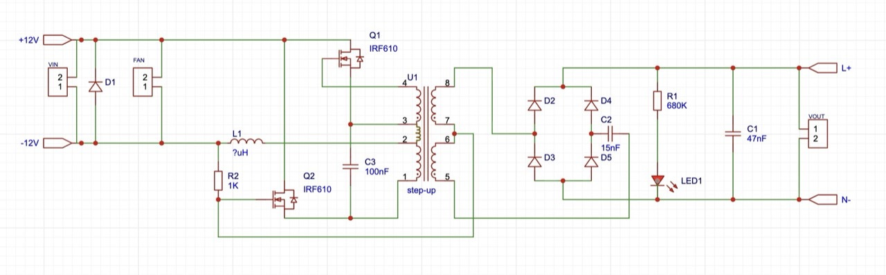
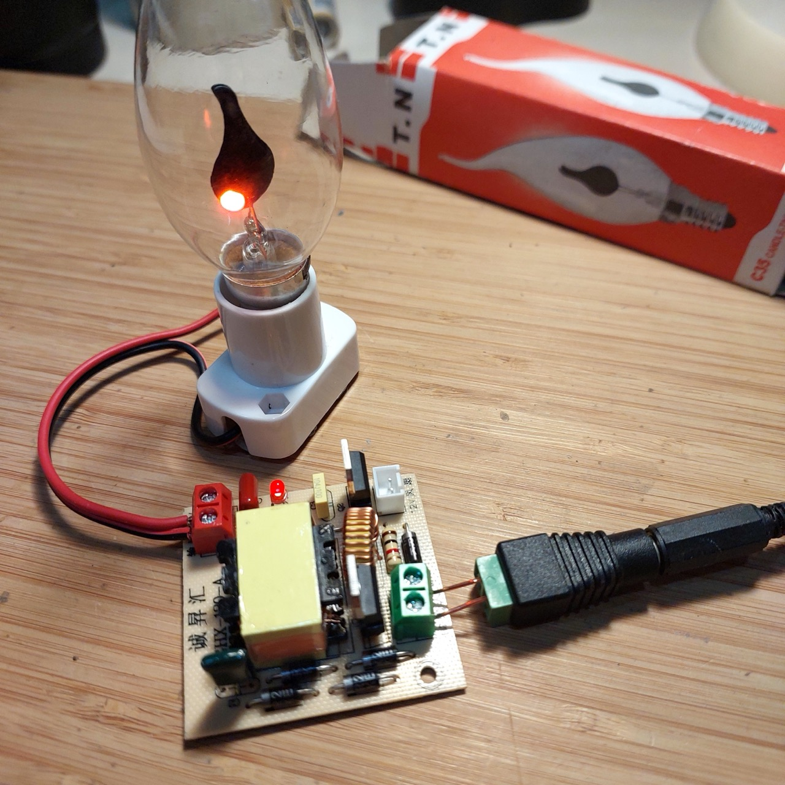

# #828 220V DC Boost Inverter

Review a common 12-16.8V DC to 220V DC inverter module. Test it with neon and flame-effect lamp loads across the input voltage range, and reverse-engineer the circuit.

## Notes

I purchased a
["DC 12-16.8V to 220V Boost Inverter Module High-Power 100W Boost Module Outdoor Universal Solar Panel Inverter DIY Electronic Kit" (aliexpress seller listing)](https://www.aliexpress.com/item/1005010587445476.html)
for SG$3.80 (Jan-2026).

This is a common 220V DC inverter design, available from many sources.

### Module Specifications

As provided by the seller:

> Features:
>
> * Wide input voltage range of 12-16.8V, stable 220V output, instantly powers small appliances
> * High-power boost capability of 50-100W, effortlessly drives light bulbs, routers, and speakers
> * Reserved fan interface for active cooling, ensuring long-term operation without overheating
> * Pure sine wave high-frequency inverter technology protects devices and extends lifespan
> * Versatile applications: Suitable for LED lights, mobile phone charging, printer operation, etc.
>
> Product Specifications:
>
> * Product Name: Boost Inverter
> * Input Voltage: DC 12-16.8V
> * Output Voltage: DC 220V
> * Current: 2.1A
> * Power: 50-100W (100W achievable with fan cooling)
> * Output: Only connect low-power appliances; output must not exceed 50W
> * Compatible Fan: DC 12V fan (with PH2.0-2P plug)
>
> Applications:
>
> Suitable for light bulbs, fluorescent lights, LED lights, energy-saving lamps (not compatible with resistor-capacitor lamps), mobile phone chargers, routers, broadband modems, speakers, surveillance equipment, etc.
>
> Cannot be used with temperature-adjustable soldering irons, solenoid valves, relays, capacitor charging, or power strips with indicator lights. Swapping the positive and negative output wires may resolve this. Does not support motors, fans, aquarium pumps, oxygen pumps, electric shavers, motor-driven devices, iron-core transformers, etc.
>
> Important Notes:
>
> * This product accepts only 12-16.8V battery input, converting it to 220V AC output. Do not reverse polarity or connect to electric vehicles. Ensure all connections are correct before applying battery power.
> * Install a cooling fan for extended operation or use in enclosed spaces. Do not test the output terminals with a multimeter.
> * This is a high-frequency inverter module. Exercise personal safety precautions during use and operate strictly according to specifications while ensuring safety.

### Module Usage

Three connection points:

* DC input
    * Note: the ground connection is marked -12V
* Fan
    * Note: this is simply wired in parallel with the DC input
* Output

### Module Construction

I've redrawn the module construction below. Some key points:

* I don't know the details of the step-up transformer
    * input side actually appears to be 2-tap bridged with a 3-tap to provide 4-tap input (not correctly drawn in the schematic)
    * output is 3-tap winding
* I'm only guessing Q1 and Q2 are IRF610 - appear to be, but markings have been removed
* We seem to have an oscillator driving the input windings to the transformer comprising the LC circuit and the two mosfets
* Transformer output is converted to DC with a full bridge rectifier and smoothing cap C1

### Test Circuit Design

For a quick test, I'm just loading the output with some high-voltage neon lamps:

* ["60pcs Neonlight Indicator Light Sign Lamp Assorted 4 * 10mm 5 * 12mm 6 * 16mm 20pcs each Red Vermelho Neon Light Lampada Bulb" (aliexpress seller listing)](https://www.aliexpress.com/item/32343993534.html)
    * purchased 60 for US $2.87/lot (Nov-2018).
* With a 150kΩ current-limiting resistor

Designed with Fritzing: see [220VInverter.fzz](./220VInverter.fzz).

Wired up and ready to test:

### Test

The following table records the behaviour as I step-up the input voltage.
Power is the total input power as measure by the power supply to the circuit.

| Input | Output | Power |
|-------|--------|-------|
| 1V    | -      | -     |
| 2V    | 40V    | 0.02W |
| 3V    | 68V    | 0.08W |
| 4V    | 92V    | 0.16W |
| 5V    | 116V   | 0.28W |
| 6V    | 141V   | 0.42W |
| 7V    | 165V   | 0.58W |
| 8V    | 190V   | 0.78W |
| 9V    | 215V   | 0.99W |
| 10V   | 240V   | 1.23W |
| 11V   | 265V   | 1.50W |
| 12V   | 290V   | 1.79W |

Note that the module claims to handle input voltages up to 16.8V,
but at 10V I am already exceeding the claimed output of 220V.

Perhaps this is load dependant. The neon lamp was only putting a very low load on the module.

I changing the load to a 240V 3W flame-effect bulb:

* ["New 1 Pc Flame/Candle Shapes E14 3W Fire LED Light Edison Bulb Lighting Vintage Flickering Effect Tungsten Novel Candle Tip Lamp" (aliexpress seller listing)](https://www.aliexpress.com/item/1005002870869026.html) purchased for SG$1.35 each (Nov-2021)

Repeated the test with the flame bulb:

| Input | Output | Power |
|-------|--------|-------|
| 1V    | -      | -     |
| 2V    | 40V    | 0.02W |
| 3V    | 68V    | 0.08W |
| 4V    | 94V    | 0.15W |
| 5V    | 112V   | 0.31W |
| 6V    | 131V   | 0.52W |
| 7V    | 153V   | 0.80W |
| 8V    | 176V   | 1.13W |
| 9V    | 199V   | 1.57W |
| 10V   | 223V   | 2.02W |
| 11V   | 246V   | 2.57W |
| 12V   | 270V   | 3.24W |

Note: only tested 12V momentarily, as it is over-driving the specs of the lamp.

While the lamp doubled the load, it hasn't helped with regulation.

### Conclusion

The converter is very effective, but totally unregulated - at 12V.

The input voltage needs to be adjusted to ensure the required output is generated.

## Credits and References

* ["DC 12-16.8V to 220V Boost Inverter Module High-Power 100W Boost Module Outdoor Universal Solar Panel Inverter DIY Electronic Kit" (aliexpress seller listing)](https://www.aliexpress.com/item/1005010587445476.html)
    * purchased for SG$3.80 (Jan-2026)
* ["60pcs Neonlight Indicator Light Sign Lamp Assorted 4 * 10mm 5 * 12mm 6 * 16mm 20pcs each Red Vermelho Neon Light Lampada Bulb" (aliexpress seller listing)](https://www.aliexpress.com/item/32343993534.html)
    * purchased 60 (20 x 4mm, 20 x 5mm, 20 x 6mm) for US $2.87/lot (Nov-2018).
* ["New 1 Pc Flame/Candle Shapes E14 3W Fire LED Light Edison Bulb Lighting Vintage Flickering Effect Tungsten Novel Candle Tip Lamp" (aliexpress seller listing)](https://www.aliexpress.com/item/1005002870869026.html)
    * purchased for SG$1.35 each (Nov-2021)
