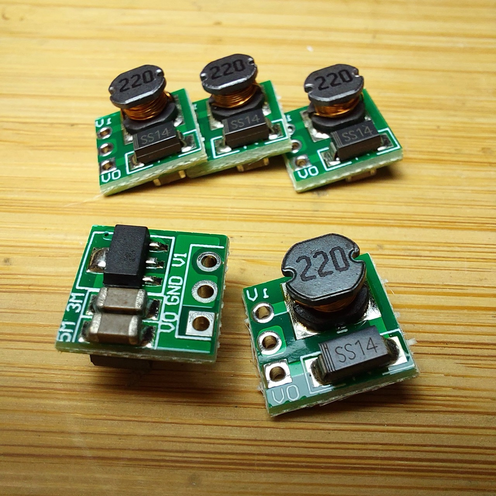

# #760 AAA 5v Power Pack

Using an amazingly small little boost converter to make a 5V regulated power pack from a couple of AAA batteries.

## Notes

I picked up some
[5V DC-DC Step-Up Power Modules](https://www.aliexpress.com/item/1005006438496545.html) on aliexpress for a nice price (SG$1.62 for 5),
following a suggestion from [@steveschnepp](https://github.com/tardate/LittleArduinoProjects/issues/77)
for making a 5V power pack from AA or AAA batteries.

These are tiny! They are built on a 10.4mm x 10.4mm PCB, gross component height 7.5mm.
There are 3 connections (Vin, Vout and Ground), which can take standard 2.54mm pin headers if desired (not supplied).

### Circuit Design

These modules are build around the [Micro One ME2108](https://www.microne.com.cn/product/124.html) step-up DC/DC converter from
[Nanjing Micro One Electronics Inc. 版权所有.南京微盟电子有限公司](https://www.microne.com.cn/).

Specifically, it uses the ME2108A/50 SOT-89-3 packaging with 5.0V output
and an operating input range of 0.9V~6.5V.

| PIN | NAME | FUNCTION                                         |
|-----|------|--------------------------------------------------|
| 1   | Vss  | Ground                                           |
| 2   | Vout | Output voltage monitor, IC internal power supply |
| 3   | Lx   | Switch                                           |

The module just implements the standard circuit using internal transistor as described in the datasheet:

Components:

* ME2108A/50 step-up DC/DC converter
* 220µH inductor
* SS14 - 1N5820 Small Signal Schottky Diode
* 5µF + 3µF capacitors? I haven't measured the values

### First Tests

It works just fine with 2x AAA batteries. Here's a quick test on a breadboard:

As the ME2108 has an input range of 0.9V~6.5V, it also works with a single AAA battery,
though the output regulation is down a little:

### A 2x AAA Power Pack

I've just added a switch and mounted on to a 2xAAA battery pack with globs of hot glue (for insulation as much as structural strength).

And now I have a little 5V power source powered by AAA batteries:

I really like this idea, especially for powering little embedded projects that need 5V: the smaller, cheaper and easier option than a rechargeable 18650 power pack.

## Credits and References

* [0.9-5V To 5V DC-DC Step-Up Power Module Voltage Boost Converter Board 1.5V 1.8V 2.5V 3V 3.3V 3.7V 4.2V To 5V](https://www.aliexpress.com/item/1005006438496545.html) - aliexpress
* Nanjing Micro One NB: currently serfved with an expired and invalid SSL certificate
    * [ME2108](https://www.microne.com.cn/product/124.html)
    * [Nanjing Micro One Electronics Inc. 版权所有.南京微盟电子有限公司](https://www.microne.com.cn/)
