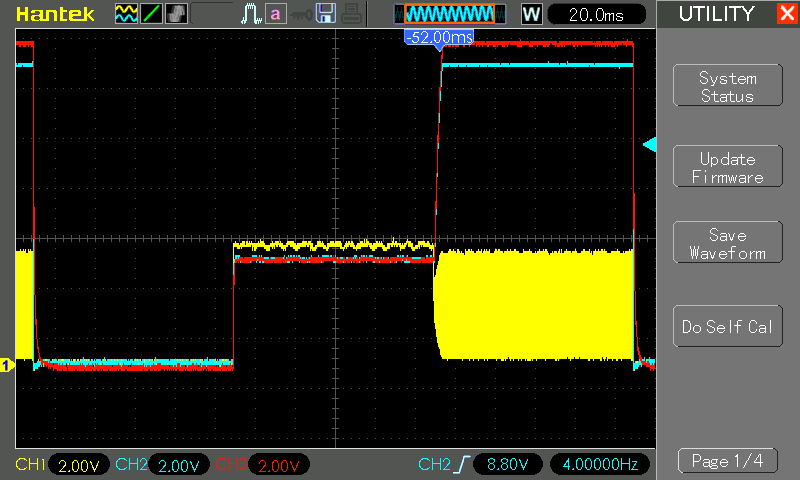

# #766 One Pin Three Voltage Levels

Designing and testing a circuit to drive and switch an output between 3 voltage levels (0v, VCC, 2.4xVCC) from a single GPIO pin.
Tested with an Arduino Uno running at 5V driving a 0V, 5V, 12V output on a single GPIO pin

## Notes

A common requirement when programming EEPROMs or other chips is to be able to switch between 3 voltage levels,
say 0V, 5V, and 12V. Specifically, LOW and HIGH voltage levels, and another VERY HIGH voltage level that is above the main power rail of the circuit.

For example, the
[LEAP#394 AT89C2051 Programmer](../../../../8051/AT89C2051/Programmer/)
uses two GPIO pins to drive a 12V charge pump and an additional GPIO pin to enable voltage output,
for a total of 3x GPIO pins. This can be rationalised to 2x GPIO pins if a half-wave charge pump is used instead.

But is it possible to drive 3 voltages levels using a single GPIO pin?

If the 3 voltages levels are LOW, HIGH, and then some MID-level voltage, the solution is quite simple:

* LOW output: GPIO LOW
* HIGH output: GPIO HIGH
* MID output: GPIO PWM out with RC averaging

However, we are interested in the case where the 3rd voltage is VERY HIGH i.e. above the HIGH power rail.

Is it possible? Well, yes. It was [steveschnepp who suggested an approach](https://github.com/tardate/LittleArduinoProjects/issues/25). I've tested and refined that a bit here.

This project demonstrates the control of 3 voltage levels with a single GPIO pin.
Note:

* I'm using an Arduino Uno with 5V GPIO, though the approach is generally applicable to any microcontroller
* The 3 output voltage levels are nominally 0V, 5V, and 12V.
* In practice, the voltages are actually 0V, 4.3V, and 11.8V, but these are expected to be within tolerances for LOW, HIGH, and VERY HIGH logic levels in most applications
* It is not possible to drive much power, especially at the VERY HIGH output level, but this is not required in most applications where 3 voltage levels need to be asserted.

### Circuit Design

Here is the final circuit, with a brief explanation of the operating principles.
See the breadboard and schematic details below, capture from the Fritzing file [OnePinThreeV.fzz](./OnePinThreeV.fzz).

There are 4 core sub-systems in the circuit:

* an Arduino Uno provides the 5V power rail and the single digital GPIO pin to control the circuit
* a push-pull driver centered around Q1, Q2 used to switch between high and low output
* an inverter (Q3) with RC-dampened gate used to switch the push-pull driver
* a half-wave Dickson charge pump with 3 positive stages that is used to generate the VERY HIGH voltage when excited

When asserting LOW (0V) output:

* GPIO output is set LOW
* the LOW GPIO output switches the inverter Q3 output HIGH
* this in turn enables the low-side nFET Q2 of the push-pull driver
    * VON is effectively floating with high-impedance
    * VOUT is pulled LOW to 0V
* the charge pump is inactive
    * with GPIO output LOW, there is no switching activity in the charge pump
    * no power via VON
* Output VOUT is ~0V

When asserting HIGH (5V nominal) output:

* GPIO output is set HIGH
* the HIGH GPIO output switches the inverter Q3 output LOW
* this in turn enables the high-side pFET Q1 of the push-pull driver
* VOUT is pulled HIGH
    * the nominal 5V output is reduced to ~4.3V due the voltage drop across Q1 and diode D9
    * a 1N5819 is used for D9, specifically for its very low forward voltage
    * D9 is required to prevent reverse voltage condition when VOUT is VERY HIGH
* Output VOUT is ~4.3V

When asserting VERY HIGH (12V nominal) output:

* GPIO output is set to a 62.5kHz PWM signal
    * the PWM signal is smoothed with RC filter (R1, C7)
    * given PWM frequency of 62.5kHz wavelength 16µs
    * smoothing to 3τ with R1=10kΩ resistor requires at least C7=[4.8nF](https://www.wolframalpha.com/input?i=%281%2F62.5kHz+*+3%29%2F10k%CE%A9)
    * so C7=10nF will reliably dampen the PWM ripple
* the effectively HIGH GPIO output switches the inverter Q3 output LOW
* this in turn enables the high-side pFET Q1 of the push-pull driver
* VON and VOUT are pulled HIGH
* the GPIO PWM signal drives the charge pump:
    * diode D8 prevents the RC smoothing from affecting the charge-pump PWM signal
    * VON provides the power to the pump
    * with 3 positive stages and minimal load, the pump voltage at CH3 rises to over 12V
    * zener diode D7 clamps VOUT to approx 12V (Rz absorbs the voltage drop)
* VOUT via the charge pump is >> VON via the push-pull stage
    * D9 prevents VOUT feeding back to VON
    * so VOUT governed by the charge-pump output
* Output VOUT is 12V nominal (11.8V as measured)

Miscellaneous features of the circuit:

* I added a 200mZ polyfuse to the Arduino 5V line to make sure it doesn't short and damage the onboard regulator
* LED2 and its R2 current-limiting resistor is optional. It provides an indicator that the VCC power rail is active.
* LED1 and its RL current-limiting resistor provides a relatively low-current load indicator
    * the green LED glows quite dim with 5V out
    * the green LED glows quite bright with 12V out
* I've added a 3-wire voltmeter to provide an output readout
    * power drawn from VCC
    * measures VOUT

Breadboard testing when in VOUT=0V mode:

Breadboard testing when in VOUT=5V mode:

Breadboard testing when in VOUT=12V mode:

### Testing

The [OnePinThreeV.ino](./OnePinThreeV.ino) sketch switches between 0V, 5V, and 12V output every 100ms.

The following scope trace captures the resulting output:

* CH1 (yellow) - GPIO output
* CH2 (blue) - effective VOUT
* CH3 (red) - charge pump output voltage prior to zener clamping

## Credits and References

* [Improvements on the "DicksonChargePump" #25](https://github.com/tardate/LittleArduinoProjects/issues/25) - steveschnepp
* [BS250 datasheet](https://www.futurlec.com/Transistors/BS250.shtml)
* [2N7000 datasheet](https://www.futurlec.com/Transistors/2N7000.shtml)
