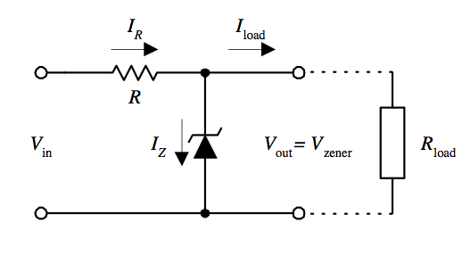
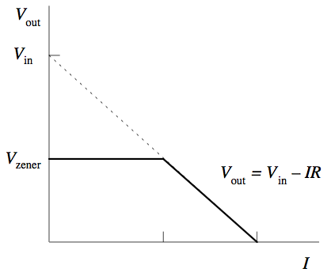
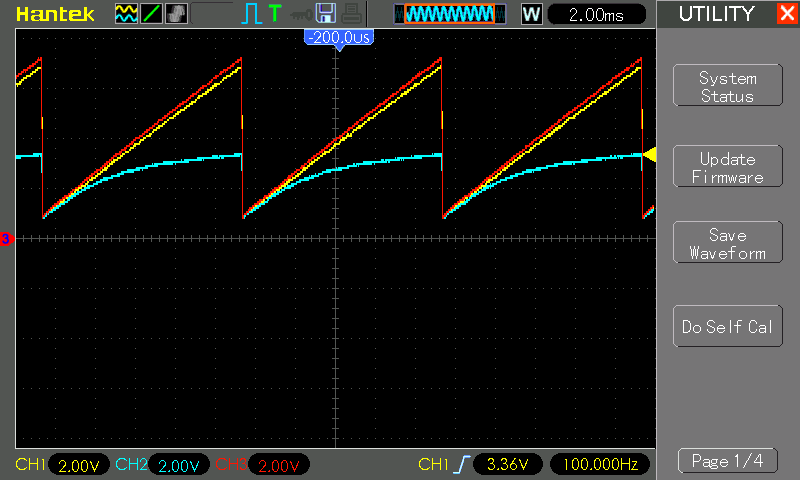

# #029 Zener Regulator

Using a zener diode as a voltage regulator.

## Notes

Zener diodes are commonly used as simple [voltage regulators](https://en.wikipedia.org/wiki/Zener_diode#Voltage_regulator).

The voltage regulator design puts the zener diode in parallel with the load, with a series resistor R to absorb any excess voltage drop:

As long as Vin is greater than the zener breakdown voltage, `Vout = Vzener`

* The zener diode will not conduct until Vin reaches the zener breakdown voltage, so in low voltage conditions, the load voltage will follow Vin
* Since the zener only carries the "overflow" current, load current is not really a factor in its performance
    * however it is important to ensure that the series resistor R is able to handle the voltage drop `Vin-Vzener` at the expected load current

### Testing the Behaviour

The test circuit uses a 3.3V 1N4728 zener diode in parallel with a 10kΩ "load" resistor.

A signal generator is used to feed a sawtooth wave, buffered by an LM358 voltage follower in order to provide sufficient drive power.
The LM358 is powered from 12V to provide sufficient headroom for the test.

In the following trace:

* CH1 (Yellow) - Vin
* CH2 (Blue) - Vout
* CH3 (Red) - Signal In
    * 100 Hz sawtooth, 6V peak-peak, offset +1V (1 min, 7V max)

Vout is measuring the voltage drop across the zener diode in parallel with the load resistor R1:

* when the input voltage is below the zener breakdown voltage, Vout follows Vin
* as the voltage approaches the zener breakdown voltage, Vout is clamped to the zener breakdown voltage

## Credits and References

* [Zener Voltage Regulator](https://en.wikipedia.org/wiki/Zener_diode#Voltage_regulator)
* [1N4728 datasheet](https://www.futurlec.com/Diodes/1N4728.shtml)
* [LM358N Datasheet](https://www.futurlec.com/Linear/LM358N.shtml)
