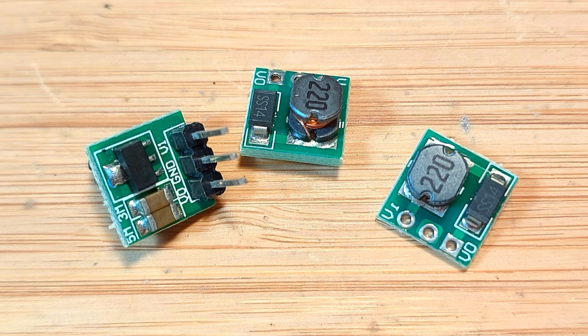

# #863 ME2108 Boost Converter Module

A micro boost converter module based on the ME2108 IC, with a fixed 5V output from operating input range of 0.9V~6.5V.

## Notes

These modules are built around the [Micro One ME2108](https://www.microne.com.cn/product/124.html) step-up DC/DC converter from
[Nanjing Micro One Electronics Inc. 版权所有.南京微盟电子有限公司](https://www.microne.com.cn/).

Specifically, they use the ME2108A/50 in SOT-89-3 packaging with 5.0V output
and an operating input range of 0.9V~6.5V.

| PIN | NAME | FUNCTION                                         |
|-----|------|--------------------------------------------------|
| 1   | Vss  | Ground                                           |
| 2   | Vout | Output voltage monitor, IC internal power supply |
| 3   | Lx   | Switch                                           |

The module implements the standard circuit using internal transistor as described in the datasheet:

Components:

* ME2108A/50 step-up DC/DC converter
* 220µH inductor
* SS14 - 1N5820 Small Signal Schottky Diode
* 5µF + 3µF capacitors? I haven't measured the values

### First Tests

It works just fine with 2x AAA batteries. Here's a quick test on a breadboard:

As the ME2108 has an input range of 0.9V~6.5V, it also works with a single AAA battery,
though the output regulation is down a little:

## Credits and References

* ["0.9-5V To 5V DC-DC Step-Up Power Module Voltage Boost Converter Board 1.5V 1.8V 2.5V 3V 3.3V 3.7V 4.2V To 5V" (aliexpress seller listing)](https://www.aliexpress.com/item/1005006438496545.html)
    * Purchased for SG$1.74 including tax for 5 pieces (Nov-2024)
* Nanjing Micro One NB: currently served with an expired and invalid SSL certificate
    * [ME2108](https://www.microne.com.cn/product/124.html)
    * [Nanjing Micro One Electronics Inc. 版权所有.南京微盟电子有限公司](https://www.microne.com.cn/)
