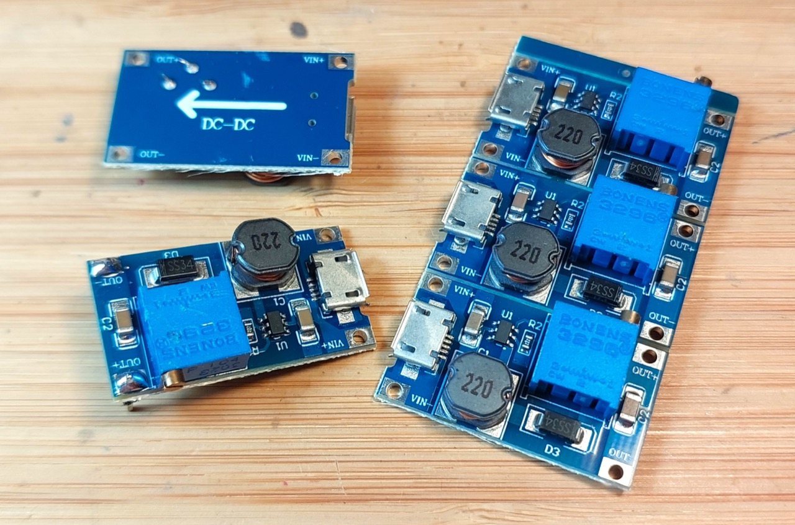
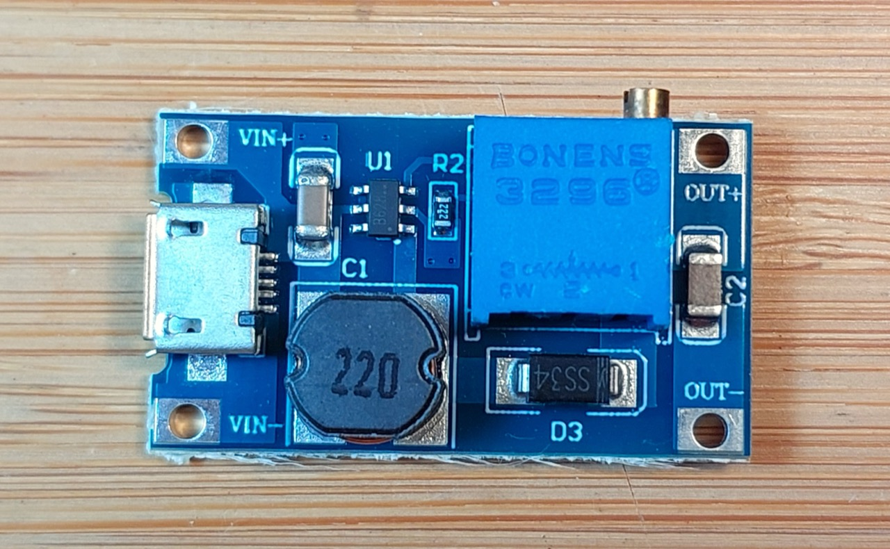
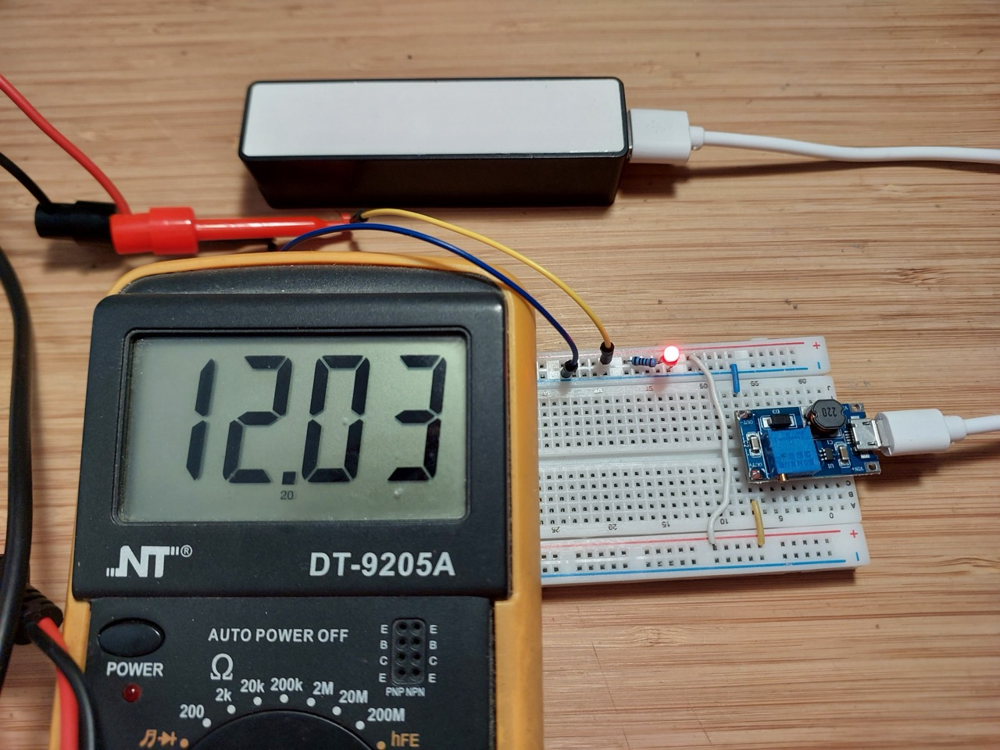

# #862 MT3608 Boost Converter Modules

Low-cost boost converter modules based on the MT3608 IC, with optional USB input connectors, and output adjustable up to 28V from input 2V~24V DC.

## Notes

MT3608-based boost converter modules are available from many sources.
The [aliexpress seller](https://www.aliexpress.com/item/4001066566291.html) I purchased from offers the module in 3 variants.
It is the same board but with different input connectors:

* input and output connector pads for solder or mechanical connection
* micro USB input connector
* USB-C input connector

I am testing the module with the micro USB connector:

### About the MT3608

The MT3608 (parts also produced as the B6286) is a very efficient boost converter that can deliver up to 24V at 4A.
It requires only 6 external passive components, and is readily available as a complete module for as little as $0.40.

* 2V to 24V Input Voltage
* 1.2MHz Fixed Switching Frequency
* Internal 4A Switch Current Limit
* Internal Compensation
* Up to 28V Output Voltage
* Automatic Pulse Frequency Modulation Mode at Light Loads
* up to 97% Efficiency
* SOT23-6 package

### Quick Test

With 5V input, testing regulation at 12V output:

## Credits and References

* ["5PCS MT3608 DC-DC Step Up Converter Booster Power Supply Module Boost Step-up Board MAX output 28V 2A" (aliexpress seller listing)](https://www.aliexpress.com/item/4001066566291.html)
    * Purchased the micro USB variant for SG$2.28 for 5 pieces (Jun-2023)
* [MT3608 datasheet](https://www.olimex.com/Products/Breadboarding/BB-PWR-3608/resources/MT3608.pdf)
