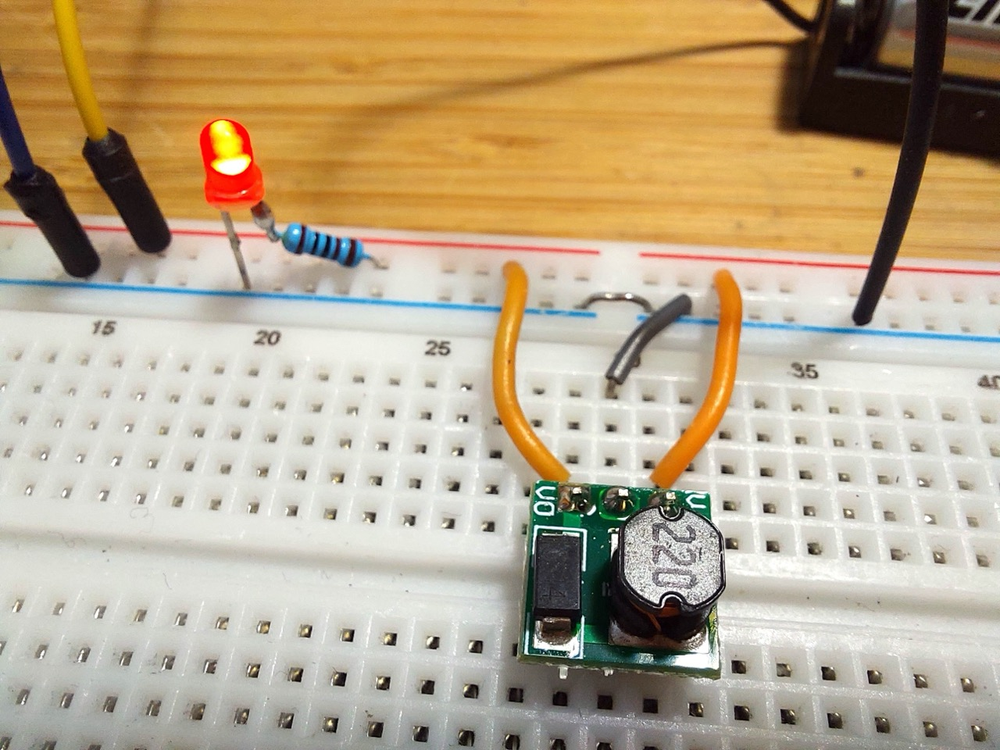
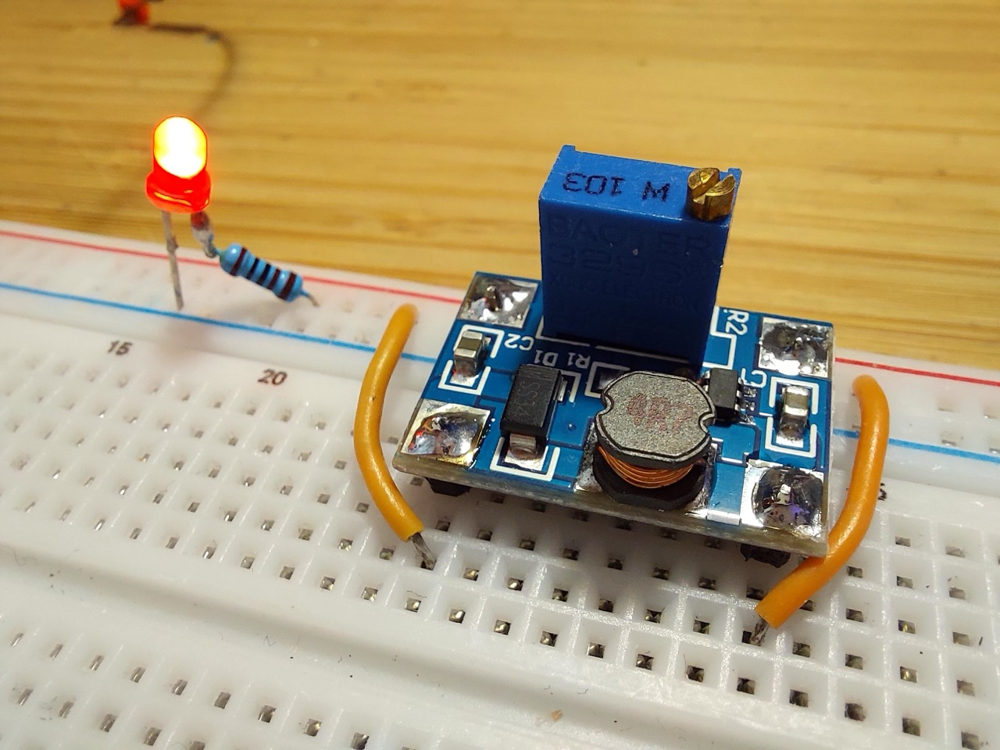
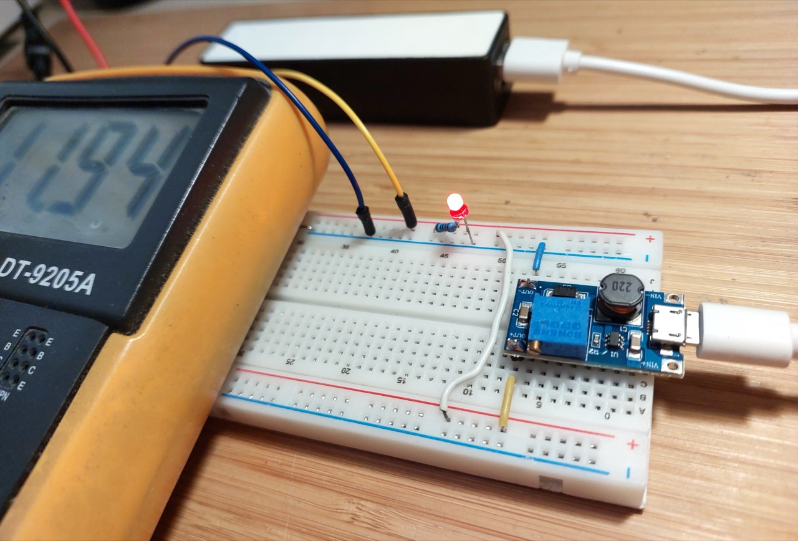

# #864 Boost Converter Modules

Reviewing a range of low-cost boost converter modules that can generally supply up to 30V.

## Notes

There are many super-cheap boost converter modules available.
I have collated the notes on many devices I've tried here.
See the individual project pages for each device for full details.

### Module 1 - ME2108 5V Boost Converter Module

See [LEAP#863 ME2108 Boost Converter Module](./ME2108Module1/).

A micro boost converter module based on the ME2108 IC, with a fixed 5V output from operating input range of 0.9V~6.5V.

### Module 2 - SX1308 Boost Converter Module

See [LEAP#861 SX1308 Boost Converter Module](./SX1308Module1/).

A small boost converter module based on the SX1308 IC, with output adjustable up to 28V from input 2V~24V DC.

### Module 3 - MT3608 Boost Converter Module

See [LEAP#862 MT3608 Boost Converter Module](./MT3608Module1/).

Low-cost boost converter modules based on the MT3608 IC, with optional micro USB input connector, and output adjustable up to 28V from input 2V~24V DC.

## Credits and References

* [ME2108 product info](https://www.microne.com.cn/product/124.html)
* [MT3608 datasheet](https://www.olimex.com/Products/Breadboarding/BB-PWR-3608/resources/MT3608.pdf)
* [SX1308 datasheet](https://www.sunrom.com/download/458.pdf)
