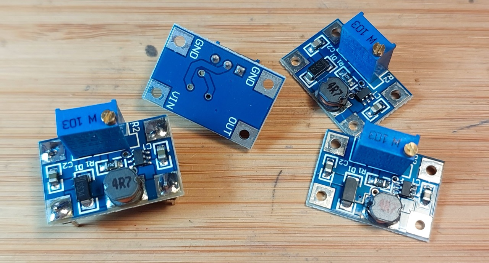
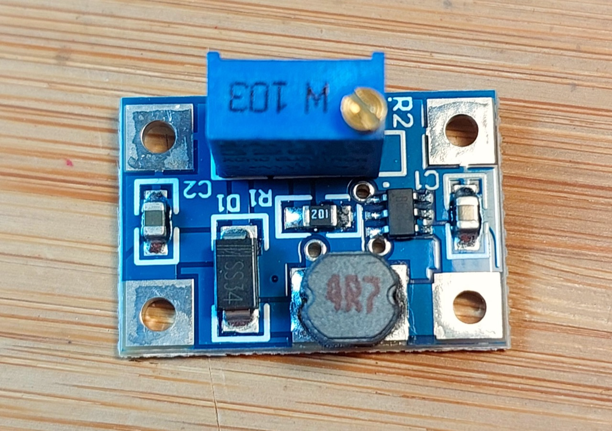
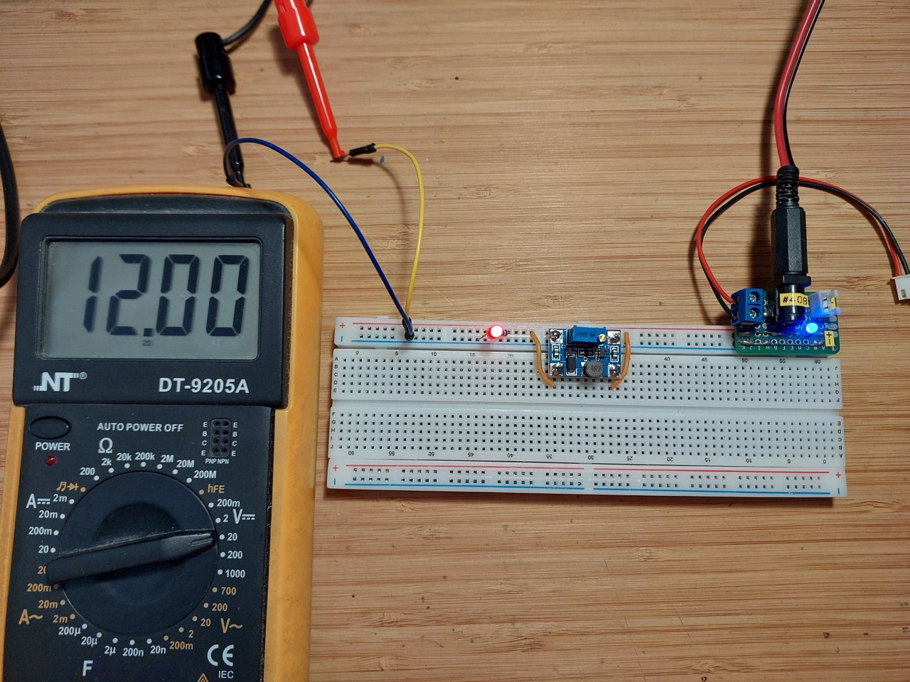
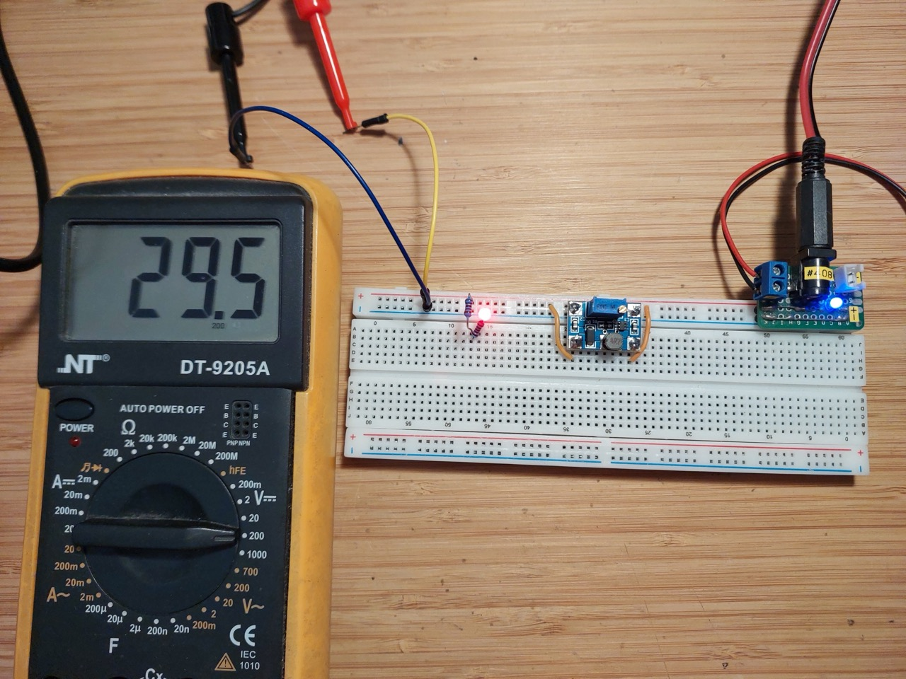

# #861 SX1308 Boost Converter Module

A small boost converter module based on the SX1308 IC, with output adjustable up to 28V from input 2V~24V DC.

## Notes

SX1308-based boost converter modules are available from many sources.
The [aliexpress seller](https://www.aliexpress.com/item/4001066566291.html) I purchased from offers the module
in a small form factor with no input or output connectors, suitable for wiring into any circuit.

### About the SX1308

The SX1308 Boost Converter is a tiny, high-efficiency DC-DC step-up adjustable power module that turns a lower voltage into a higher voltage

* Input Voltage: 2V to 24V DC
* Output Voltage: Adjustable up to 28V (or ~31V max depending on the specific breakout board)
* Maximum Output Current: Up to 2A (internal switch limit)
* Switching Frequency: Fixed 1.2 MHz
* Efficiency: Up to 95%–96%

### Quick Test

With 5V input, testing regulation at 12V and 30V output:

## Credits and References

* ["5PCS MT3608 DC-DC Step Up Converter Booster Power Supply Module Boost Step-up Board MAX output 28V 2A" (aliexpress seller listing)](https://www.aliexpress.com/item/4001066566291.html)
    * Purchased the SX1308 variant for SG$2.14 for 5 pieces (Jun-2023)
* [SX1308 datasheet](https://www.sunrom.com/download/458.pdf)
