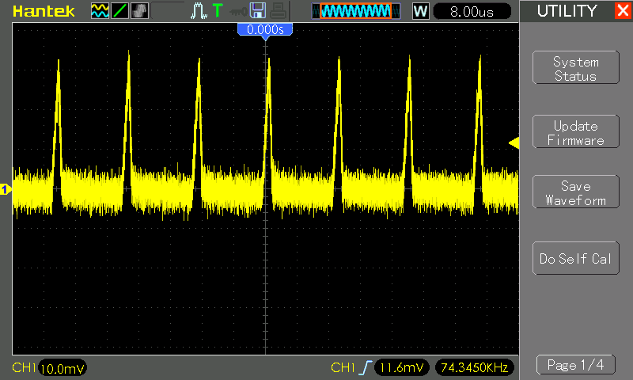

# #821 LM2596S 2.6-30V Buck Converter Module

A common LM2596S-based buck converter module with adjustable-voltage control, operating at around 50kHz switching frequency.

## Notes

NB: see [LEAP211 Buck Converter Modules](../) for an overview of all the buck converter modules I have tried.

This item is very similar to
[LEAP#822 LM2596S 1.23V-30V Buck Module](../LM2596SModule2/)
but with slightly different components.

I purchased the
["1PCS NEW LM2596 DC-DC adjustable power step-down module" (aliexpress seller listing)](https://www.aliexpress.com/item/32276206956.html)
for US$0.93 (Oct-2015).

The product is no longer available from the same seller, but the same item is
["LM2596S DC-DC 3A Adjustable Step-down Module LM2596 Constant Current Voltage Regulator High Efficiency Low Heat" (aliexpress seller listing)](https://www.aliexpress.com/item/1005010353698432.html) currently listed for SG$1.61 (Jan-2026).

Buck circuit comprises:

* LM2596S-ADJ (as marked, but behaves more like an LM2576 - see note below)
* 330µH output inductor
* 220µF output capacitor

### Test Circuit Design

In the test configuration, I have the buck converter adjusted to ~3V output,
and two blue LEDs in parallel with the load. The LEDs have a forward voltage Vf of ~3V.

Designed with Fritzing: see [LM2596SModule1.fzz](./LM2596SModule1.fzz).

### Performance

* minimum voltage achieved in practice: 2.56V
* switching frequency appears to be in the ~50kHz range rather than the 150kHz per datasheet(??)
* switching spikes around 30-40mV

### Conclusion

This is one of the most common modules, but quite noisy and can't regulate to very low voltages.

It also behaves more like an LM2576:

* the 330µH inductor is also more suited to a standard LM2576 topology rather than the 33µF recommended for the LM2596.
* the apparent switching frequency is closer to the LM2576 52kHz rather than the LM2596's 150kHz.
* so is this a fake or QC-fail LM2596S-ADJ? Possibly, if my scope traces are reliable.

## Credits and References

* ["1PCS NEW LM2596 DC-DC adjustable power step-down module" (aliexpress seller listing)](https://www.aliexpress.com/item/32276206956.html)
    * Originally purchased for for US$0.93 (Oct-2015).
    * No longer offered by this seller.
* ["LM2596S DC-DC 3A Adjustable Step-down Module LM2596 Constant Current Voltage Regulator High Efficiency Low Heat" (aliexpress seller listing)](https://www.aliexpress.com/item/1005010353698432.html)
    * Same product, currently listed for SG$1.61 (Jan-2026).
* Texas Instruments:
    * [LM2596 product page](https://www.ti.com/product/LM2596)
    * [LM2596 datasheet](https://www.ti.com/lit/ds/symlink/lm2596.pdf)
    * [LM2576 product page](https://www.ti.com/product/LM2576)
    * [LM2576 datasheet](https://www.ti.com/lit/ds/symlink/lm2576.pdf)
