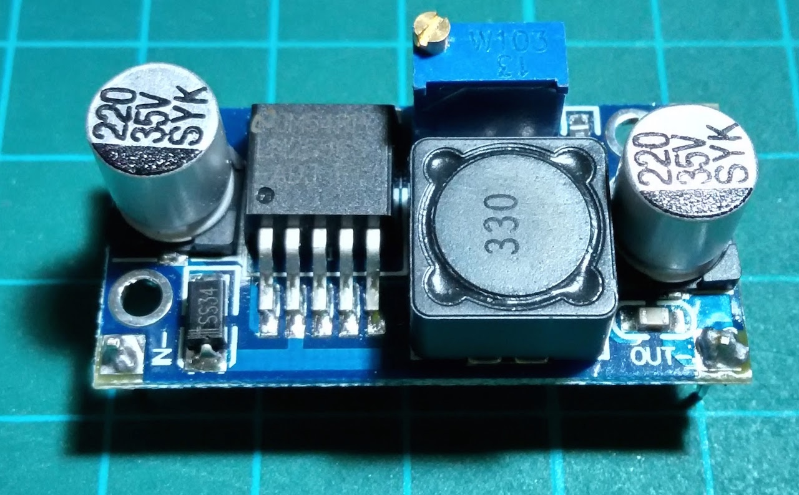
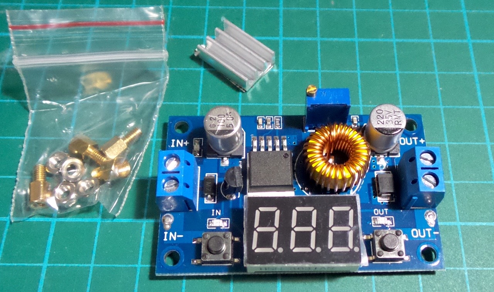
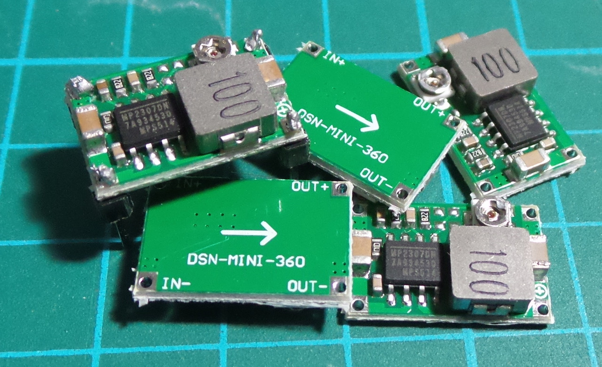
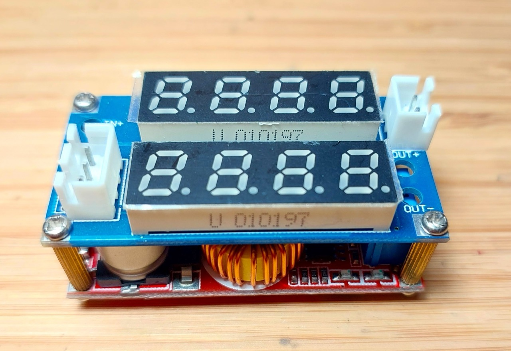

# #211 Buck Converter Modules

Reviewing a range of low-cost buck converter switch-mode power supplies that can generally supply up to 30V.

## Notes

There are many super-cheap buck converter modules available.
I have collated the notes on many devices I've tried here.
See the individual project pages for each device for full details.

### Module 1 - LM2596S 2.6-30V Buck Module

See [LEAP#821 LM2596S 2.6-30V Buck Module](./LM2596SModule1/).

A common LM2596S-based buck converter module with adjustable-voltage control, operating at around 50kHz switching frequency.

### Module 2 - LM2596S 1.23V-30V Buck Module

See [LEAP#822 LM2596S 1.23V-30V Buck Module](./LM2596SModule2/).

Another LM2596S-based buck converter with adjustable-voltage control and slightly different components, operating at around 50kHz switching frequency.

### Module 3 - XL4015 1.25V-36V Buck Module

See [LEAP#823 XL4015 1.25V-36V Buck Module](./XL4015Module1/).

An XL4015-based buck converter with adjustable-voltage control and selectable input/output voltage display.

### Module 4 - MP2307DN 1.0V-17V Buck Module

See [LEAP#824 MP2307DN 1.0V-17V Buck Module](./MP2307Module1/).

A common MP2307DN-based buck converter module that is extremely small and convenient for relatively low-power requirements under 17V.

### Module 5 - XL4015 0.8-30V Buck Module

See [LEAP#825 XL4015 0.8-30V CC/CV Buck Converter with Display](./XL4015Module2/).

Features constant-current, constant-voltage control, LED display of both current and voltage, and a serial interface for remotely querying current and voltage.

## Credits and References

* Texas Instruments:
    * [LM2596 product page](https://www.ti.com/product/LM2596)
    * [LM2596 datasheet](https://www.ti.com/lit/ds/symlink/lm2596.pdf)
    * [LM2576 product page](https://www.ti.com/product/LM2576)
    * [LM2576 datasheet](https://www.ti.com/lit/ds/symlink/lm2576.pdf)
* XLSemi
    * [DC-DC Converters](https://www.xlsemi.com/products_DC_DC_buck_mv.html)
    * [XL4015 datasheet](https://www.xlsemi.com/datasheet/XL4015-EN.pdf)
    * [XL4015 DEMO board manual](https://www.xlsemi.com/demo/XL4015-DEMO.pdf)
* [MP2307 datasheet](https://cdn-shop.adafruit.com/datasheets/MP2307_r1.9.pdf)
* [App note: Diode turn-on time induced failures in switching regulators](http://dangerousprototypes.com/2013/01/05/diode-turn-on-time-induced-failures-in-switching-regulators/)
* [..as mentioned on my blog](https://blog.tardate.com/2016/07/littlearduinoprojects211-buck-converter.html)
