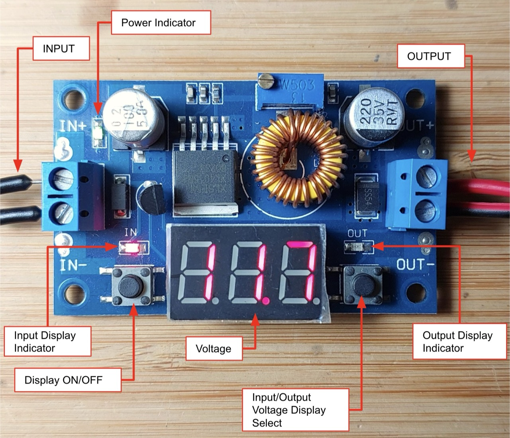

# #823 XL4015 1.25V-36V Buck Converter Module with Voltage Display

An XL4015-based buck converter with adjustable-voltage control and selectable input/output voltage display.

## Notes

NB: see [LEAP211 Buck Converter Modules](../) for an overview of all the buck converter modules I have tried.

I purchased the
["5A 75W XL4015 DC-DC Converter Adjustable Step-Down Module 4.0-38V to 1.25V-36V DIY Adjustable Power Supply Free Shipping" (aliexpress seller listing)](https://www.aliexpress.com/item/32411291600.html)
for US$2.80 (May-2016).

The product is no longer available from the same seller, but the same item is
["XL4015 High power 5A 75W DC-DC Adjustable Step-down Charger Module Step Down Buck Converter LED Driver with Red Voltmeter"  (aliexpress seller listing)](https://www.aliexpress.com/item/1005008919620321.html)
currently listed SG$2.82 (Jan-2026).

Board comprises:

* XL4015E5 with toroidal inductor and capacitors as per datasheet recommendations
* digital voltmeter with push-buttons to switch display on/off and select input/output voltage for display

Controls and indicators:

* Display ON/OFF push-button: turns on/off the LED voltage display
* Input/Output Voltage Display Select push-button: toggles between input/output voltage display
* Power Indicator: green LED, always ON when power is ON
* Input Display Indicator: red LED, ON when input voltage is displayed
* Output Display Indicator: red LED, ON when output voltage is displayed

### Test Circuit Design

In the test configuration, I have the buck converter adjusted to ~3V output,
and two blue LEDs in parallel with the load. The LEDs have a forward voltage Vf of ~3V.

Designed with Fritzing: see [XL4015Module1.fzz](./XL4015Module1.fzz).

### Performance

Up with the best. There's no scope capture below because despite my best attempts, the output voltage remained flat as a board (no detectable ripples or spikes .. just the normal noise floor)

## Credits and References

* ["5A 75W XL4015 DC-DC Converter Adjustable Step-Down Module 4.0-38V to 1.25V-36V DIY Adjustable Power Supply Free Shipping" (aliexpress seller listing)](https://www.aliexpress.com/item/32411291600.html)
    * Originally purchased for US$2.80 (May-2016).
    * No longer offered by this seller.
* ["XL4015 High power 5A 75W DC-DC Adjustable Step-down Charger Module Step Down Buck Converter LED Driver with Red Voltmeter"  (aliexpress seller listing)](https://www.aliexpress.com/item/1005008919620321.html)
    * Same product, currently listed for SG$2.82 (Jan-2026).
* XLSemi
    * [DC-DC Converters](https://www.xlsemi.com/products_DC_DC_buck_mv.html)
    * [XL4015 datasheet](https://www.xlsemi.com/datasheet/XL4015-EN.pdf)
    * [XL4015 DEMO board manual](https://www.xlsemi.com/demo/XL4015-DEMO.pdf)
