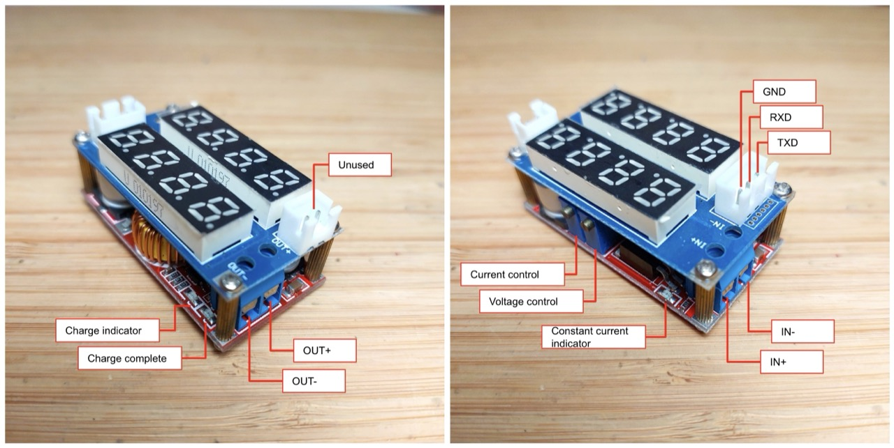
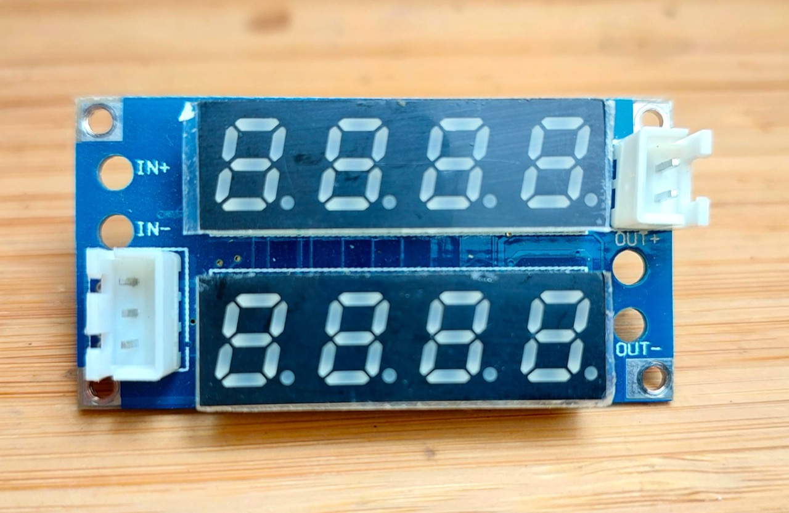
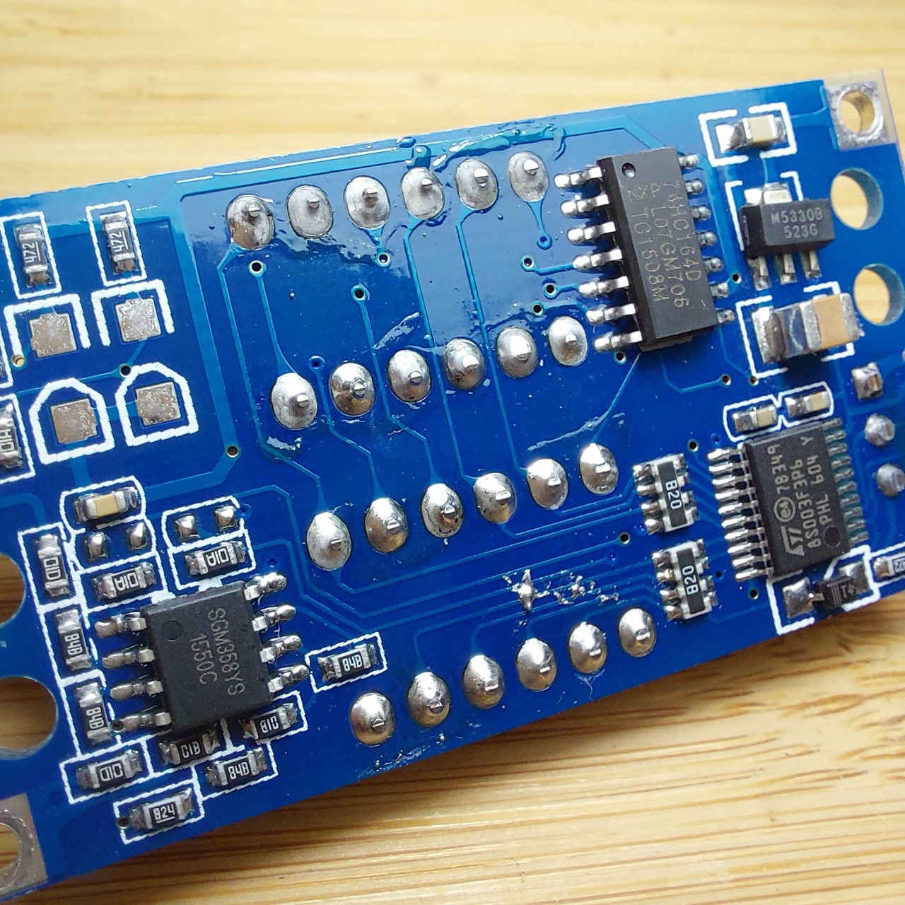

# #825 XL4015 0.8-30V CC/CV Buck Converter with Display

Testing an XL4015-based buck converter with adjustable voltage and current controls and display. The serial interface is tested with a python script to capture current and voltage readings from the measurement board.


## Notes

NB: see [LEAP211 Buck Converter Modules](../) for an overview of all the buck converter modules I have tried.

I purchased the
["5A Adjustable CC/CV Display Step Down charge Module LED Panel Voltmeter Ammeter" (aliexpress seller listing)](https://www.aliexpress.com/item/32595519873.html) for US$5.03 (Jun-2016).

NB: it is no longer offered by this seller, but the same model is still widely available
e.g.
["XL4015 5A 75W Adjustable Power CC/CV Step-Down Charge Module LED Driver Voltmeter Ammeter Constant Current Voltage" (aliexpress seller listing)](https://www.aliexpress.com/item/1005008980068690.html)
currently listed for SG$7.28  (Jan-2026).

The basic module is an XL4015-based buck converter with adjustable voltage and constant current limit.

A second board holds the current and voltage sense and display circuitry. The board can be removed if the display is not required.

The module works well as a buck converter.

It does feature over-current protection or constant current control, however it requires manual calibration as there is no display of the current limit setting.

It claims to be suitable as a lithium battery charger, however I'd probably not consider it in that role because of the uncalibrated, manual current control.

There are some practical issues that would need to be addressed in order to use the module in a project:

* the 10kΩ voltage and current control potentiometers would need to be replaced with more conveniently controls if adjustment is to be allowed
* mounting the board could be a challenge, as the 4 corner mounting poles are actually powered and integral to the functioning of the device.

In the following notes, I examine the construction of the board, test it out, and even explore using the serial interface for taking remote readings of the current and voltage.

### Module Specifications

NB: these are the details provided by the seller.

> Product Introduction:
>
> This module is an adjustable voltage reduction module with an LED digital tube, which can achieve real-time monitoring of output voltage and current. The output voltage and output current can be changed by adjusting the blue adjustable resistor on the module (refer to the functional diagram below for specific instructions). The input and output voltage difference is 1V.
>
> Product parameters:
>
> * Input voltage: DC5V-32V;
> * Output voltage: adjustable from DC0.8-30V;
> * Conversion efficiency: maximum 96%;
> * Output current: Maximum output current of 5A, adjustable;
> * Output power: maximum 75W;
>
> Special attention:
>
> * Pay attention to wiring according to the diagram and do not make mistakes.
> * The positive and negative terminals of the input terminal cannot be reversed, otherwise the module will be directly burned out;
> * The maximum input voltage and maximum output current cannot be met simultaneously. Long term use should not be subjected to high voltage, high current, or hot plugging, and attention should be paid to strengthening heat dissipation;
> * The maximum output power is 75W, which is a limiting condition. Please leave some margin for use; When using this module with a power output exceeding 3A or 35W, please strengthen the heat dissipation;
> * When used as a voltage reduction module, the input voltage is greater than the output voltage;
> * If the digital display is incomplete or abnormal, check whether the copper pillar is installed properly, tighten the screws around the product, and connect the upper and lower plates.
>
> Communication protocol description:
>
> * This module has the function of communicating with computers. Can facilitate computer reading of module current and voltage data;
> * As the output of this module is TTL level, to achieve communication with the computer, the module can be connected to the computer through a USB to TTL serial port module.
> * The communication protocol is as follows:
>     * Baud rate: 9600 Bps
>         * BB CC ADDR 00 XX XX CRC (current return command)
>         * BB CC ADDR 01 XX XX CRC (Voltage Return Command)
>     * of which
>         * BB CC is the frame header (2 bytes)
>         * ADDR is the module address (1 byte)
>         * 00 is the current reading command (1 byte)
>         * 01 is the command to read voltage (1 byte)
>         * XX XX arbitrary value (2 bytes)
>         * CRC Check (1 byte)
>
> Function characteristics:
>
> * It can be used as a common voltage reduction module with overcurrent protection capability;
> * Can be used as a battery or battery charger;
> * Can be used as a high-power LED constant current drive module;
> * It has two modes: constant current and constant voltage, and an indicator light to indicate which mode it is currently in;
> * When used as a lithium battery charger, the float charging voltage and charging current can be set, and there is an indicator light to indicate whether it is charging or fully charged;
> * It has a current limiting protection function, which will not burn out the module even if the output is short circuited.

### Module Construction



The lower board is a conventional XL4015-based buck converter with adjustable voltage and constant current limit.


A upper board holds the current and voltage sense and display circuitry. The board can be removed if the display is not required.

The 4 metal spacers in each corner are actually used to conduct IN+, IN-, OUT+, OUT- between the boards.



The upper board features:

* 74HC164D 8-Bit Parallel-Out Serial Shift Registers
    * to drive LED display
* SGM358YS rail-rail opamp
    * for current/voltage measurement
* STM8S003F3P6 8 Bit MCU, STM8 Family STM8S Series Microcontrollers, 16 MHz, 8 KB, 20 Pins
    * take measurements
    * drive the display
    * host the serial communications



#### LED Indicators

| LED                        | Colour | Behaviour                         |
|----------------------------|--------|-----------------------------------|
| charging indicator         | Blue   | ON when output current > ~20mA    |
| charge complete indicator  | Red    | ON when output current < ~20mA    |
| constant current indicator | Red    | ON when output is current limited |

### Test Circuit Design

To test the module, I am using:

* 12V bench power supply on the input side
* 10Ω 25W resistive load on the output side
* optional serial adapter

Designed with Fritzing: see [XL4015-Charge-Module.fzz](./XL4015-Charge-Module.fzz).


Wired up for a basic test.
Note that the refresh frequency of the display is
fast enough to be easily read with the naked eye,
but far too slow forme to be able to capture it with a camera.
Trust me: the display readings are accurate!


## Testing the Serial Communications

I'm using a CH340G USB-serial adapter from my macOS host.
See
[LEAP#406 Custom CH340G USB to UART interface](../../../../SerialInterface/UsbUartCH340G/) for more details.

The RX/TX connections need to be crossed when connecting between the device and adapter:

| USB-Serial | Power Supply |
|------------|--------------|
|  GND       |  GND         |
|  RXD       |  TXD         |
|  TXD       |  RXD         |


### The Serial Protocol

I've been able to expand on the vendor-supplied serial interface details. The following is the serial protocol as implemented by the specific
device I am testing.

Request frame:

```txt
0xBB 0xCC ADDR CMD XX XX CRC
```

Response frame:

```txt
0xBB 0xCC ADDR CMD LSB MSB
```

Where:

* 0xBB 0xCC is the frame header (2 bytes)
* ADDR is the module address (1 byte)
    * the module I have responds to address 0x00.
* CMD=00 indicates current (1 byte)
* CMD=01 indicates voltage (1 byte)
* XX XX arbitrary value (2 bytes)
* CRC Check (1 byte)
* LSB, MSB: 16 bit reading value

Note:

* Operates at 9600 baud
* I've implemented two CRC strategies: additive (sum & 0xFF) and CRC-8 (poly 0x07).
* BUT the request CRC appears to be ignored by the device. The device responds regardless of the CRC value supplied.
* There is no CRC in the response.

Example interaction:

```txt
Sent Frame: BB CC 00 00 00 00 87
Received Frame: BB CC 00 00 31 00
Sent Frame: BB CC 00 01 00 00 88
Received Frame: BB CC 00 01 FA 01
```

This reads as:

* Current: 0.049 A (0x0031 mA)
* Voltage: 0.506 V (0x01FA mV)

### Testing the Connection

I've written a python script [monitor.py](./monitor.py) to query and report the voltage and current readings.

The script should be given the appropriate TTY post (as there are no flow-control lines).

e.g. with the device set for 3V output, no current control, into the 10Ω load:

```sh
$ ./monitor.py -p /dev/tty.usbserial-2420
Voltage: 3.078 V, Current: 0.302 A
```

Running a series of captures
with the output voltage set to 5V into the 10Ω load.
Initially the current limit is not active, but then gradually wind down the current limit control:

```sh
$ for (( ; ; )) ; do python monitor.py -p /dev/tty.usbserial-2420 ; sleep 1 ; done
Voltage: 5.024 V, Current: 0.490 A
Voltage: 5.024 V, Current: 0.489 A
Voltage: 5.024 V, Current: 0.490 A
Voltage: 5.024 V, Current: 0.490 A
Voltage: 5.021 V, Current: 0.490 A
Voltage: 5.024 V, Current: 0.490 A
Voltage: 5.024 V, Current: 0.490 A
Voltage: 5.021 V, Current: 0.490 A
Voltage: 5.029 V, Current: 0.490 A
Voltage: 5.026 V, Current: 0.490 A
Voltage: 5.024 V, Current: 0.490 A
Voltage: 5.026 V, Current: 0.490 A
Voltage: 4.992 V, Current: 0.472 A
Voltage: 4.300 V, Current: 0.425 A
Voltage: 3.585 V, Current: 0.356 A
Voltage: 3.196 V, Current: 0.311 A
Voltage: 2.966 V, Current: 0.288 A
Voltage: 2.963 V, Current: 0.289 A
Voltage: 2.963 V, Current: 0.289 A
Voltage: 2.961 V, Current: 0.288 A
Voltage: 2.963 V, Current: 0.289 A
Voltage: 2.963 V, Current: 0.289 A
...
```

See the full source in [monitor.py](./monitor.py):

```python
import serial
import time
from typing import Optional, Tuple
import argparse
import sys

class XL4015Monitor:
  FRAME_LEN = 6
  CMD_CURRENT = 0x00
  CMD_VOLTAGE = 0x01
  HEADER = (0xBB, 0xCC)

  def __init__(self, port: str, baud: int = 9600, timeout: float = 1.0, debug: bool = False):
    self.port = port
    self.baud = baud
    self.timeout = timeout
    self.debug = debug
    self.ser: Optional[serial.Serial] = None

  def open(self):
    if self.ser and self.ser.is_open:
      return
    self.ser = serial.Serial(self.port, baudrate=self.baud, timeout=self.timeout)

  def close(self):
    if self.ser:
      try:
        self.ser.close()
      finally:
        self.ser = None

  @staticmethod
  def _crc_additive(buf: bytes) -> int:
    return sum(buf) & 0xFF

  @staticmethod
  def _crc8_poly07(buf: bytes) -> int:
    crc = 0x00
    for b in buf:
      crc ^= b
      for _ in range(8):
        if crc & 0x80:
          crc = ((crc << 1) ^ 0x07) & 0xFF
        else:
          crc = (crc << 1) & 0xFF
    return crc

  def _build_frame(self, addr: int, cmd: int) -> bytes:
    body = bytes([self.HEADER[0], self.HEADER[1], addr & 0xFF, cmd & 0xFF, 0x00, 0x00])
    crc = self._crc_additive(body)
    return body + bytes([crc])

  def _read_exact(self, n: int) -> bytes:
    assert self.ser is not None
    buf = bytearray()
    deadline = time.time() + self.timeout
    while len(buf) < n:
      remaining = deadline - time.time()
      if remaining <= 0:
        break
      chunk = self.ser.read(n - len(buf))
      if not chunk:
        continue
      buf.extend(chunk)
    if len(buf) < n:
      raise TimeoutError(f"Timeout reading {n} bytes (got {len(buf)})")
    return bytes(buf)

  def _sync_and_read_frame(self) -> bytes:
    assert self.ser is not None
    deadline = time.time() + self.timeout
    while True:
      if time.time() > deadline:
        raise TimeoutError("Timeout waiting for frame header")
      b = self.ser.read(1)
      if not b:
        continue
      if b[0] != self.HEADER[0]:
        continue
      second = self.ser.read(1)
      if not second:
        continue
      if second[0] != self.HEADER[1]:
        continue
      rest = self._read_exact(self.FRAME_LEN - 2)
      return bytes([self.HEADER[0], self.HEADER[1]]) + rest

  def _verify_crc(self, frame: bytes) -> bool:
    if len(frame) != self.FRAME_LEN:
      return False
    body = frame[:-1]
    crc_byte = frame[-1]
    if self._crc_additive(body) == crc_byte:
      return True
    if self._crc8_poly07(body) == crc_byte:
      return True
    return False

  def _debug_print_frame(self, name: str, frame: bytes):
    if self.debug:
      frame_hex = " ".join(f"{b:02X}" for b in frame)
      print(f"{name}: {frame_hex}")

  def _parse_frame(self, frame: bytes) -> dict:
    self._debug_print_frame("Received Frame", frame)
    if len(frame) != self.FRAME_LEN:
      raise ValueError("Frame wrong length")
    addr = frame[2]
    cmd = frame[3]
    val = (frame[5] << 8) | frame[4]
    return {"addr": addr, "cmd": cmd, "raw": val}

  def send_and_receive(self, addr: int, cmd: int, timeout: Optional[float] = None) -> dict:
    if self.ser is None or not self.ser.is_open:
      self.open()
    if timeout is not None:
      original_timeout = self.ser.timeout
      self.ser.timeout = timeout
    try:
      frame_out = self._build_frame(addr, cmd)
      self._debug_print_frame("Sent Frame", frame_out)
      self.ser.reset_input_buffer()
      self.ser.write(frame_out)
      self.ser.flush()
      frame_in = self._sync_and_read_frame()
      parsed = self._parse_frame(frame_in)
      return parsed
    finally:
      if timeout is not None:
        self.ser.timeout = original_timeout

  def read_current(self, addr: int) -> float:
    scale = 0.001
    parsed = self.send_and_receive(addr, self.CMD_CURRENT)
    return parsed["raw"] * scale

  def read_voltage(self, addr: int) -> float:
    scale = 0.001
    parsed = self.send_and_receive(addr, self.CMD_VOLTAGE)
    return parsed["raw"] * scale


if __name__ == "__main__":
  parser = argparse.ArgumentParser(description="XL4015 monitor")
  parser.add_argument("-p", "--port", help="serial port (e.g. /dev/ttyUSB0)")
  parser.add_argument("-a", "--address", type=int, default=0x00, help="module address")
  parser.add_argument("-b", "--baud", type=int, default=9600, help="baud rate")
  parser.add_argument("-t", "--timeout", type=float, default=1.0, help="serial timeout (s)")
  parser.add_argument("-d", "--debug", action="store_true", help="enable debug output")
  args = parser.parse_args()

  if not args.port:
    parser.print_help()
    sys.exit(1)

  try:
    m = XL4015Monitor(port=args.port, baud=args.baud, timeout=args.timeout, debug=args.debug)
    try:
      m.open()
      try:
        amps = m.read_current(addr=args.address)
      except Exception as e:
        print("Current read error:", e)
      try:
        volts = m.read_voltage(addr=args.address)
      except Exception as e:
        print("Voltage read error:", e)
      print(f"Voltage: {volts:.3f} V, Current: {amps:.3f} A")
    finally:
      m.close()
  except KeyboardInterrupt:
    pass

```

## Credits and References

* ["5A Adjustable CC/CV Display Step Down charge Module LED Panel Voltmeter Ammeter" (aliexpress seller listing)](https://www.aliexpress.com/item/32595519873.html)
    * originally purchased for US$5.03 (Jun-2016)
    * no longer available from this seller
* ["XL4015 5A 75W Adjustable Power CC/CV Step-Down Charge Module LED Driver Voltmeter Ammeter Constant Current Voltage" (aliexpress seller listing)](https://www.aliexpress.com/item/1005008980068690.html)
    * currently listed for SG$7.28  (Jan-2026)
* XLSemi
    * [DC-DC Converters](https://www.xlsemi.com/products_DC_DC_buck_mv.html)
    * [XL4015 datasheet](https://www.xlsemi.com/datasheet/XL4015-EN.pdf)
    * [XL4015 DEMO board manual](https://www.xlsemi.com/demo/XL4015-DEMO.pdf)
