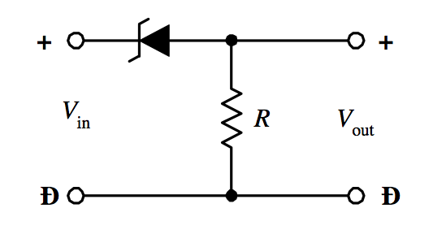
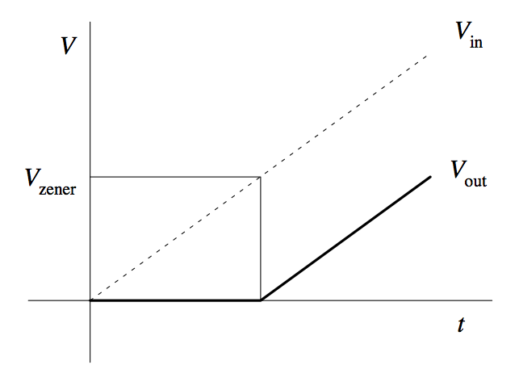
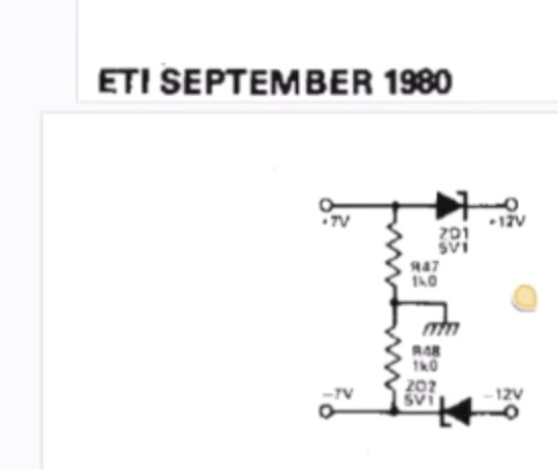
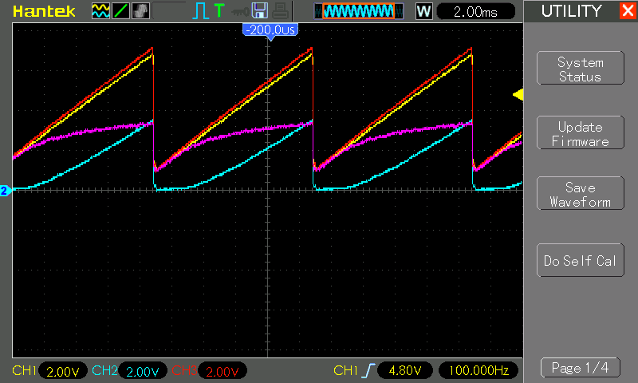

# #772 Zener Dropper

Using a zener diode as a voltage dropper/shifter.

## Notes

Zener diodes are often used as voltage regulators, as in
[LEAP#029 Zener Regulator](../LinearRegulators/Zener/).

Perhaps less commonly, they can also be used to lower the output voltage by an amount equal to the Zener diode's breakdown voltage.
In this configuration, a Zener diode acts as a [voltage shifter/voltage dropper](https://en.wikipedia.org/wiki/Zener_diode#Voltage_shifter)

The voltage shifter design puts the zener diode in series with the load:

As long as Vin is greater than the zener breakdown voltage, `Vout = Vin - Vzener`

* The zener diode will not conduct until Vin reaches the zener breakdown voltage, so in low voltage conditions, the load will be "off"
* Since the zener must carry the full load current, it must have a suitable power rating
    * most common silicon zener diodes are only rated for 1W maximum, so only suitable for relatively low power loads
    * this is perhaps one reason why this configuration is not so common

NB: I was reminded about this usage while watching one of [Julian Ilett's latest Vocoder videos on youtube](https://www.youtube.com/watch?v=X65nWlevw-4). It included an example of zener diodes being used in a voltage shift configuration to regulate ±7V rails from ±12V rails.

### Testing the Behaviour

The test circuit uses a 3.3V 1N4728 zener diode in series with a 1kΩ "load" resistor.

A signal generator is used to feed a sawtooth wave, buffered by an LM358 voltage follower in order to provide sufficient drive power.
The LM358 is powered from 12V to provide sufficient headroom for the test.

In the following trace:

* CH1 (Yellow) - Vin
* CH2 (Blue) - Vout
* CH3 (Red) - Signal In
    * 100 Hz sawtooth, 6V peak-peak, offset +1V (1 min, 7V max)
* Purple - CH1-CH2 i.e. calculated drop across the zener diode

Vout is measuring the voltage drop across the load resistor R1:

* when the input voltage is well below the zener breakdown voltage, load is off
* as the voltage approaches the zener breakdown voltage, the zener starts to conduct and load voltage starts to rise
* as the voltage continues to rises, drop across the zener diode plateaus at the 3.3V rating for the zener diode

## Credits and References

* [Zener Voltage Shifter](https://en.wikipedia.org/wiki/Zener_diode#Voltage_shifter)
* [1N4728 datasheet](https://www.futurlec.com/Diodes/1N4728.shtml)
* [LM358N Datasheet](https://www.futurlec.com/Linear/LM358N.shtml)
