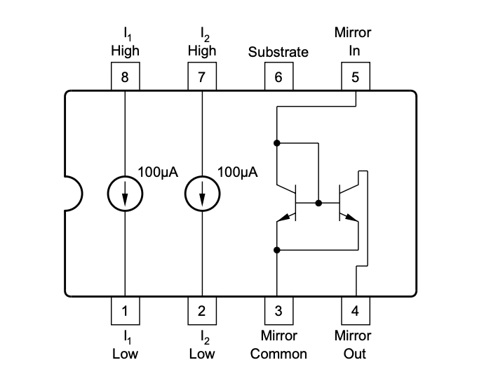
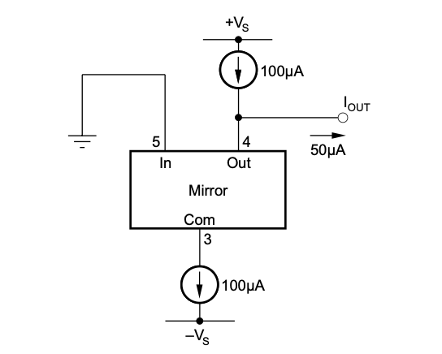

# #768 50 µA Current Source

Testing the REF200 as a 50µA current source.

## Notes

The REF200 is a precision analog building block that integrates a matched pair of 100 µA current sources and a current mirror into a single monolithic device. Designed for high-accuracy analog applications, it provides highly stable and predictable current outputs over a wide temperature range, with excellent matching (typically within 0.2%) and low temperature drift. Its current sources are ideal for biasing and excitation in sensor systems, while the current mirror is useful for analog signal processing and amplifier biasing.

Operating from a supply voltage as low as 2.5V up to 40V, the REF200 offers high output impedance and low compliance voltage, making it well-suited for low-power and precision systems. Its compact and reliable design eliminates the need for multiple discrete components, improving both accuracy and board space efficiency in circuits such as transimpedance amplifiers, current-loop transmitters, and analog instrumentation.

A range of example applications/configurations are included in the data sheet, including:

* Reverse Voltage Protection
* 50µA Current Source
* 200-µA, 300-µA, and 400-µA Floating Current Sources
* 50-µA Current Sinks
* FET Cascade Circuits
* Operational Amplifier Offset Adjustment Circuits
* Adjustable Current Sources
* RTD Excitation With Three-Wire Lead Resistance Compensation
* Precision Triangle Waveform Generator
* Precision Duty-Cycle Modulator
* Low Noise Current Sink
* Low Noise Current Sink With Compliance Below Ground
* Floating 300-µA and 400-µA Cascoded Current Sources
* Rate Limiter
* 25-mA Floating Current Source
* Dead-Band Circuit
* Double Dead-Band Circuit
* Low-Voltage Reference
* Voltage Reference
* Bipolar Limiting Circuit
* Limiting Circuit
* Window Comparator
* Instrumentation Amplifier With Compliance to –Vs

### 50µA Current Source Configuration

The data sheet provides the suggested circuit. It essentially leverages the current mirror to source 50µA from a 100µA reference, leaving the remaining 50µA as the current source.

The REF200 device has completely floating current sources and current mirror, so in this case a split power supply is used to provide the three voltage levels: +Vs, GND, -Vs.

### Circuit Design

I've used an LM2662MX to provide the -5V rail.
Once that is available, wiring up the REF200 for 50µA current source does not require any other components: just the correct connections.

### Test Results

In a little breadboard test, I'm reading 48.3µA for the current source. Which is close, but not quite within specified tolerances.
However considering the breadboard layout, this is perhaps a reasonable result.

The REF200 current accuracy is quoted as ±1% max, ±0.25% typical,
so I should expect a reading of 49.5µA - 50.5µA at worst.

I'm using the ANENG ANG860B+ Digital Multimeter to measure the current. It includes a µA scale ammeter.
The ANG860B+ DC µA accuracy is quoted at ±1.5%,
so I should expect a reading of 48.8µA - 51.3µA at worst.

Now in my little breadboard test, I'm reading 48.3µA for the current source. Which is close, but not quite within my expected range.

One factor that could be pulling the number further down is the accuracy of the voltage split. I measure +Vs=5.000V, -Vs=-4.999V (to ±0.5% accuracy), so that may account for a few fractions of a µA.

There is also the effect of running the circuit on DIP adapters on a breadboard. The REF200 data sheet does provide typical layout recommendations:

* Minimize trace lengths in the current source and current mirror paths to reduce impedance.
* Using a solid ground plane helps distribute heat and reduces electromagnetic interference (EMI) noise pickup.
* Place the external components as close to the device as possible. This configuration prevents parasitic errors
(such as the Seebeck effect) from occurring.
* Do not run sensitive analog traces in parallel with digital traces. Avoid crossing digital and analog traces if
possible, and only make perpendicular crossings when absolutely necessary.

## Credits and References

* [REF200 Datasheet](https://www.ti.com/product/REF200)
* See [LEAP#165](../../Power/LM2662Inverter/) for more on the LM2662MX
* See [LEAP#475](../../../Equipment/ANG860B/) for more on the ANENG ANG860B+ Digital Multimeter
