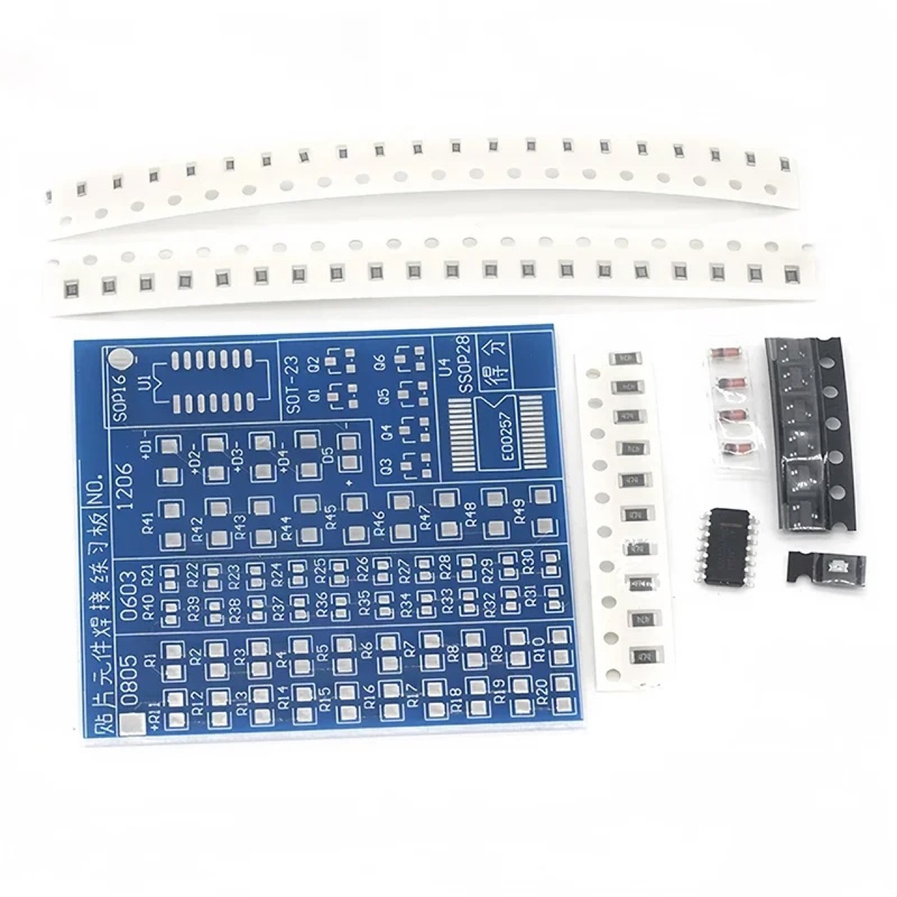

# #808 Basic SMD Practice Board

A basic soldering practice board for SMD components.

## Notes

NB: see [LEAP#171 SMD Practice Boards](../) for an overview of all the SMD practice boards I have tried.

This is an example of a basic practice board with 0603, 0805, 1206, SOT-23 and SOP-16 components.

Obtained from a seller on aliexpress for US$1.04 in Apr-2015 as ["SMT SMD Component Welding Practice Board Soldering Practice DIY Kit Better US57 Free Shipping"](https://www.aliexpress.com/item/SMT-SMD-Component-Welding-Practice-Board-Soldering-Practice-DIY-Kit-Better-US57-Free-Shipping/32243189935.html).
That seller is no longer offering the item, but an equivalent item is available (as of Dec-2025) for SG$1.19 from another seller: ["SMD Soldering Plate Component Weld Welding Practice SMT PCB Board DIY Kit Skill Training Learning Electronic Suit hot"](https://www.aliexpress.com/item/1005009114629754.html)

### Circuit Design

This is an example of a basic practice board:

* with 0603, 0805, 1206, SOT-23 and SOP-16 components.
* after soldering, it can be powered 7V to 15V and an LED will light up if all 0603, 0805, 1206 resistors and diodes soldered correctly
* there's no test circuit for the SOT-23 and SOP-16 components

### Build Log

Here's the test circuit showing a pass on my practice board (yay! ... though you can see I bodged the SOP16 a bit):

## Credits and References

* [LEAP#171 SMD Practice Boards](../)
* ["SMT SMD Component Welding Practice Board Soldering Practice DIY Kit Better US57 Free Shipping"](https://www.aliexpress.com/item/SMT-SMD-Component-Welding-Practice-Board-Soldering-Practice-DIY-Kit-Better-US57-Free-Shipping/32243189935.html)
* ["SMD Soldering Plate Component Weld Welding Practice SMT PCB Board DIY Kit Skill Training Learning Electronic Suit hot"](https://www.aliexpress.com/item/1005009114629754.html)
