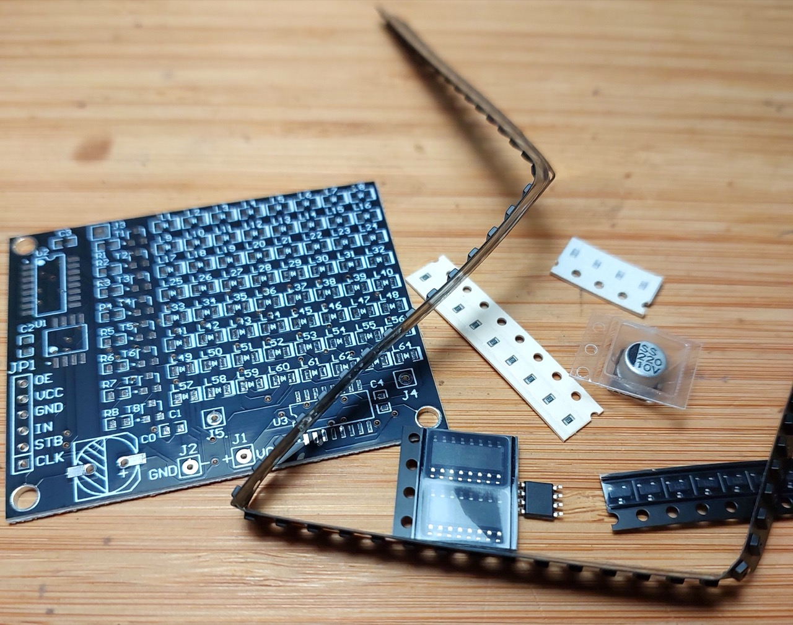
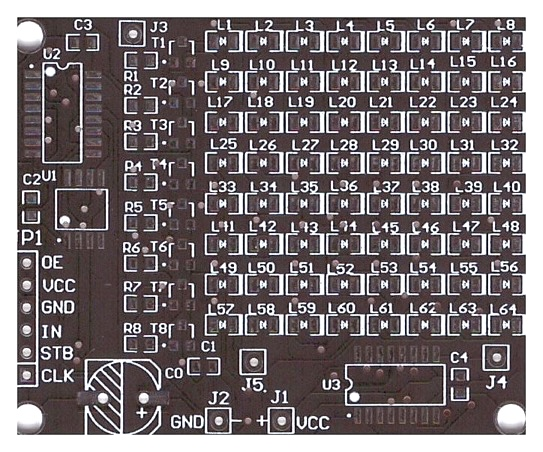

# #810 LED Matrix SMD Practice Board

A full-featured soldering practice board with a range of components (0603 , 0805, SO-8, SO-16) and a 64-LED matrix that displays a microcontroller-generated pattern when soldered correctly.

Here's a quick demo..

## Notes

NB: see [LEAP#171 SMD Practice Boards](../) for an overview of all the SMD practice boards I have tried.

I purchased ["DIY Electronic Kit 256 LED Dot Matrix Advertising Screen Kit Light-emitting Diode SMD Soldering Component Welding Training Kit" (seller listing on aliexpress)](https://www.aliexpress.com/item/1005009939912954.html) for SGD$1.94 Dec-2025.

There is also a 256 LED version of the kit.

### Kit Details

As specified by the seller:

> Features:
>
> 1. The circuit design is innovative and highly entertaining, suitable for entry-level soldering exercises and practical training.
> 2. Double sided fiberglass spray tin plate, made of high-strength material, can be disassembled and reused repeatedly.
> 3. The microcontroller with pre programmed programs is convenient for teaching and competition.
> 4. There are 64/256 LED2 specifications to choose from, which can display characters and patterns.
> 5. With a complete range of component types and surface mount technology, it enhances hands-on and electronic practical abilities.
>
> Parameter:
>
> * Supply voltage: DC 4-5V
> * Display color: Red
> * PCB Size:
>     * 64 LED:60*49mm
>     * 256 LED:96*85mm
>
> Circuit Introduction:
>
> Style: 1:64 LED (88 components) advertising screen welding practice kit
>
> This kit consists of 64 0805 patch LEDs forming a display unit, which can display any 64 pixel character, such as numbers, using a row column scanning method. The kit comes with a pre programmed microcontroller, and the startup display mode is: vertical line by line lighting → full screen lighting and flashing twice → horizontal line by line lighting → countdown display of 9-0 character advertisements in sequence. Then repeat the above display content. If you want to change the display content, you can connect the control signal from interface JP1 without soldering the included microcontroller, and any content can be displayed. (You can refer to the relevant information of our store's 8 * 8 dot matrix, which is consistent with the interface of the microcontroller. This interface needs to be provided by oneself and is not included in the kit.) The circuit includes 64 patch LEDs, 8 row driving transistors, 8 current limiting resistors, 2 serial expansion chips, 1 microcontroller chip, 1 patch electrolytic capacitor, 4 patch high-frequency capacitors, a total of 88 components and 202 solder joints.
>
> Style 2: 256 LED (300 components) advertising screen welding practice kit
>
> This kit consists of 256 0805 patch LEDs forming a display unit, which can display any character with 256 pixels, such as Chinese characters, using a row column scanning method. The kit comes with a pre programmed microcontroller, and the startup display mode is: line by line lighting → full screen lighting and flashing twice → sequentially displaying the "You are good" character advertisement → peach heart flashing three times. Then repeat the above display content. If you want to change the display content, you can connect the control signal from interface JP1 without soldering the included microcontroller, and any content can be displayed. (You can refer to the relevant information of our store's 16 * 16 dual color dot matrix, which is consistent with the interface of the microcontroller. This interface needs to be provided by oneself and is not included in the kit.) The circuit includes 256 SMD LEDs, 16 row driving transistors, 16 current limiting resistors, 4 serial expansion chips, 1 microcontroller chip, 1 SMD electrolytic capacitor, and 6 SMD high-frequency capacitors, totaling 300 components and 678 solder joints.
>
> Circuit principle:
>
> The control core of the circuit is the microcontroller U1, which continuously transmits line scan data to U2 and display data to U3 through a pre written program, thereby controlling the display screen to display corresponding patterns in a regular manner.
> Installation precautions:
> All components should be installed tightly against the surface of the circuit board, and attention should be paid to the polarity direction of integrated circuits, light-emitting diodes, transistors, and electrolytic capacitors. The circuit board provides J1-J5 test points, which can be used for waveform measurement, voltage measurement, and other extended applications. The power supply voltage can be 4-5V. Due to the fact that the main component of the kit is LED and the circuit is relatively simple, it is usually ready as soon as it is installed. The microcontroller program of this kit has already been burned and the effect can be achieved after soldering. We regret to inform you that the source code is not provided.

### Circuit Design

The following schematic is provided by the seller. I haven't redrawn it (yet).

| Item | Name            | Specifications | Ref    | Qty |
|------|-----------------|----------------|--------|-----|
| 1    | Capacitor       | 220µF          | C0     | 1   |
| 2    | Capacitor       | 0603 100nF     | C1-C4  | 4   |
| 3    | LED             | 0805 red       | L1-L64 | 65  |
| 4    | Resistor        | 0603 6.2kΩ     | R1-R8  | 9   |
| 5    | Transistor      | 8550 SOT-23    | T1-T8  | 8   |
| 6    | Microcontroller | DX156 SO-8     | U1     | 1   |
| 7    | IC              | 74HC595 SO-8   | U2,U3  | 2   |
| 8    | PCB             | 6 x 4.9 cm     |        | 1   |

The header JP1 breaks out the signals used by the microcontroller to drive the shift registers.

### Construction

I used two iron tips for soldering with a handheld iron:

* conical needle tip
    * 0603, 0805, SOT-3 components
* chisel tip
    * SO-8, SO-16 ICs
    * cleanup

Construction complete:

And working successfully:

Here's a quick demo..

## Credits and References

* [LEAP#171 SMD Practice Boards](../)
* [74HC595 Datasheet](https://www.futurlec.com/74HC/74HC595SMD.shtml)
* [S8550LT1 Datasheet](https://www.futurlec.com/Transistors/S8550LT1.shtml)
