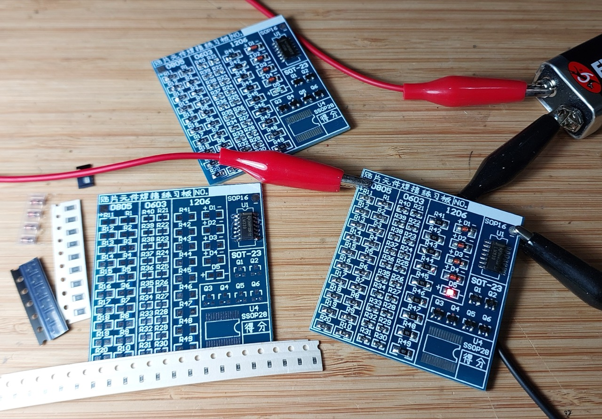
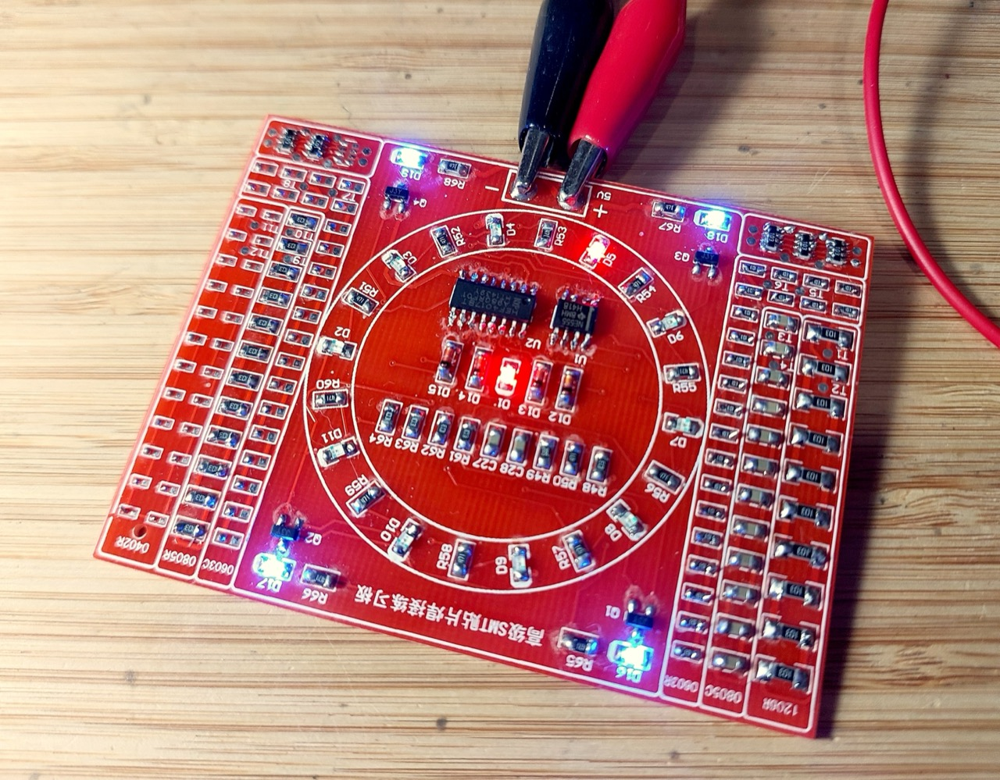
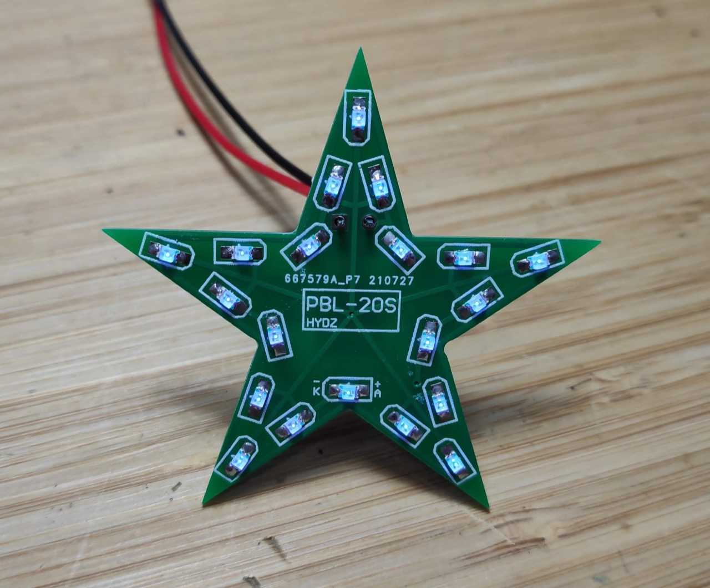
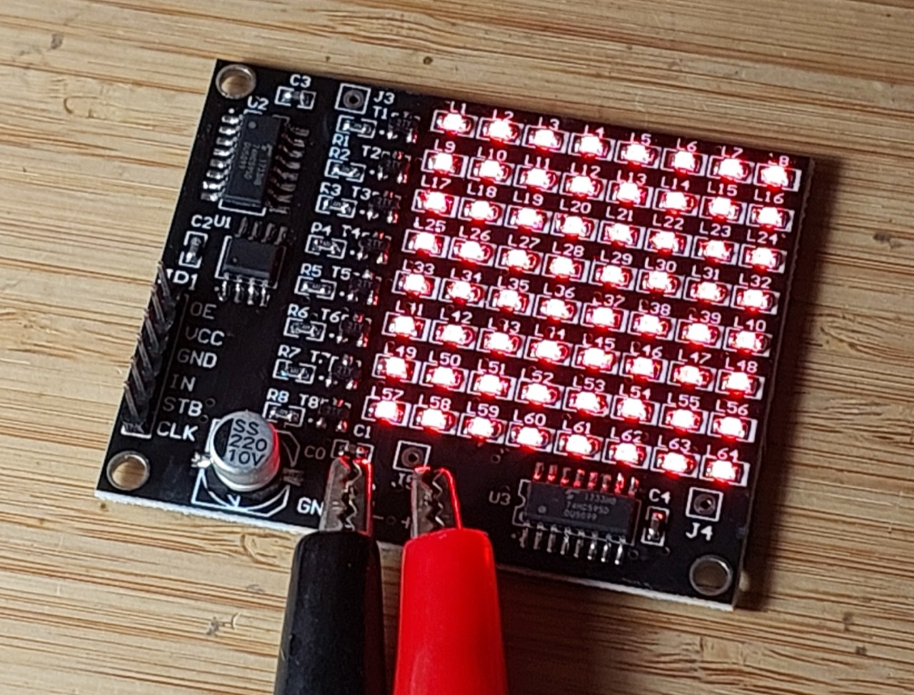

# #171 SMD Practice Boards

A collection of notes, kits and resources for hand-soldering surface mount devices

## Notes

Through-hole and DIP components have historically made it really easy for the electronics hobbyist to hand-solder a project together.

These days it's getting harder to avoid surface mount components due to

* availability or cost of through-hole/DIP packages
* or that some newer components may only be available in surface mount packages

One effective solution is to use a "module" if one is available.
These are generally small boards holding surface mount chip(s) and supporting circuitry
but provide pins or sockets for easy external connections.
Although mainly geared for microcontroller market, there are many that are also relevant for standalone analog or digital circuits.

However as I've found, surface-mount devices can be quite easy to use in a hobby project even in the absence of a suitable module.
The challenge kind of breaks down into two categories:

* larger pitch SMDs which can quite easily be soldered with traditional techniques
    * e.g. SOT/SOIC components and 0805 or even 0603 discrete components with a pitch of 0.95 or higher
    * ["SO16 SSOP16 TSSOP16 SOIC16 To DIP adapter boards" (seller listing on aliexpress)](https://www.aliexpress.com/item/32436820541.html) are handy to make the components breadboard-compatible

* small pitch SMD packages that generally require drag or reflow soldering techniques
    * e.g TSSOP/TQFP packages with a pitch of 0.80 or lower
    * magnifier and lots of flux! .. pretty much essential
    * I haven't quite mastered this yet ;-(

### Surface Mount Nomenclature

* [Surface-mount technology](https://en.wikipedia.org/wiki/Surface-mount_technology) - wikipedia
* [List of integrated circuit package dimensions](https://en.wikipedia.org/wiki/List_of_integrated_circuit_package_dimensions) - wikipedia
* [MELFs](http://en.wikipedia.org/wiki/MELF_electronic_components).

### SMD Practice Kits

To get started, there is a large range of cheap practice boards available.
I've tried quite a few, which I'll present below.

#### Basic SMD Practice Board

See [LEAP#808 Basic SMD Practice Board](./BasicKit1/).

An example of a basic practice board with 0603, 0805, 1206, SOT-23 and SOP-16 components.

#### Ring Counter Practice Kit

See [LEAP#809 Basic SMD Practice Board](./RingCounterKit1/).

A full-featured soldering practice board with a wide range of components from 0402 to 1206 and SOP-8/16.
It includes a classic 4017/555 ring counter test circuit.

#### Glowing Star SMD Practice Board

See [LEAP#620 Glowing Star SMD Practice Board](./Star/).

A five-pointed star SMD Practice Board with LM358 oscillator LED effects.

#### LED Matrix SMD Practice Board

See [LEAP#810 LED Matrix SMD Practice Board](./LedMatrixKit1/).

A full-featured soldering practice board with a range of components (0603 , 0805, SO-8, SO-16) and a 64-LED matrix that displays a microcontroller-generated pattern when soldered correctly.

## Credits and References

* [LEAP#808 Basic SMD Practice Board](./BasicKit1/)
* [LEAP#809 Basic SMD Practice Board](./RingCounterKit1/)
* [LEAP#620 Glowing Star SMD Practice Board](./Star/)
* ["SO16 SSOP16 TSSOP16 SOIC16 To DIP adapter boards" (seller listing on aliexpress)](https://www.aliexpress.com/item/32436820541.html) - modules I used from an aliexpress seller to mount the SOP-8 chip
