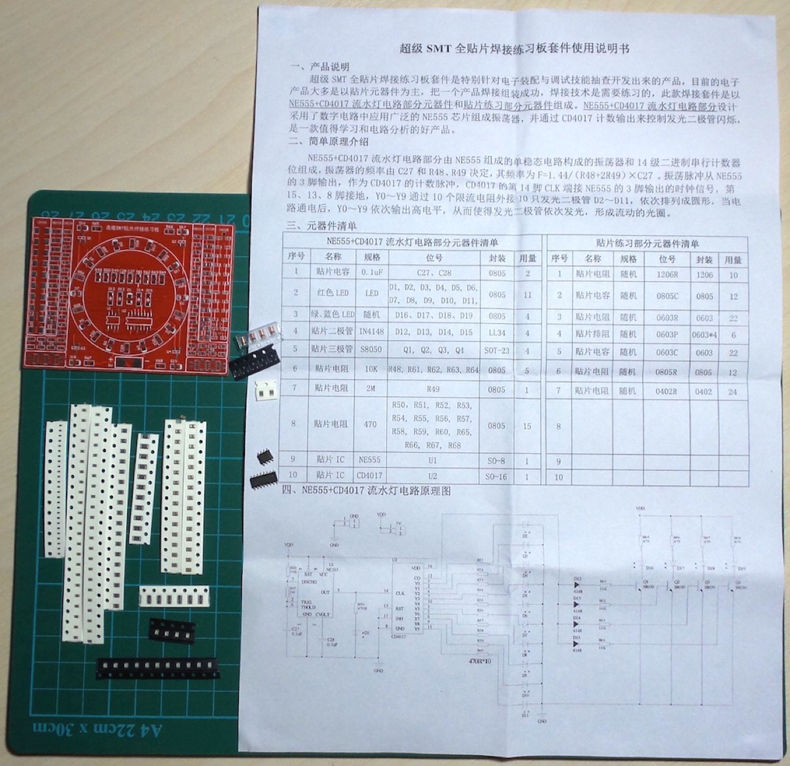

# #809 Ring Counter SMD Practice Board

A full-featured soldering practice board with a wide range of components from 0402 to 1206 and SOP-8/16.
It includes a classic 4017/555 ring counter test circuit.

Here's a quick demo..

## Notes

NB: see [LEAP#171 SMD Practice Boards](../) for an overview of all the SMD practice boards I have tried.

This is an example of a pretty full-featured practice board with a wide range of components from 0402 to 1206 and SOP-8/16.

* central feature is a classic 4017/555 ring counter test circuit - similar to the [LEAP#107 Ring Counter](../../RingCounter/) project
* all components are laid out in circuits with clear test points

Originally purchased ["SMD components welding practice board / Welding practice light kit/ Skills Training welding competition kit" (seller listing on aliexpress)](https://www.aliexpress.com/item/32315250409.html) for US$12.70 for 5 boards (US$2.54/board) in May-2015.
That seller is no longer offering the item, but an equivalent item is available (as of Dec-2025) for SGD$2.42: ["DIY SMD SMT Welding Practice Soldering Skill Training Board 3-12V Water Flowing Led DIY Kit for School Learning Project" (seller listing on aliexpress)](https://www.aliexpress.com/item/1005005743527760.html)

### Kit Details

See [instructions](./assets/instructions.pdf) (Chinese PDF).

In translation:

> 1. Product description
>
> The Super SMT All-Surface Mount Soldering Practice Board Kit is a product specifically developed for spot checks on electronic assembly and debugging skills.
> Most current electronic products use surface mount components, and successfully assembling a product requires practice.
> This soldering kit consists of components for the NE555+CD4017 LED flashing circuit and surface mount practice components.
> The NE555+CD4017 LED flashing circuit design uses the widely used NE555 chip in digital circuits to form an oscillator, and controls the LED blinking through the CD4017's counting output. It is a valuable product for learning and circuit analysis.
>
> 1. Introduction to simple principles
>
> The NE555+CD4017 flowing light circuit consists of an oscillator formed by a monostable circuit based on the NE555 and a 14-stage binary serial counter.
> The oscillator frequency is determined by C27 and resistors R48 and R49, with a frequency of F = 1.44/(R48 + 2R49) × C27.
> The oscillation pulse is output from pin 3 of the NE555 as the counting pulse for the CD4017. Pin 14 (CLK) of the CD4017 is connected to the clock signal output from pin 3 of the NE555. Pins 15, 13, and 8 are grounded.
> Ten LEDs (D2-D11) are connected externally through ten current-limiting resistors to Y0~Y9, arranged in a circle.
> When the circuit is powered on, Y0~Y9 output high levels sequentially, causing the LEDs to light up sequentially, forming a flowing light ring.

### Component list for NE555+CD4017 running light circuit

| Item | Name       | Specification | Ref              | Package | Qty |
|------|------------|---------------|------------------|---------|-----|
| 1    | capacitor  | 0.1µF         | C27, C28         | 0805    | 2   |
| 2    | LED        | red           | D1-D11           | 0805    | 11  |
| 3    | LED        | blue or green | D16-D19          | 0805    | 4   |
| 4    | diode      | 1N4148        | D12-D15          | LL34    | 4   |
| 5    | transistor | S8050         | Q1-Q4            | SOT-23  | 4   |
| 6    | resistor   | 10kΩ          | R48, R61-R64     | 0805    | 5   |
| 7    | resistor   | 2MΩ           | R49              | 0805    | 1   |
| 8    | resistor   | 470Ω          | R50-R60, R65-R68 | 0805    | 15  |
| 9    | IC         | NE555         | U1               | SO-8    | 1   |
| 10   | IC         | CD4017        | U2               | SO-16   | 1   |

### Component list for surface mount practice section

| Item | Name           | Specification | Ref    | Package | Qty |
|------|----------------|---------------|--------|---------|-----|
| 1    | resistor       | random        | 1206R  | 1206    | 10  |
| 2    | capacitor      | random        | 0805C  | 0805    | 12  |
| 3    | resistor       | random        | 0603R  | 0603    | 22  |
| 4    | resistor array | random        | 0603P  | 0603*4  | 6   |
| 5    | capacitor      | random        | 0603C  | 0603    | 22  |
| 6    | resistor       | random        | 0805R  | 0805    | 12  |
| 7    | resistor       | random        | 0402R  | 0402    | 24  |

### Circuit Design

Here's a quick video of the test circuit in action:

## Credits and References

* [LEAP#171 SMD Practice Boards](../)
* ["SMD components welding practice board / Welding practice light kit/ Skills Training welding competition kit" (seller listing on aliexpress)](https://www.aliexpress.com/item/32315250409.html) - as originally purchased
* ["DIY SMD SMT Welding Practice Soldering Skill Training Board 3-12V Water Flowing Led DIY Kit for School Learning Project" (seller listing on aliexpress)](https://www.aliexpress.com/item/1005005743527760.html) - similar kit, another seller
* [LEAP#107 Ring Counter](../../RingCounter/)
