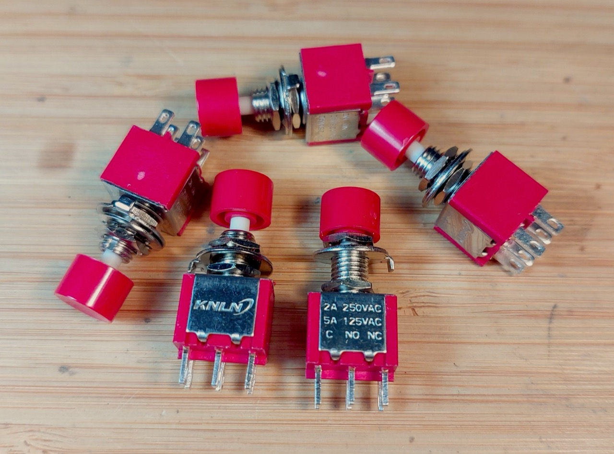
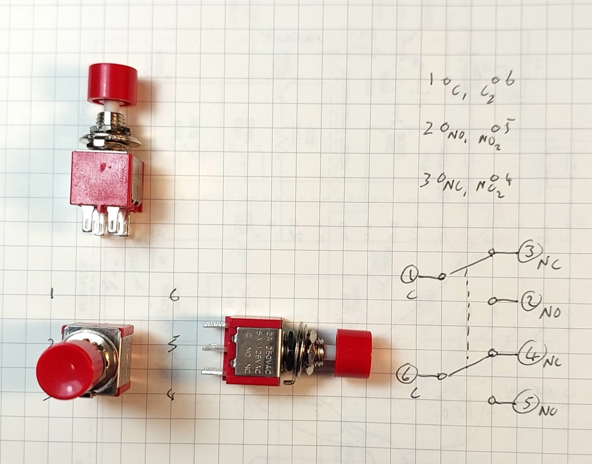
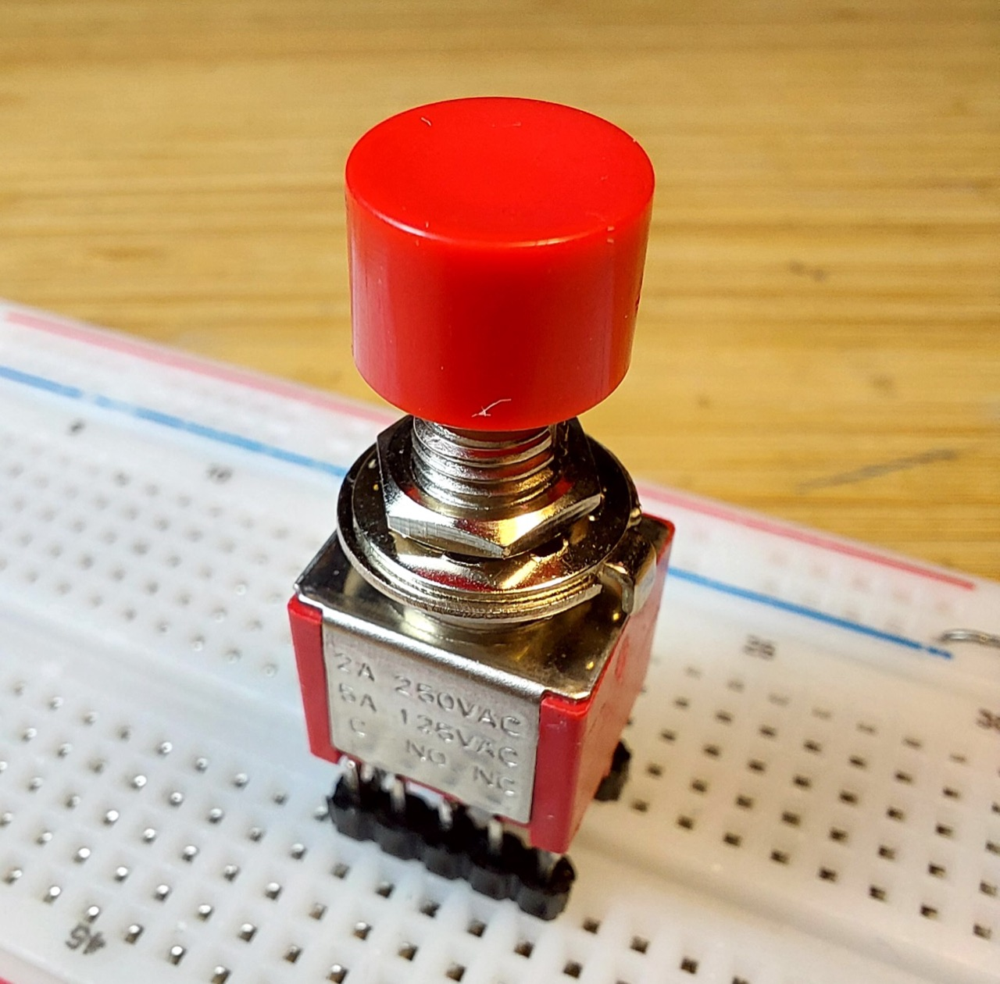

# #xxx DPDT Momentary Push-buttons

description here

Here's a quick demo..

## Notes

While designing [LEAP#847 2d6 Dice Roller](../../../playground/2d6/) I considered one option that required a momentary dual pole push-button.
I didn't have any in my parts store, and it turns out that this particular switch configuration is quite rare, especially for low voltage applications.

I did find one part in a reasonable small form factor:
["5PCS 10PCS PS-202 Mini 6MM 6Pin SPDT DPDT Momentary Push Button Switch 2A 250VAC 5A 120VAC Toggle Switch With Red Cap" (aliexpress seller)](https://www.aliexpress.com/item/1005006487128734.html). I purchased 5 pieces for SG$4.88 (Jun-2026).

This particular part has a mirrored layout of the two poles on either side of the switch.
The switch itself has a nice positive "click" between states, but is non-latching off course.

I've attached some pin headers to make a breadboard-compatible switch:

### Circuit Design

Designed with Fritzing: see [MomentaryDPDT.fzz](./MomentaryDPDT.fzz).

This is a simple demonstration of a non-latching (momentary) 4-way crossover switch.

Circuit setup on a breadboard:

When the button is not pressed, yellow LED is on.

When the button is pressed, current is reversed. The yellow LED turns off, and the red LED turns on.

## Credits and References

* ["5PCS 10PCS PS-202 Mini 6MM 6Pin SPDT DPDT Momentary Push Button Switch 2A 250VAC 5A 120VAC Toggle Switch With Red Cap" (aliexpress seller)](https://www.aliexpress.com/item/1005006487128734.html)
    * Purchased 5 pieces for SG$4.88 (Jun-2026)
* <https://en.wikipedia.org/wiki/Switch>
