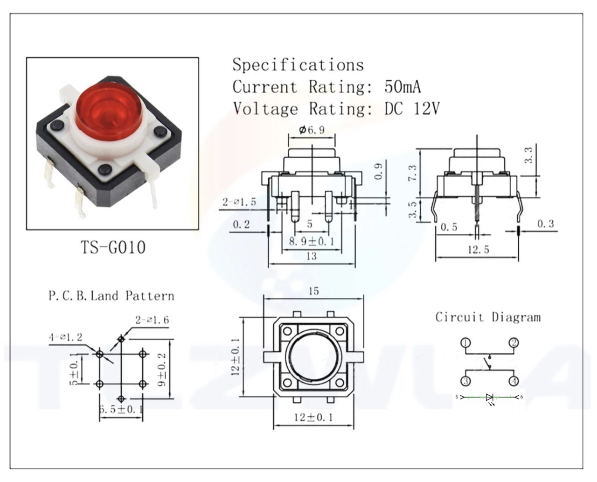

# #854 SPST Momentary Push-buttons with LED

Testing some push-button switches with built-in LEDs. I've used a CD4069 inverter-based latching circuit to demonstrate toggling the LED on and off.

Here's a quick demo..

## Notes

I found some push-button switches with built-in LEDs, and got a batch to test them out:
["5PCS 10PCS PS-202 Mini 6MM 6Pin SPDT DPDT Momentary Push Button Switch 2A 250VAC 5A 120VAC Toggle Switch With Red Cap" (aliexpress seller listing)](https://www.aliexpress.com/item/1005006487128734.html), purchased for SG$4.48 (Jun-2026).

Details are scant; the following is the closest to a data sheet that I could find, but it didn't include the LED details (I have annotated the picture). Note:

* The switch and LED circuits are completely independent.
* The LED cathode pin has been coloured with a marker on the devices I received.
* I was not sure if a current limiting resistor is included in the switch, but I am 99% sure there is **not** one included.
* The LED is turned on when power is applied across the LED pins 5 and 6 (with a suitable current-limiting resistor).

### Circuit Design

Designed with Fritzing: see [MomentarySPSTWithLED.fzz](./MomentarySPSTWithLED.fzz).

To test and demonstrate the switch, I've coupled it up to a latching circuit based on
[LEAP#761 Inverter-based Push Button Latch](../../CD4069/PushButtonLatch/).

Pressing the push-button with toggle the built-in LED on and off.

### Build Log

## Credits and References

* <https://en.wikipedia.org/wiki/Push_switch>
* ["5PCS 10PCS PS-202 Mini 6MM 6Pin SPDT DPDT Momentary Push Button Switch 2A 250VAC 5A 120VAC Toggle Switch With Red Cap" (aliexpress seller listing)](https://www.aliexpress.com/item/1005006487128734.html)
    * Purchased for SG$4.48 (Jun-2026).
