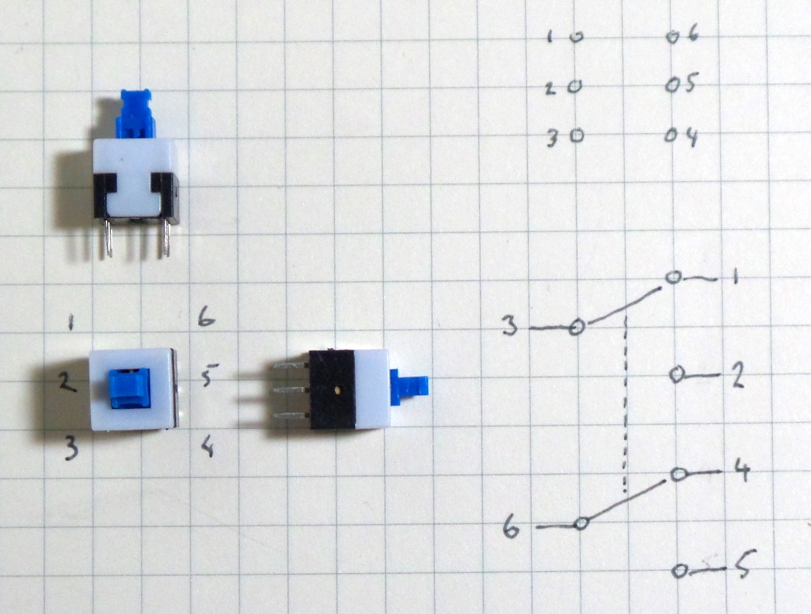

# #243 Switches

Notes on miscellaneous mechanical switches used in electrical circuits.

## Notes

Switches are the most basic of "input" devices for electrical systems.

Thorough coverage of the variety of switches can be found in Chapter 6 of Charles Platt's excellent
[Encyclopedia of Electronic Components Volume 1](../../books/encyclopedia-of-electronic-components/),
and also (coincidentally) Chapter 6 of John M. Hughes' [Practical Electronics: Components and Techniques](../../books/practical-electronics/).

### Pole and Throw Terminology

The terms pole and throw are also used to describe switch contact variations.

The number of "poles" is the number of electrically separate switches which are controlled by a single physical actuator. For example, a "2-pole" switch has two separate, parallel sets of contacts that open and close in unison via the same mechanism.

The number of "throws" is the number of separate wiring path choices other than "open" that the switch can adopt for each pole. A single-throw switch has one pair of contacts that can either be closed or open. A double-throw switch has a contact that can be connected to either of two other contacts, a triple-throw has a contact which can be connected to one of three other contacts, etc

### Types of Switches

* Toggle switch
* Rocker
* Slide
* Rotary
* Pushbutton - typically momentary action, but sometimes locking on/off
* Snap-action -  typically used as sensors

### Example: DPDT Toggle Switches

See [LEAP#244 DPDT Toggle Switches](./DPDT/).

### Example: DPDT Momentary Push-buttons

See [LEAP#848 Momentary DPDT Push-buttons](./MomentaryDPST/).

### Example: SPST Momentary Push-button With LED Indicator

## Credits and References

* <https://en.wikipedia.org/wiki/Switch>
* [Encyclopedia of Electronic Components Volume 1](../../books/encyclopedia-of-electronic-components/)
* [Practical Electronics: Components and Techniques](../../books/practical-electronics/)
* [..as mentioned on my blog](https://blog.tardate.com/2017/01/leap243-switches.html)
