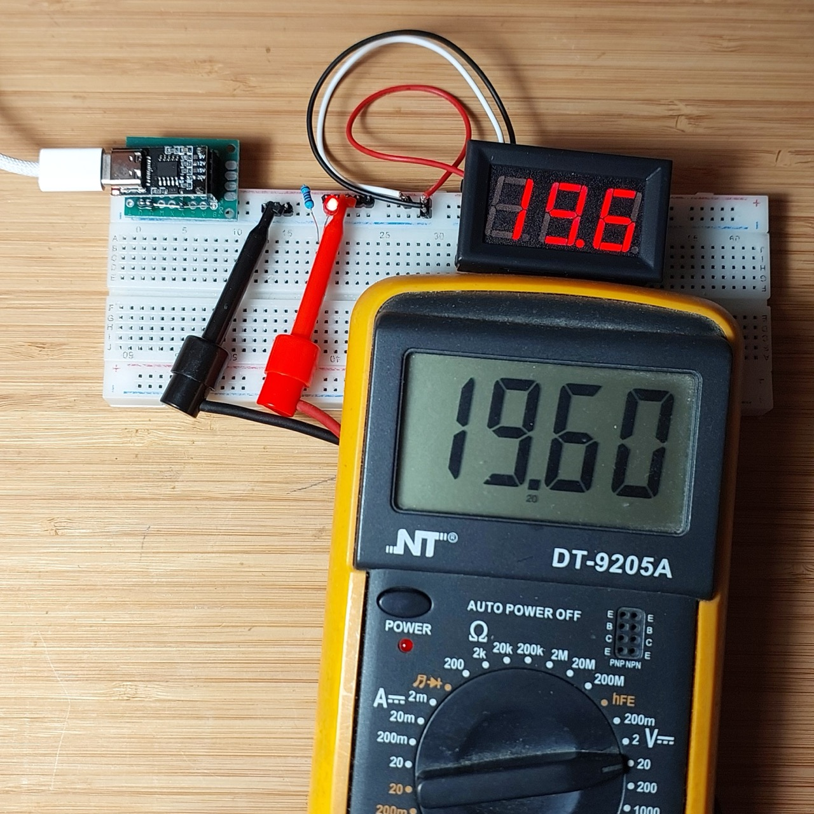

# #758 USB 3 Power Adapter Board

Testing a USB 3 Power Adapter Board that can supply a fixed 9, 12, 15, or 20V at up to 5A.

## Notes

I just got some
["Type C PD2.0 PD3.0 Fast Charge Trigger Polling Detector USB Boost Power Supply Change Module Charger Board Diymore"](https://www.aliexpress.com/item/1005005324613468.html)
boards from aliexpress.

These are designed to trick a USB 3.0 power supply to switch into USB-PD mode,
allowing the board to be used as a DC power supply at either 9, 12, 15, or 20V (5A max).
They use the [CH224K USB PD power receiving chip](https://www.wch-ic.com/downloads/CH224DS1_PDF.html) from 南京沁恒微电子股份有限公司 Nanjing Qinheng Microelectronics.

Note:

* USB PD Revision 3.1 specification is a major update to enable delivering up to 240W of power over full featured USB Type-C cable and connector.
* For more on PD, there's an excellent series of posts on <https://eeucalyptus.net/>:
    * [USB PD coding](https://eeucalyptus.net/2023-12-06-usb-pd-1.html)
    * [USB PD on the CH32V003](https://eeucalyptus.net/2024-05-13-usb-pd-2.html)

## Selecting Output Voltage

The boards all come pre-configured for 12V (with a 0Ω resistor connecting the 12V pad).

They can be re-configured for 9V, 15V, or 20V by moving the 0Ω resistor from the 12V pad to the corresponding pad. This is "relatively" easy to do with a hand soldering iron.

Note: there are other boards available where the output can be selected via DIP switch e.g.
[Type-C QC AFC PD2.0 PD3.0 to DC Spoof Scam Fast Charge Trigger Polling Detector USB-PD Notebook Power Supply Change Board Module](https://www.aliexpress.com/item/1005004455694484.html)

## 9V Mode

Re-configured for 9V by moving the 0Ω resistor from the 12V pad to the 9V pad.
Output is measuring 8.98V under resistive load.

## 12V Mode

The boards all come pre-configured for 12V (with a 0Ω resistor connecting the 12V pad).
Output is measuring 11.88V under resistive load.

## 15V Mode

Re-configured for 15V by moving the 0Ω resistor from the 12V pad to the 15V pad.
Output is measuring 14.79V under resistive load.

## 20V Mode

Re-configured for 20V by moving the 0Ω resistor from the 12V pad to the 20V pad.
Output is measuring 19.60V under resistive load.

## Power Supply

The Power Supply must be designed to deliver the required USB-PD voltages.
Many phone chargers can only deliver up to 9V or 12V.
For example the [Apple 20W charger will only deliver 9V](https://www.chargerlab.com/review-of-new-apple-20w-charger-for-iphone-15-a2940/).

For testing here I am using an
[Essager 65W USB Type C Charger](https://www.aliexpress.com/item/1005004306745418.html)
that can deliver up to 20V/3.25A.

* Brand: Essager
* Material: ABS/PC
* Charging port: 2 Type-C & 1 USB-A
* input: 100~240V~,50Hz, 16A Max
* Output Type-C1/2: 5V/3A 9V/3A 12V/3A 15V/3A 20V/3.25A (65W Max)
* PPS: 3.3-11V/5A:
* Output USB-A: 4.5V/5A 5V/4.5A 5V/3A 9V/3A 12V/3A 20V/3A (60W Max)
* 1.Output: Type-C1 + USB-A: 45W+18W Max
* 2.Output: Type-C1 + Type-C2: 45W+20W Max
* 3.Output: Type-C2 + USB-A: 15W Max
* 4.Output: Type-С1 + Type-C2 + USB-A: 45W+15W Max

## Credits and References

* [Type C PD2.0 PD3.0 Fast Charge Trigger Polling Detector USB Boost Power Supply Change Module Charger Board Diymore](https://www.aliexpress.com/item/1005005324613468.html)
* [USB C and USB 3.1, USB 3.2, USB4 and USB4 V2 Explained](https://www.onlogic.com/blog/usb-type-c-and-usb-3-1-explained/)
