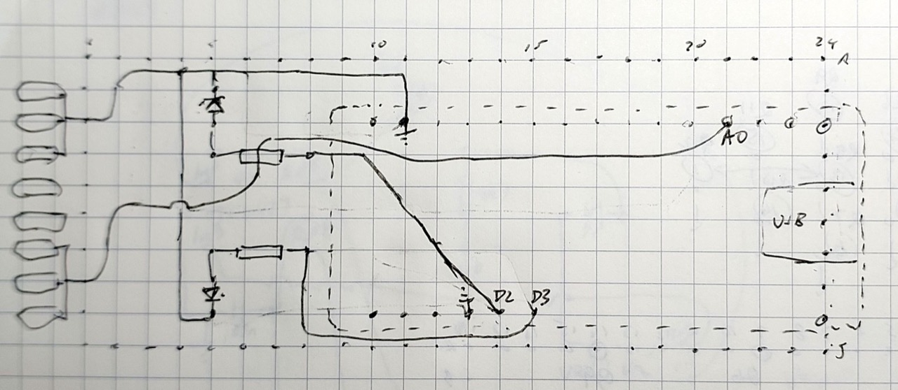
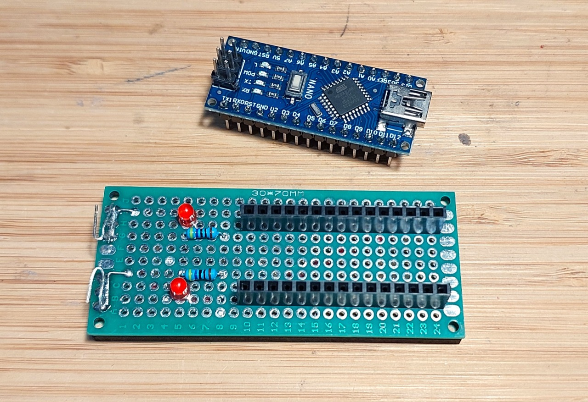
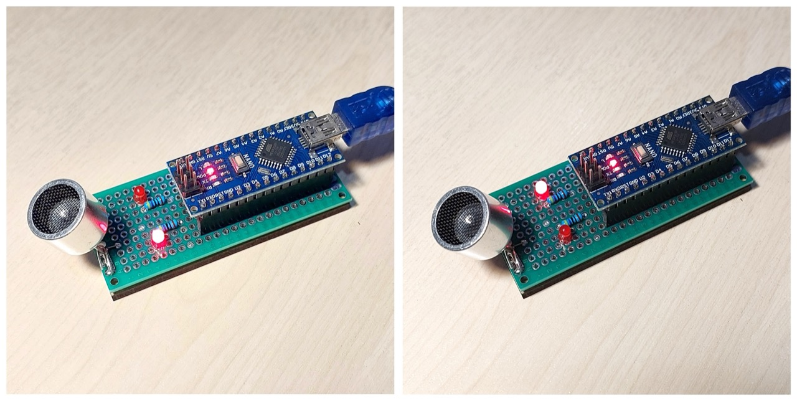

# #xxx Ultrasonic Piezo Polarity Tester

Using an Arduino to automatically determine the polarity of ultrasonic piezo transducers.

Here's a quick demo..

## Notes

Ultrasonic piezo transmitters and receivers such as the TCT40-16 are inherently polarized.
Correct polarity may be significant depending on the application.
See [LEAP#856 TCT40-16](../TCT40-16/) for more details.

While a simple multimeter test can usually determine polarity,
this project expands on an idea found at
<https://www.instructables.com/Acoustic-Levitator/>
to create an automated test bed powered by an Arduino.

The project relies on the fact that when sampling the voltage:

* if the piezo anode is sampled with piezo cathode connected to ground: the voltage will steadily rise
* if the piezo cathode is sampled with piezo anode connected to ground: the voltage will always be ~0V
* if there is no piezo connected to the sampling pin: the voltage will fluctuate randomly

Some caveats:

* I've noticed the behaviour can be quite erratic if powered from a noisy power supply (e.g. a wall wart) or under-powered power bank.
* Generally works perfectly if powered from my computer USB.
* If don't get a clear reading at first, can help to flip and retest the piezo orientation a few times until it "settles" on a stable behaviour

### Circuit Design

Designed with Fritzing: see [PiezoPolarityTester.fzz](./PiezoPolarityTester.fzz).

Setup for testing on a breadboard:

### The Sketch

See [PiezoPolarityTester.ino](./PiezoPolarityTester.ino).

Some points to note:

* I am using an Arduino Nano here, but any Arduino model would work just as well
* it sets the ADC sampling rate to ~9.6KHz
    * ADCSRA register is setup with ADC prescaler of 128
    * with 16MHz clock in the nano, this sets ADC Clock Frequency to 16MHz/128 = 125kHz
    * 13 ADC clock cycles are required to complete one conversion, so sampling rate is 125kHz/13 ~= 9615Hz
* it uses a rough variance calculation to determine the polarity:
    * takes 5 readings, each reading is the average of 32 samples
    * calculates the average variance from one reading to the next
    * categorizes the result:
        * very low variance: piezo is inverted
        * moderate variance: piezo is not inverted
        * high variance: probably no piezo connected
* sets the LEDs accordingly:
    * both off: no piezo detected
    * will light the LED matching the positive terminal (anode) of the piezo

### Breadboard Test

Works nicely with a reliable indication of which terminal is positive.

### Protoboard Build

To make it a little more convenient to use, I transferred the circuit to a small 3x7cm protoboard. I planned out a rough layout:

As built. I fashioned clips from some component leads to "spring-load" the piezo under test.

I stuck the board to a 3x7cm piece of 3mm MDF with hot glue to protect the underside from shorts and make it sit on a bench nicely.

Under test:

## Credits and References

* <https://www.instructables.com/Acoustic-Levitator/> - source of the original idea
* [LEAP#856 TCT40-16](../TCT40-16/)
